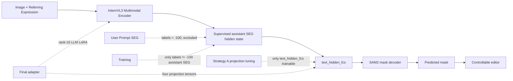
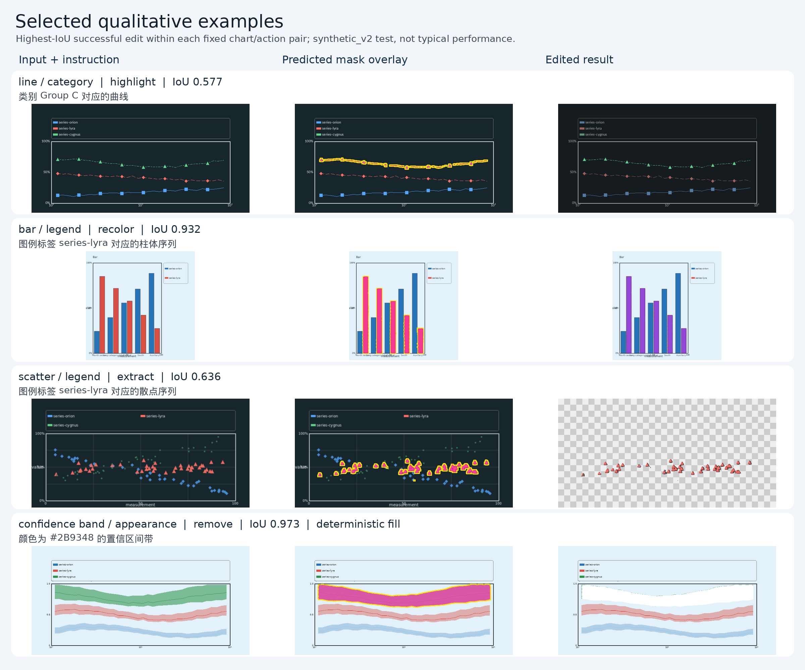
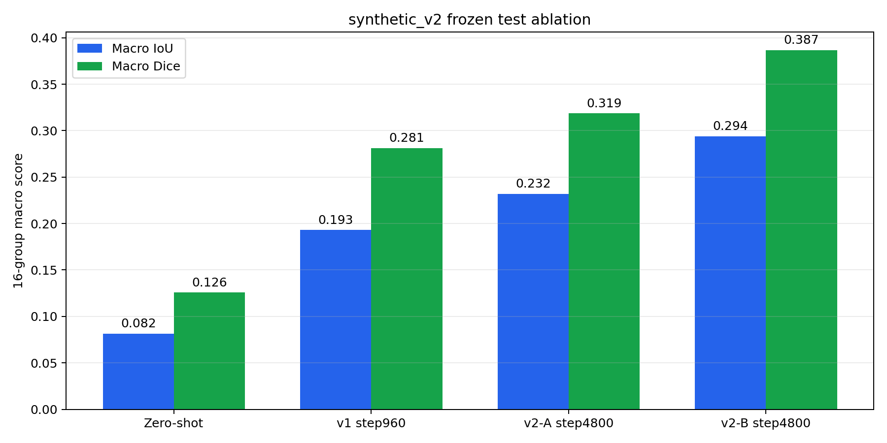
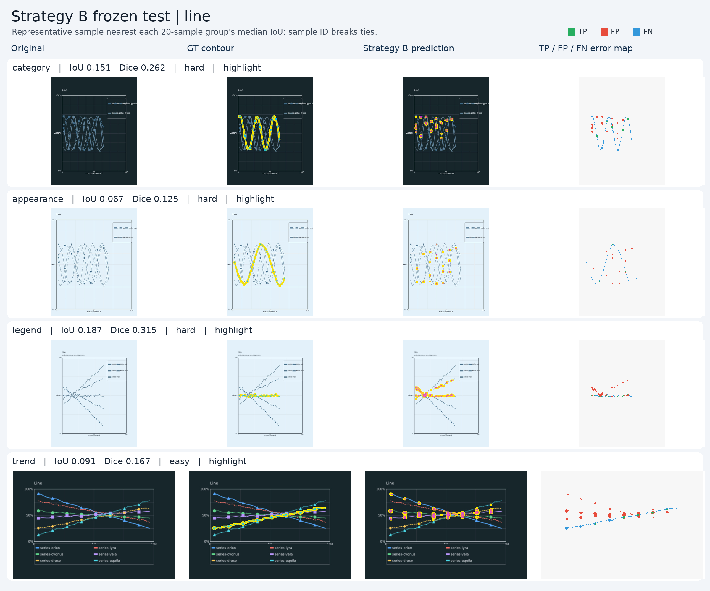
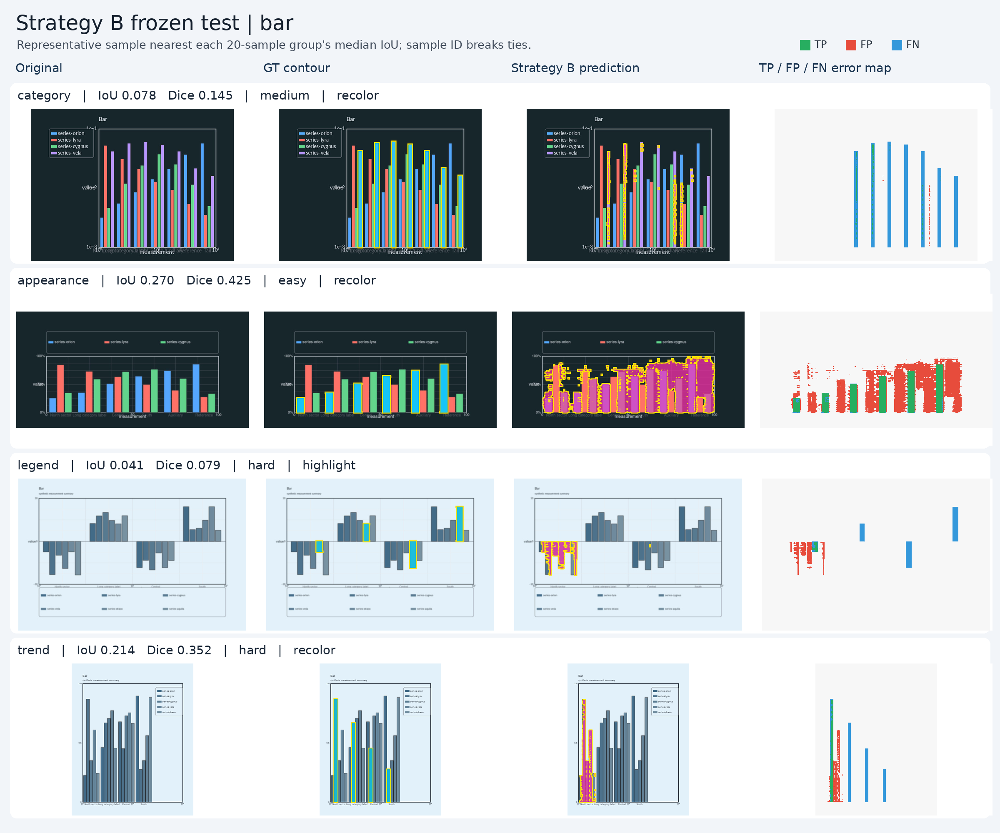
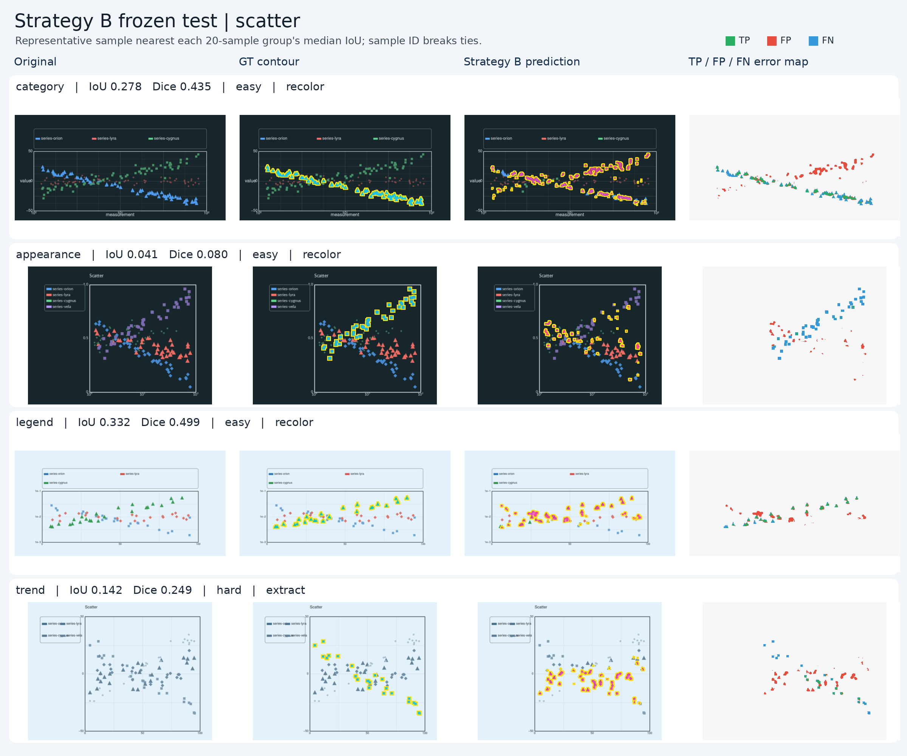
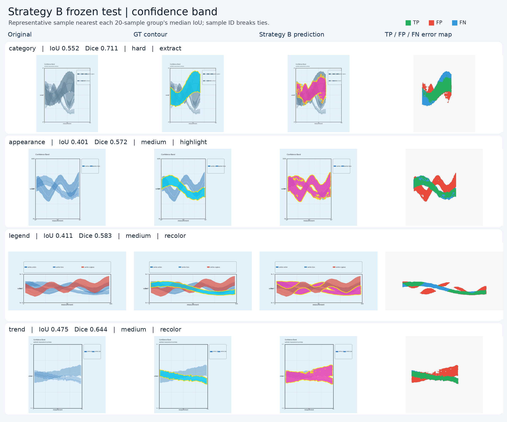
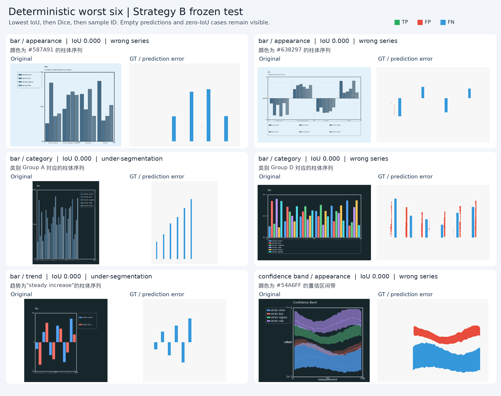

# ChartGround-Edit

ChartGround-Edit 是基于 Sa2VA-InternVL3-2B 的科学图表指代分割与可控编辑系统，
支持用自然语言定位曲线、柱体、散点序列和置信区间，并执行 `highlight`、
`recolor`、`extract`、`remove`。

## 核心能力

- 自然语言指代分割与细粒度图表图元定位
- 完整的 predicted-mask 编辑闭环，不使用 GT mask 修正预测
- 覆盖 16 个 chart/referring 组合的 balanced synthetic benchmark
- projection-only tuning 与受控的小型 LLM LoRA 消融
- 严格的 train/val/test 隔离、预注册 checkpoint 选择和一次性 frozen test
- 可复现的数据生成、对齐审计、训练、指标聚合和无 GT Demo CLI

## 架构



训练对齐使用
`(input_ids == seg_token_idx) AND (labels != -100)`，因此 Prompt 中的用户
`[SEG]` 不参与 mask 对齐；每个样本严格要求一个 supervised assistant `[SEG]`
对应一个 GT mask。v1/Strategy A 冻结 LLM、vision backbone、InternVL `mlp1`
和 SAM2；Strategy B 只额外训练最后 8 个 LLM attention 层的 LoRA。

## 结果

下表定量结果来自 Pillow 生成的 `synthetic_v1`；后文的受控 A/B 消融来自
`synthetic_v2`。两者都不能解释为真实论文图表上的泛化结果。Macro 指标对 16 个
`chart_type × referring_type` 组合等权平均。

| 阶段 | split / scope | checkpoint | Macro IoU | Macro Dice | Empty rate |
|---|---|---|---:|---:|---:|
| Zero-shot | test 64 | Sa2VA HF baseline | 0.198033 | 0.242366 | 42.1875% |
| Overfit32 | train 32 | step320 | 0.569468 | 0.674806 | 0% |
| Full train | val 64 | step960 | 0.426042 | 0.532503 | 0% |
| Fine-tuned | test 64 | frozen step960 | **0.428948** | **0.534238** | **0%** |

仅训练 2.75M 参数，约占 2.316B 参数训练模型的 **0.12%**。一次性 fine-tuned
test 相对 zero-shot 的 Macro IoU 提升 **+0.2309**，empty rate 从 **42.19%**
降至 **0%**；Micro IoU/Dice 为 `0.397803/0.569183`。完整统计见
[Phase 5B results](docs/phase5b_finetuned_test_results.md) 和
[saved summary](results/phase5b_finetuned_test_summary.json)。

Phase 5B 的可读版定量图完全由冻结的已保存 mask 重建，没有重跑模型。四类图分别见
[line](assets/phase5b_eval_line.png)、[bar](assets/phase5b_eval_bar.png)、
[scatter](assets/phase5b_eval_scatter.png) 和
[confidence band](assets/phase5b_eval_confidence_band.png)；同时保留
[确定性最差案例](assets/phase5b_failure_cases.png)。
历史 v1 的 [16-group gallery](assets/phase5b_finetuned_test_gallery.png) 和
[确定性编辑操作](assets/editing_v0_gallery.png) 仍可单独查看。

## Quick Start

### 1. 环境与 checkpoint

从仓库根目录创建并激活 Sa2VA 环境：

```bash
bash setup_env.sh sa2va latest
source projects/sa2va/.venv/bin/activate
```

所需模型身份：

- Base：`OpenGVLab/InternVL3-2B@899155015275a9b7338c7f4677e19c784e0e5a21`
  （仅训练构建使用）
- Sa2VA HF：`ByteDance/Sa2VA-InternVL3-2B@15837dcaecc304714a1f0f069e74f47e47521c7f`
- ChartGround adapter：约 16 MB 的 `chartground_v2_lora_step4800.pth`，SHA-256
  `c47ce4e38a9b1679c766d6360d66b6a3b69286d36b9d7cde50c70991ae475b97`

Adapter checkpoint 不在 Git 中。它只包含 4 个 projection 和 64 个 LoRA tensor，
不是可独立运行的完整模型，必须配合上面的固定 Sa2VA revision。CLI 默认拒绝 hash、
base/full-PTH、数据或 LoRA identity 不匹配的 checkpoint。

### 2. 无 GT 推理与编辑

```bash
CUDA_VISIBLE_DEVICES=<GPU_ID> HF_HUB_OFFLINE=1 TRANSFORMERS_OFFLINE=1 \
projects/sa2va/.venv/bin/python \
  projects/chartground_edit/scripts/run_chartground_edit.py \
  --checkpoint <SA2VA_CHECKPOINT> \
  --adapter-checkpoint <CHARTGROUND_ADAPTER> \
  --image <INPUT_IMAGE> \
  --referring-expression "图中上升最快的折线" \
  --action recolor --color "#E63946" \
  --output-dir <OUTPUT_DIR> \
  --device cuda:0 --dtype bfloat16
```

CLI 不接收 GT mask。它输出：

- `predicted_mask.png`
- `overlay.png`
- `edited.png`（预测非空且编辑成功时）
- `result.json`

四种动作均由 `--action {highlight,recolor,extract,remove}` 选择；可选参数包括
`--color`、`--strength`、`--fill-mode` 和 `--neighbor-radius`。

## 数据复现

`synthetic_v1` 共 320 条，train/val/test=`192/64/64`。四种图表
（line、bar、scatter、confidence band）与四种指代
（category、appearance、legend、trend）组成 16 个组合，并覆盖四种编辑动作。

```bash
projects/sa2va/.venv/bin/python \
  projects/chartground_edit/scripts/generate_synthetic_v1.py \
  --output-dir <DATA_DIR> --seed 20260916 --clean \
  --gallery-output <OUTPUT_DIR>/synthetic_v1_gallery.png

projects/sa2va/.venv/bin/python \
  projects/chartground_edit/scripts/validate_synthetic_v1.py \
  --manifest <DATA_DIR>/annotations.jsonl --expected-count 320

projects/sa2va/.venv/bin/python \
  projects/chartground_edit/scripts/audit_synthetic_v1.py \
  --manifest <DATA_DIR>/annotations.jsonl --expected-count 320 \
  --near-duplicate-threshold 0.01 --output-json <OUTPUT_DIR>/audit.json
```

生成数据受 Git ignore 保护。Schema、数据卡和泄漏审计说明见
[jsonl_schema_v1.md](docs/jsonl_schema_v1.md)、
[data_card_synthetic_v1.md](docs/data_card_synthetic_v1.md) 和
[synthetic_v1_audit.md](docs/synthetic_v1_audit.md)。

视觉分布更丰富的 `synthetic_v2` 共 1,600 条，train/val/test=`960/320/320`，
每个 chart/referring 组合 100 条且 action 精确平衡；它使用独立 v2 schema，不修改
v1。生成与联合重复审计：

```bash
projects/sa2va/.venv/bin/python \
  projects/chartground_edit/scripts/generate_synthetic_v2.py \
  --output-dir <V2_DATA_DIR> --seed 20260917 --clean \
  --gallery-output <OUTPUT_DIR>/synthetic_v2_gallery.png

projects/sa2va/.venv/bin/python \
  projects/chartground_edit/scripts/audit_synthetic_v2.py \
  --manifest <V2_DATA_DIR>/annotations.jsonl \
  --v1-manifest <V1_DATA_DIR>/annotations.jsonl \
  --output-json <OUTPUT_DIR>/synthetic_v2_audit.json
```

完整分布、难度定义和 v1/v2 对比见
[synthetic_v2 data card](docs/synthetic_v2_data_card.md)。

### synthetic_v2 projection-only baseline

Phase 7A 使用原始 Sa2VA projection 初始化，只训练 2.75M 个 `text_hidden_fcs`
参数，在 synthetic_v2 的 960 条 train 上完成 5 epoch，并且只在 320 条 val 上
选择 checkpoint。step4800 的 16-group Macro IoU 为 `0.210365`，zero-shot 为
`0.097575`，v1 step960 迁移为 `0.178815`；详细训练曲线、分组指标和限制见
[Phase 7A results](docs/phase7a_v2_projection_results.md)。Phase 7A 本身未访问
synthetic_v2 test。

### synthetic_v2 frozen A/B test

Phase 7B 在同一 projection 基础上增加 LLM 最后 8 层 attention q/k/v/o 的 rank-16
LoRA，总可训练参数为 3,999,488（0.1726%）。它先由固定 320 条 val 预选，再按冻结
protocol 在 320 条 test 上与三个固定状态各评测一次；没有根据 test 重新选模型。

| Model | Trainable | Macro IoU | Macro Dice | Micro IoU | Empty |
|---|---:|---:|---:|---:|---:|
| Zero-shot | 0 | 0.081553 | 0.125826 | 0.122480 | 34.3750% |
| v1 projection | 2,754,304 | 0.192929 | 0.281413 | 0.239054 | 0.3125% |
| v2 projection | 2,754,304 | 0.231966 | 0.318796 | 0.308443 | 2.8125% |
| v2 projection + LoRA | 3,999,488 | **0.294018** | **0.386910** | **0.398550** | **1.5625%** |

B 相对 zero-shot 的 Macro IoU 提升 `+0.212465`，相对 Strategy A 提升
`+0.062052`，后者 paired group bootstrap 95% CI 为 `[0.038416, 0.088712]`。
Strategy B 只训练约 `0.1726%` 参数；test 上相对 zero-shot 为 16/16 组合提升。
315 个非空 predicted mask 全部成功完成编辑，另外 5 个空预测明确跳过且没有使用 GT。
详见
[Phase 7C frozen-test results](docs/phase7c_v2_frozen_test_results.md) 与
[saved summary](results/phase7c_v2_frozen_test_summary.json)。

## 发布展示

**Selected qualitative examples.** 主图固定 line/highlight、bar/recolor、
scatter/extract、confidence band/remove 四组，在各组成功编辑的冻结结果中取最高 IoU；
这是精选展示，不代表平均效果。`remove` 使用 deterministic fill，不是生成式修复。





<details>
<summary>Detailed per-chart evaluation</summary>

以下四图覆盖 16 个 chart/referring 组合。每组取 IoU 最接近该组 20 条 test 样本
中位数的代表样本，以 sample ID 打破平局；它们不是按最佳效果挑选。









</details>

以下展示按冻结规则确定的最差 6 条，包含零 IoU 案例，不隐藏失败。



[查看完整 16 组合 contact sheet](assets/phase7c_v2_final_gallery.png)。以上所有结果均来自
`synthetic_v2`：最终 test Macro IoU 为 `0.294018`，256/320 个样本 IoU < 0.5，
主要失败模式为 under-segmentation。

## 训练复现

训练需要 base InternVL3-2B 与由官方 `tools/convert_to_pth.py` 生成的 Sa2VA full
BF16 PTH。以下三条命令共享这些参数：

```bash
# 1 sample / 1 optimizer step
projects/sa2va/.venv/bin/python \
  projects/chartground_edit/scripts/run_phase4b_smoke1.py \
  --config projects/chartground_edit/configs/phase4b_smoke1.py \
  --base-model <BASE_CHECKPOINT> --full-pth <SA2VA_FULL_PTH> \
  --output <WORK_DIR>/iter_1.pth \
  --base-repo-id OpenGVLab/InternVL3-2B \
  --base-revision 899155015275a9b7338c7f4677e19c784e0e5a21 \
  --sa2va-hf-revision 15837dcaecc304714a1f0f069e74f47e47521c7f \
  --full-pth-sha256 <FULL_PTH_SHA256>

# overfit32 / 320 steps
projects/sa2va/.venv/bin/python \
  projects/chartground_edit/scripts/run_phase4c_train.py \
  --config projects/chartground_edit/configs/phase4c_overfit32.py \
  --base-model <BASE_CHECKPOINT> --full-pth <SA2VA_FULL_PTH> \
  --full-pth-sha256 <FULL_PTH_SHA256> --output-dir <WORK_DIR> \
  --base-repo-id OpenGVLab/InternVL3-2B \
  --base-revision 899155015275a9b7338c7f4677e19c784e0e5a21 \
  --sa2va-hf-revision 15837dcaecc304714a1f0f069e74f47e47521c7f

# full train / 1920 steps
projects/sa2va/.venv/bin/python \
  projects/chartground_edit/scripts/run_phase4c_train.py \
  --config projects/chartground_edit/configs/phase5a_full_train.py \
  --base-model <BASE_CHECKPOINT> --full-pth <SA2VA_FULL_PTH> \
  --full-pth-sha256 <FULL_PTH_SHA256> --output-dir <WORK_DIR> \
  --base-repo-id OpenGVLab/InternVL3-2B \
  --base-revision 899155015275a9b7338c7f4677e19c784e0e5a21 \
  --sa2va-hf-revision 15837dcaecc304714a1f0f069e74f47e47521c7f
```

这些配置固定 P2、labels-aware assistant `[SEG]`、strict one-to-one 对齐和
projection-only trainables。完整实验记录见仓库根目录 `EXPERIMENTS.md`。

## 测试

```bash
PYTHONPATH=projects/chartground_edit \
projects/sa2va/.venv/bin/python -m pytest -q projects/chartground_edit/tests
```

测试只限定在项目目录；不要从仓库根目录无范围运行 pytest。

## 已知局限

- 全部定量训练和评测来自 Pillow 合成图表；尚未完成真实论文图表的定量 OOD 评测。
- 最终 frozen-test Macro IoU 为 `0.294018`，不是生产级精度；256/320 个 test 样本
  IoU 低于 0.5。
- 主要失败模式是 under-segmentation；`line/trend` 仍是最弱组合。
- `remove` 是确定性填色或邻域统计替换，不是生成式内容恢复。
- v1 发布 checkpoint 只更新 projection；v2 Strategy B 也只增加小型 LLM LoRA，
  vision encoder 和 SAM2 均未适配。
- 暂未覆盖复杂子图、3D 图、热力图、组合图及字符级 OCR 分割。

## 模型、结果与上游

- [Projection model card](MODEL_CARD.md)
- [Fine-tuned frozen-test protocol](docs/phase5b_finetuned_test_protocol.md)
- [Fine-tuned frozen-test results](docs/phase5b_finetuned_test_results.md)
- [Sa2VA upstream project](../sa2va/README.md)

ChartGround-Edit 是 Sa2VA 的扩展项目。代码与模型使用时需同时遵守本仓库、Sa2VA、
InternVL3 和 SAM2 的许可证及使用条款。
