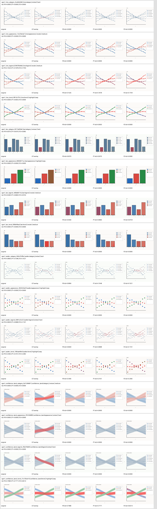
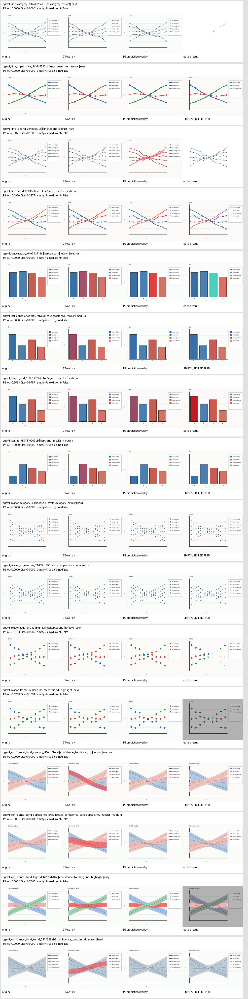

# ChartGround-Edit

ChartGround-Edit 是基于 Sa2VA 的科学图表自然语言指代分割与可控编辑子项目。输入图表和指令，模型定位被指代的曲线、柱体、散点或置信区间等元素并输出 mask；编辑模块再用该 mask 执行 `highlight`、`recolor`、`extract` 或 `remove`。

当前状态：Phase 1–3C 已完成；Phase 4A 的训练源码审计、train-only smoke1/overfit32 子集冻结和纯数据契约已完成。P2 `target_only_zh` 保持冻结，模型训练、forward/backward 和 checkpoint 转换均未执行。审计发现 P2 用户文本与 official assistant target 各含一个 `[SEG]`，而现有训练 forward 不按 labels 过滤用户 token；该问题是 Phase 4B 前的硬门禁，当前不能宣称训练链路可用。

## MVP

- 图表：折线图、柱状图、散点图、带置信区间的科学曲线图
- 指代：类别、外观、图例、趋势
- 编辑：`highlight`、`recolor`、`extract`、`remove`
- 暂不支持：字符级 OCR 分割、数学公式理解、复杂三维图表和开放域编辑

## 当前目录结构

```text
projects/chartground_edit/
├── README.md
├── assets/                 # README 使用的版本化展示资产
├── configs/                # Phase 4 train-only ID 清单与设计态配置
├── docs/                   # 标注、JSONL、数据卡与编辑语义规范
├── data/                   # 本地生成的 synthetic_v0（生成物被 gitignore）
├── scripts/                # 数据、校验、编辑 CLI 与 gallery 入口
├── tests/                  # 数据、几何、编辑器与 CLI 测试
└── chartground_edit/       # Python 包
    ├── datasets/           # schema、reader、合成生成器、同步变换
    ├── editing/            # GT/predicted mask 均可复用的确定性编辑后端
    ├── inference/          # Sa2VA backend、结果类型、mask 后处理与指标
    ├── training/           # 不加载模型的 train-only 契约与子集选择
    └── visualization/      # 原图/mask/overlay/目标裁剪及 contact sheet
```

## Phase 1A 快速使用

从仓库根目录运行；命令只生成本地小图，不下载数据或模型：

```bash
PYTHONPATH=projects/chartground_edit python \
  projects/chartground_edit/scripts/generate_synthetic_v0.py \
  --output-dir projects/chartground_edit/data/synthetic_v0 \
  --seed 20260915 --clean
```

生成后可打开：

- `projects/chartground_edit/data/synthetic_v0/annotations.jsonl`
- `projects/chartground_edit/data/synthetic_v0/gallery.png`
- `projects/chartground_edit/data/synthetic_v0/visualizations/*.png`

运行测试：

```bash
python -m pytest projects/chartground_edit/tests -q
```

可单独验证已有 manifest：

```bash
PYTHONPATH=projects/chartground_edit python \
  projects/chartground_edit/scripts/validate_jsonl_v0.py \
  projects/chartground_edit/data/synthetic_v0/annotations.jsonl \
  --expected-count 32
```

协议详见 `docs/annotation_spec_v0.md` 与 `docs/jsonl_schema_v0.md`，数据限制详见 `docs/data_card_synthetic_v0.md`。

## Phase 1B：使用 mask 编辑

编辑接口只接收 RGB Pillow 图像、二值 mask、动作名和参数，不依赖 Sa2VA 或 annotation 数据结构。完整契约见 `docs/editing_spec_v0.md`。

```python
from chartground_edit.editing import edit

edited = edit(image, mask, "recolor", {"color": "#E63946"})
```

CLI 可从仓库根目录直接运行：

```bash
python projects/chartground_edit/scripts/edit_with_mask.py \
  --image projects/chartground_edit/data/synthetic_v0/images/cge_bar_category_01.png \
  --mask projects/chartground_edit/data/synthetic_v0/masks/cge_bar_category_01.png \
  --action recolor \
  --output /tmp/chartground_edit_recolor.png \
  --color "#E63946"
```

CLI 同时提供 `--highlight-strength` 和 `--remove-fill-mode {color,neighbor}`；运行 `--help` 可查看完整参数。四种动作的 v0 语义为：

- `highlight`：mask 内保持原样，mask 外按强度变暗并降低饱和度；这是唯一预期修改 mask 外的动作。
- `recolor`：仅修改 mask 内色相/饱和度，并保留原像素 HSL lightness。
- `extract`：返回 RGBA，mask 外 alpha 为 0，mask 内保留原 RGB。
- `remove`：仅在 mask 内使用固定色或确定性邻域中位数填充，不进行内容恢复或生成式修复。


gallery 可复现生成：

```bash
python projects/chartground_edit/scripts/generate_editing_gallery.py \
  --manifest projects/chartground_edit/data/synthetic_v0/annotations.jsonl \
  --output projects/chartground_edit/assets/editing_v0_gallery.png
```

## Phase 2 环境准备

Sa2VA-InternVL3-2B 使用仓库 `latest` 依赖组。环境入口由官方脚本创建在
`projects/sa2va/.venv`，物理目录位于 `/tmp/sa2va_env`：

```bash
bash setup_env.sh sa2va latest
source projects/sa2va/.venv/bin/activate
```

checkpoint 路径不得硬编码；ChartGround-Edit CLI 使用必填
`--checkpoint PATH` 参数。当前环境版本、完整安装记录、离线约定、checkpoint
校验结果和已知依赖 metadata 冲突见
[`docs/phase2_environment.md`](docs/phase2_environment.md)。

## Phase 2B-1：单样本 Sa2VA baseline

CLI 从 JSONL 读取原图、GT 和未经补充的原始 instruction，固定构造一个 Prompt，
再将模型的第一个预测 mask 交给指标与现有编辑器。`--skip-model-run` 可在无 GPU
时验证输入和 Prompt，且不会加载模型：

```bash
projects/sa2va/.venv/bin/python \
  projects/chartground_edit/scripts/run_sa2va_baseline.py \
  --checkpoint /path/to/Sa2VA-InternVL3-2B \
  --manifest projects/chartground_edit/data/synthetic_v0/annotations.jsonl \
  --sample-id cge_bar_category_01 \
  --device cuda:0 --dtype bfloat16 \
  --edit-action recolor --edit-color "#E63946" \
  --output-dir /tmp/chartground_edit_phase2b1_smoke \
  --skip-model-run
```

2026-09-15 的唯一真实 smoke 使用 checkpoint revision
`15837dcaecc304714a1f0f069e74f47e47521c7f`。模型生成
`Sure, [SEG].<|im_end|>` 并返回一个非空 bool mask，但预测了错误柱体，实际
IoU/Dice 均为 0.0。编辑链路成功不代表分割正确；尚未运行完整 test split。


## Phase 2B-2：固定 test split 零样本基线

批量入口在一个进程中创建一个 backend，并按 manifest 顺序处理 split；模型只加载
一次，单样本失败不会触发重试。以下命令固定选择 4 条 test 样本，仍使用 Phase
2B-1 的唯一 Prompt 和第一个预测 mask：

```bash
CUDA_VISIBLE_DEVICES=2 \
HF_HUB_OFFLINE=1 \
TRANSFORMERS_OFFLINE=1 \
projects/sa2va/.venv/bin/python \
  projects/chartground_edit/scripts/run_sa2va_split.py \
  --checkpoint /path/to/Sa2VA-InternVL3-2B \
  --manifest projects/chartground_edit/data/synthetic_v0/annotations.jsonl \
  --split test --device cuda:0 --dtype bfloat16 \
  --expected-count 4 --continue-on-sample-error \
  --output-dir /tmp/chartground_edit_phase2b2_test
```

2026-09-15 的真实运行中，4/4 inference success、0/4 空预测、2/4 nonempty
disjoint；macro mean IoU/Dice 为 0.035667/0.064015，micro IoU/Dice 为
0.006158/0.012241。模型只加载一次。所有编辑图均由 predicted mask 驱动；错误预测
也完整保留在下图中。


这只是 4 条合成样本的诊断性 baseline，不是最终统计结果。test split 未用于 Prompt
选择；后续 Prompt 诊断只能在 val split 上进行。逐样本输出、文本、耗时、显存和
结果解释见 [`docs/phase2_zeroshot_results.md`](docs/phase2_zeroshot_results.md)。

## Phase 2C：val-only Prompt 诊断

split 审计确认 synthetic_v0 存在生成顺序偏置：train 只有 appearance/legend/trend，
val 和 test 都只有 category；val 全是 highlight，test 全是 recolor。具体交叉表与适用
边界见 [`docs/synthetic_v0_split_audit.md`](docs/synthetic_v0_split_audit.md)。原 manifest
没有修改。

Phase 2C 将 synthetic-v0 instruction 确定性拆成 `referring_expression`、
`edit_action` 和显式 `edit_parameters`，并只在 val 上比较三个预注册 Prompt：

```bash
CUDA_VISIBLE_DEVICES=1 \
HF_HUB_OFFLINE=1 \
TRANSFORMERS_OFFLINE=1 \
projects/sa2va/.venv/bin/python \
  projects/chartground_edit/scripts/run_prompt_diagnostic.py \
  --checkpoint /path/to/Sa2VA-InternVL3-2B \
  --manifest projects/chartground_edit/data/synthetic_v0/annotations.jsonl \
  --split val \
  --prompt-variants full_instruction,target_only_en,target_only_zh \
  --device cuda:0 --dtype bfloat16 --expected-count 4 \
  --output-dir /tmp/chartground_edit_phase2c_prompt_diagnostic
```

脚本明确拒绝 `--split test`。真实 4×3 运行中三个 Prompt 都达到 100% inference
success 和 100% `[SEG]` output rate，含义只是全部样本成功产生协议合法输出，**不代表
100% segmentation accuracy**。P0/P1/P2 macro IoU 分别为
0.392236/0.340420/0.351172；删除编辑动作没有显示一致改善。中文 wrapper 保持
`[SEG]` 输出，但改变了部分 mask 几何。


本诊断只有 4 条 category/highlight 合成 val 样本；P0 最多只能作为 balanced
synthetic_v1 val 的候选。test 零样本 macro IoU 仍只有 0.035667，且本轮没有重跑或
用于调 Prompt。完整配对结果、限制和 synthetic_v1 规范见
[`docs/phase2_prompt_diagnostic.md`](docs/phase2_prompt_diagnostic.md)。

## Phase 3A：balanced synthetic_v1

`synthetic_v1` 使用独立 v1 schema 和 Reader，直接保存 `full_instruction` 与
`referring_expression`。数据共 320 条，16 个 chart/referring 组合各 20 条，并在每个
组合内部固定为 train/val/test = 12/4/4；四种 edit action 在每个组合和 split 内严格
平衡。生成与校验不导入 Torch、Transformers 或 Sa2VA：

```bash
projects/sa2va/.venv/bin/python projects/chartground_edit/scripts/generate_synthetic_v1.py --output-dir projects/chartground_edit/data/synthetic_v1 --seed 20260916 --clean --gallery-output projects/chartground_edit/assets/synthetic_v1_gallery.png

projects/sa2va/.venv/bin/python projects/chartground_edit/scripts/audit_synthetic_v1.py --manifest projects/chartground_edit/data/synthetic_v1/annotations.jsonl --expected-count 320 --near-duplicate-threshold 0.01 --output-json projects/chartground_edit/data/synthetic_v1/audit.json
```

独立审计结果为 320/320 schema/file 合法、0 个硬约束失败、0 个空/全一 mask、0 个
精确 image/mask 重复、0 个 ID/seed/scene/content 重复。保守的低分辨率跨 split 指纹
报告 97 对人工复核候选，不自动删除；精确内容哈希和底层 content ID 均不同。完整协议、
来源和审计边界见 [`docs/jsonl_schema_v1.md`](docs/jsonl_schema_v1.md)、
[`docs/data_card_synthetic_v1.md`](docs/data_card_synthetic_v1.md) 与
[`docs/synthetic_v1_audit.md`](docs/synthetic_v1_audit.md)。批量数据继续被 Git 忽略。


## Phase 3B：balanced-val Prompt benchmark

固定 Sa2VA-InternVL3-2B、BF16 和 Phase 2C 的 P0/P1/P2，在 synthetic_v1 的 64 条 val
样本上各运行一次，共 192 次。模型只加载一次，protocol 前后 SHA-256 一致，192 个预测
mask 均独立重算指标通过。按预注册的 16-group Macro IoU 规则选择 P2
`target_only_zh`：P0/P1/P2 为 0.164503/0.179093/0.182199。

P2 相对 P1 的差值只有 +0.003106，10,000 次 paired group bootstrap 95% CI 为
[-0.006147, 0.015220]，包含 0。因此 P2 只是 **selected on validation** 的全局 operational
choice，不能称为显著更优或 test 结论。三种 Prompt 的 `[SEG]` output rate 都是 100%，
execution success 和 mask contract valid 也均为 64/64；nonempty prediction 分别为
35/64、36/64、36/64，empty prediction 为 29/64、28/64、28/64。空 mask 是合法模型
输出，不是执行异常。历史 `inference_success` 字段保留但已 deprecated，不能再展示为
执行成功率；协议成功同样不代表分割准确率。



冻结协议和完整结果分别见
[`docs/phase3b_benchmark_protocol.md`](docs/phase3b_benchmark_protocol.md) 与
[`docs/phase3b_balanced_val_results.md`](docs/phase3b_balanced_val_results.md)。仓库只保存
标量 JSONL/summary 和 16 组合 gallery；192 个 mask/overlay 保留在 `/tmp`，不提交 Git。
Phase 3B 当时没有运行 synthetic_v1 test；后续 Phase 3C 已按该约束使用同一个 P2。

## Phase 3C：frozen synthetic_v1 test baseline

Phase 3C 在模型推理前冻结独立 protocol，仅允许 `split=test` 和 P2
`target_only_zh`。模型只加载一次，64 条 test 各调用一次，64/64 execution success、
mask contract valid 和 `[SEG]`；37 条非空、27 条空预测，30 条与 GT 重叠、7 条
nonempty-disjoint。16-group Macro IoU/Dice 为 0.198033/0.242366，Micro IoU/Dice 为
0.225301/0.367748。基于 16 个 group 的 10,000 次固定 seed bootstrap 给出 Macro IoU
95% CI [0.101680, 0.316589]，Macro Dice 95% CI [0.139124, 0.360458]。

全部 37 个非空预测使用该样本真实 action/parameters 和 predicted mask 完成编辑；27 个
空预测明确跳过，没有用 GT mask 替代。完整临时输出保存在
`/tmp/chartground_edit_phase3c_frozen_test`，仓库保存 64 条标量、summary 和固定
16 组 gallery。test 指标不用于修改 Prompt，也没有回到 validation 重新选择。



冻结协议和结果分别见
[`docs/phase3c_frozen_test_protocol.md`](docs/phase3c_frozen_test_protocol.md) 与
[`docs/phase3c_frozen_test_results.md`](docs/phase3c_frozen_test_results.md)。

## Phase 4A：训练路径审计与 overfit 子集冻结

官方完全匹配的配置是 `projects/sa2va/configs/sa2va_in30_2b.py`；微调示例是
`sa2va_finetune.py`。两者的实际可训练集合包括 LLM LoRA、完整 embedding/lm_head、
InternVL `mlp1`、`text_hidden_fcs` 和 SAM2 mask decoder，并非“仅 LoRA”。Phase 4B 推荐先做 projection-only
策略 A，但必须先解决 P2 双 `[SEG]` 对齐门禁，并验证官方 HF→PTH→HF 转换闭环。

train-only 清单可确定性重建：

```bash
projects/sa2va/.venv/bin/python \
  projects/chartground_edit/scripts/prepare_phase4_overfit_subsets.py \
  --manifest projects/chartground_edit/data/synthetic_v1/annotations.jsonl \
  --smoke-output projects/chartground_edit/configs/phase4_smoke1_ids.json \
  --overfit-output projects/chartground_edit/configs/phase4_overfit32_ids.json
```

smoke1 固定为 `cgev1_bar_category_6d51bac154`。overfit32 覆盖 16 个
chart/referring 组合各 2 条，action 各 8，difficulty 为 11/10/11；清单不含 val/test、
scene/content ID 或图片/mask 副本。详见
[`docs/phase4_training_path_audit.md`](docs/phase4_training_path_audit.md)、
[`docs/phase4_training_data_contract.md`](docs/phase4_training_data_contract.md) 和
[`docs/phase4_overfit_protocol.md`](docs/phase4_overfit_protocol.md)。

## Phase 4B-0：训练对齐硬门禁

真实 tokenizer/collator 证明 smoke1 的用户 `[SEG]` 在 position 1823、label=-100，assistant
`[SEG]` 在 position 1840、label=151674。旧逻辑选择两个并由 `fix_number=5` 静默变成
5 对；新训练配置按 labels 边界只选择 assistant token，并要求每样本严格 1 token : 1
mask。任何不匹配立即报错，strict 路径不调用 legacy 修复。默认上游配置仍保留旧行为，
推理路径未改。

已创建 parse-only 的 `configs/phase4b_smoke1.py`：smoke1/train-only、P2、strategy A、
batch/accumulation=1、BF16、max_iters=1、无 val/test/resume，输出仅到 `/tmp`。本轮没有
构建模型、加载权重或训练。完整复现、配置与 checkpoint 输入输出门禁见
[`docs/phase4b_alignment_protocol.md`](docs/phase4b_alignment_protocol.md)。

## 开发路线

1. Phase 0：完成 Sa2VA 源码地图、环境边界和工程骨架。
2. Phase 1：冻结最小数据格式，用 32 个样本验证 mask 和可视化。
3. Phase 2：不训练地跑通 Sa2VA 单图推理基线。
4. Phase 3：建设可复现的科学图表指代分割数据集。
5. Phase 4：先通过 32 样本过拟合，再申请完整 LoRA/轻量训练。
6. Phase 5：实现并独立测试四类 mask 驱动编辑。
7. Phase 6：完成分层评测、Demo、文档和开源发布检查。

详细范围、源码映射和验收条件见仓库根目录的 `PROJECT.md` 与 `PLAN.md`；实验必须记录在 `EXPERIMENTS.md`。

## 开发约束

- 默认不修改 `projects/sa2va/` 的核心模型逻辑，优先通过适配器复用。
- 图像与 mask 的随机几何变换必须共享同一组参数。
- 未经确认不下载权重或大型数据，不启动完整训练。
- 所有结果必须来自可复现脚本，失败和未运行状态要明确记录。
