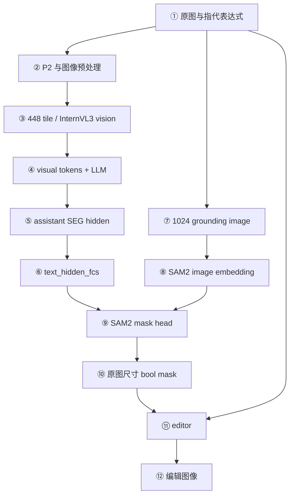
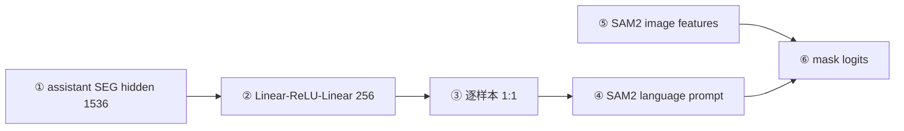
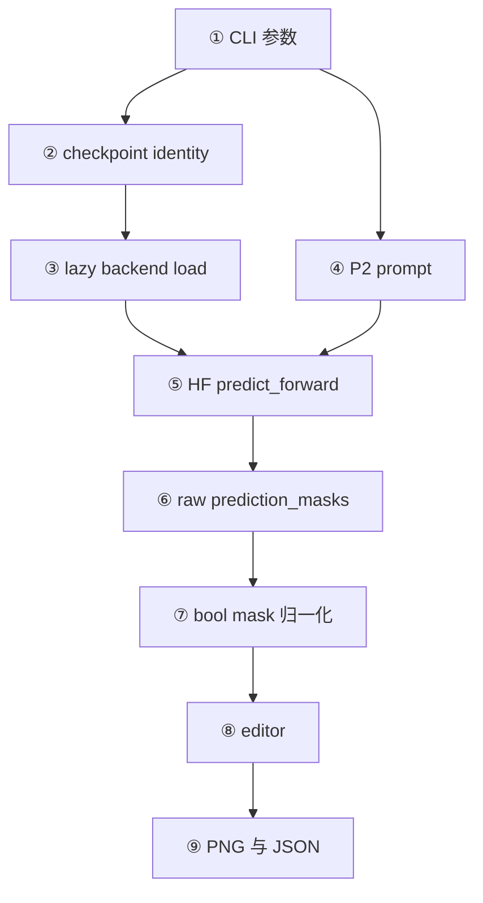
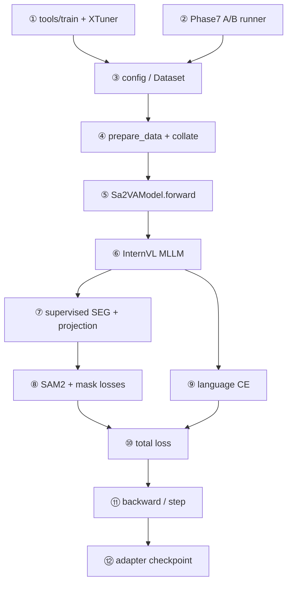
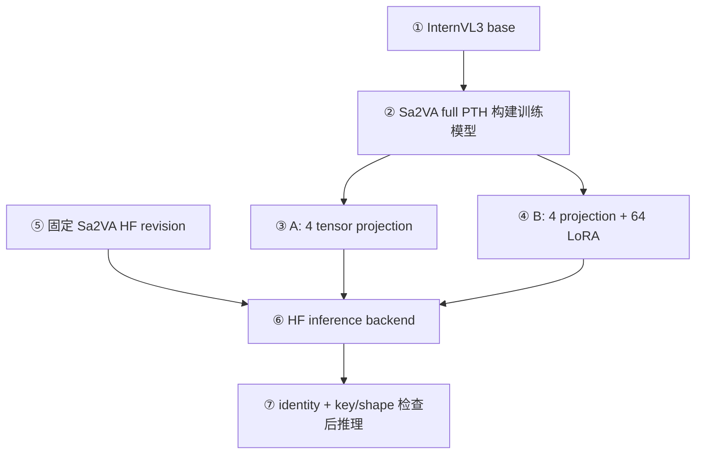

# ChartGround-Edit 项目代码学习手册：从数据到 MLLM、SAM2 与图表编辑

> 基于 `c3a5522` 审读源码。本手册是代码学习路线，不是运行报告。下文的模型形状若来自 Phase 4B 历史诊断会明确标出；仅靠静态源码无法确定的运行时值，不写成固定常数。所有路径相对于本仓库，链接从本文件所在的 `docs/` 目录解析。

## 0. 如何使用这份手册

不必从头读到尾。只想运行无 GT 编辑：先看 §1、§2、§10、§11、§14。想理解推理数据流：读 §2、§6–§10、§15–§16。想理解训练、LoRA 与 SAM2：读 §4–§9、§12–§14，再用 §17 的断点核对。

这里有四种代码边界，不可混为一谈：

| 边界 | 示例 | 本手册如何称呼 |
|---|---|---|
| 自研项目 | [`training/sa2va_adapter.py`](../chartground_edit/training/sa2va_adapter.py)、[`inference/sa2va_backend.py`](../chartground_edit/inference/sa2va_backend.py) | ChartGround-Edit |
| 仓库内 Sa2VA 训练源码 | [`Sa2VAModel`](../../sa2va/models/sa2va.py)、[`SAM2TrainRunner`](../../sa2va/models/sam2_train.py) | 上游训练路径；其中对齐 hook 是本 fork 的小修改 |
| HF checkpoint remote code | [`modeling_sa2va_chat.py`](../../sa2va/hf/models/modeling_sa2va_chat.py)、[`sam2.py`](../../sa2va/hf/models/sam2.py) | 仓库镜像供阅读；真正推理以固定 revision 的 checkpoint 内文件为准 |
| 外部第三方 | XTuner、PEFT、SAM2 基础实现 | 只写本仓库可确认的调用接口，不猜内部行为 |

第一次读代码建议按这个顺序：[`schema_v2.py`](../chartground_edit/datasets/schema_v2.py) → [`data_adapter.py`](../chartground_edit/training/data_adapter.py) → [`sa2va_adapter.py`](../chartground_edit/training/sa2va_adapter.py) → [`base.py`](../../sa2va/datasets/base.py) → [`data_utils.py`](../../sa2va/datasets/data_utils.py) → [`sa2va.py`](../../sa2va/models/sa2va.py) → [`internvl.py`](../../sa2va/models/mllm/internvl.py) → [`sam2_train.py`](../../sa2va/models/sam2_train.py) → [`sa2va_backend.py`](../chartground_edit/inference/sa2va_backend.py) → [`mask_processing.py`](../chartground_edit/inference/mask_processing.py) → [`editor.py`](../chartground_edit/editing/editor.py) → [`strategy_b.py`](../chartground_edit/training/strategy_b.py) → [`run_chartground_edit.py`](../scripts/run_chartground_edit.py)。

## 1. 项目解决什么问题

设图里有多条曲线。用户说“将图例中虚线对应的曲线高亮”。系统需要先把“图例中虚线”与整张图上的一条曲线关联起来，再给出该曲线每个像素的二值 mask，最后仅依据预测 mask 做高亮。输出不是一个类别、边界框或问答字符串，而是 `mask[H,W]` 和一张编辑后的图。主链是**指代理解 → 目标定位 → 像素分割 → 可控编辑**。

训练数据的完整编辑句子留在 JSONL 供评测/编辑使用；送入模型的 P2 只放 `referring_expression`。这使模型负责“找谁”，编辑器负责“怎样改”。若 mask 选错序列，编辑器会忠实地改错序列；编辑成功不等于分割正确。入口分别是 [`Phase7V2SplitDataset._load_sample()`](../chartground_edit/training/data_adapter.py)、[`Sa2VAInternVL3Backend.predict_prompt()`](../chartground_edit/inference/sa2va_backend.py) 和 [`edit()`](../chartground_edit/editing/editor.py)。

## 2. 顶层架构与两条视觉数据流



| 节点 | 源码入口与可确认的职责 |
|---|---|
| ① | [`Phase7V2SplitDataset.__getitem__()`](../chartground_edit/training/data_adapter.py) 或无 GT [`run()`](../scripts/run_chartground_edit.py)：读原图及指代 |
| ② | [`build_prompt_variant()`](../chartground_edit/inference/prompt_variants.py)、[`Sa2VADatasetMixin._process_single_image()`](../../sa2va/datasets/base.py) |
| ③ | [`dynamic_preprocess()`](../../sa2va/datasets/data_utils.py)、[`Sa2VAChatModel.extract_feature()`](../../sa2va/hf/models/modeling_sa2va_chat.py) |
| ④ | [`InternVLMLLM._llm_forward()`](../../sa2va/models/mllm/internvl.py)：训练路径将视觉 embedding 填入文本序列 |
| ⑤ | 训练 [`Sa2VAModel.select_seg_token_mask()`](../../sa2va/models/sa2va.py)；推理 [`get_seg_hidden_states()`](../../sa2va/hf/models/modeling_sa2va_chat.py) |
| ⑥ | [`Sa2VAModel.text_hidden_fcs`](../../sa2va/models/sa2va.py)；HF 镜像中 [`Sa2VAChatModel.text_hidden_fcs`](../../sa2va/hf/models/modeling_sa2va_chat.py) |
| ⑦ | [`DirectResize.apply_image()`](../../sa2va/models/preprocess/image_resize.py)；与 tile 路径分开 |
| ⑧ | 训练 [`SAM2TrainRunner.get_sam2_embeddings()`](../../sa2va/models/sam2_train.py)；HF [`SAM2.get_sam2_embeddings()`](../../sa2va/hf/models/sam2.py) |
| ⑨ | 训练 [`SAM2TrainRunner.inject_language_embd()`](../../sa2va/models/sam2_train.py)；HF [`SAM2.language_embd_inference()`](../../sa2va/hf/models/sam2.py) |
| ⑩ | HF [`Sa2VAChatModel.predict_forward()`](../../sa2va/hf/models/modeling_sa2va_chat.py) 阈值化；项目 [`process_prediction_masks()`](../chartground_edit/inference/mask_processing.py) 检查 |
| ⑪–⑫ | [`edit()`](../chartground_edit/editing/editor.py) 与 [`run()`](../scripts/run_chartground_edit.py) 保存结果 |

同一张图必须走两路。**MLLM 路**：`dynamic_preprocess` 依据宽高比切成运行时数量的 448×448 tile，InternVL3 vision model 提取 patch feature，经 pixel shuffle/downsample 与 `mlp1` 形成 visual tokens，替换文本里的 `<IMG_CONTEXT>` 占位后进 LLM。它擅长图例、颜色、趋势等语义关联。**Grounding 路**：原图由 `DirectResize(1024)` 变成 SAM2 输入，单独提取空间 feature；由投影后的 `[SEG]` 向量给 mask head 提示，负责像素定位。tile 几何与 SAM2 的 1024 方图并不互相替代，也不能拿 tile mask 直接当原图 mask。

## 3. 仓库结构地图

只列主链文件；“高”表示第一次应读。表内每项都是可点击的当前源码。

| 类别 | 文件 / symbol | 来源 | 优先级与位置 |
|---|---|---|---|
| schema | [`schema_v2.py::validate_annotation_v2`](../chartground_edit/datasets/schema_v2.py) | 项目 | 高；JSONL 与 mask 契约 |
| 生成 | [`synthetic_v2.py::generate_synthetic_v2`](../chartground_edit/datasets/synthetic_v2.py)、[`render_v2.py::render_scene_v2`](../chartground_edit/datasets/render_v2.py) | 项目 | 中；几何与指令从哪里来 |
| 数据读取 | [`data_adapter.py::Phase7V2SplitDataset`](../chartground_edit/training/data_adapter.py) | 项目 | 高；split、P2、mask |
| 训练桥接 | [`sa2va_adapter.py::ChartGroundPhase4Dataset`](../chartground_edit/training/sa2va_adapter.py) | 项目 | 高；tokenizer/两路图像 |
| 官方 collate | [`data_utils.py::sa2va_collect_fn`](../../sa2va/datasets/data_utils.py) | 上游 | 高；batch 字段 |
| Prompt | [`prompt_variants.py::build_prompt_variant`](../chartground_edit/inference/prompt_variants.py) | 项目 | 高；P2 文本 |
| 对齐 | [`alignment.py::validate_strict_one_to_one`](../chartground_edit/training/alignment.py)、[`Sa2VAModel.select_seg_token_mask`](../../sa2va/models/sa2va.py) | 项目 + fork hook | 高；双 SEG 防护 |
| 训练模型 | [`sa2va.py::Sa2VAModel.forward`](../../sa2va/models/sa2va.py)、[`internvl.py::InternVLMLLM._llm_forward`](../../sa2va/models/mllm/internvl.py) | 上游 | 高；语言/分割 loss |
| SAM2 训练桥 | [`sam2_train.py::SAM2TrainRunner`](../../sa2va/models/sam2_train.py) | 上游 | 高；图像 embedding 与 mask head |
| 推理后端 | [`sa2va_backend.py::Sa2VAInternVL3Backend`](../chartground_edit/inference/sa2va_backend.py) | 项目 | 高；懒加载和 mask 合约 |
| HF 推理 | [`modeling_sa2va_chat.py::Sa2VAChatModel.predict_forward`](../../sa2va/hf/models/modeling_sa2va_chat.py)、[`sam2.py::SAM2.language_embd_inference`](../../sa2va/hf/models/sam2.py) | HF 镜像 | 中；实际以 checkpoint remote code 为准 |
| Mask 后处理 | [`mask_processing.py::process_prediction_masks`](../chartground_edit/inference/mask_processing.py) | 项目 | 高；原图尺寸 bool |
| 编辑 | [`editor.py::edit`](../chartground_edit/editing/editor.py) | 项目 | 高；四动作 |
| LoRA/checkpoint | [`strategy_b.py::ChartGroundStrategyBModel`](../chartground_edit/training/strategy_b.py)、[`projection_checkpoint.py::load_projection_checkpoint_into_model`](../chartground_edit/inference/projection_checkpoint.py) | 项目 | 中；冻结/加载 |
| 评测 | [`metrics.py::intersection_over_union`](../chartground_edit/inference/metrics.py)、[`run_phase7c_v2_frozen_test.py::summarize`](../scripts/run_phase7c_v2_frozen_test.py) | 项目 | 中；单样本到组指标 |
| CLI/config | [`run_chartground_edit.py::run`](../scripts/run_chartground_edit.py)、[`phase7b_v2_lora.py`](../configs/phase7b_v2_lora.py) | 项目 | 高/中；用户和训练配置 |
| Tests | [`tests/test_phase4b_alignment.py`](../tests/test_phase4b_alignment.py)、[`tests/test_inference.py`](../tests/test_inference.py)、[`tests/test_editing.py`](../tests/test_editing.py) | 项目 | 随章节定位契约 |

## 4. synthetic_v2 样本：随机参数怎样成为图和 mask

[`build_generation_plan_v2()`](../chartground_edit/datasets/synthetic_v2.py) 固定 4 图型×4 指代×每组 100 条，组内 train/val/test=60/20/20；同一组四动作分别 15/5/5。它预先分配 seed、画布、legend、theme、交叉等参数。[`render_scene_v2()`](../chartground_edit/datasets/render_v2.py) 画几何、原图和目标 mask。生成器再调用 [`_referring_expression()`](../chartground_edit/datasets/synthetic_v2.py)、[`_edit_parameters()`](../chartground_edit/datasets/synthetic_v2.py)、[`_full_instruction()`](../chartground_edit/datasets/synthetic_v2.py)，写 JSONL；[`validate_jsonl_v2()`](../chartground_edit/datasets/schema_v2.py) 对 1600 条与文件做校验。审计入口是 [`audit_synthetic_v2.py::main()`](../scripts/audit_synthetic_v2.py)，画廊入口是 [`generate_synthetic_v2.py::main()`](../scripts/generate_synthetic_v2.py)。**本手册不重新生成数据。**

```text
固定 seed / style plan → 几何与实体 → 原图 → target index
→ 二值 mask → referring expression → action/parameters → JSONL
```

真实 train 记录 `cgev2_line_category_1609c9161fd4` 的可读子集如下（省去冗长的 `generation_metadata`）：

```json
{
  "sample_id": "cgev2_line_category_1609c9161fd4",
  "split": "train", "chart_type": "line", "referring_type": "category",
  "image_path": "images/cgev2_line_category_1609c9161fd4.png",
  "mask_path": "masks/cgev2_line_category_1609c9161fd4.png",
  "referring_expression": "类别 Group B 对应的曲线",
  "full_instruction": "在图中识别类别 Group B 对应的曲线，然后高亮该元素（强度 0.65）。",
  "edit_action": "highlight", "edit_parameters": {"strength": 0.65},
  "difficulty": "easy", "distractor_count": 1,
  "image_width": 720, "image_height": 360
}
```

完整记录还有 `schema_version`、`target_type`、`target_attributes`、`scene_id`、`content_id`、`style_family`、`instruction_template_family`、`generation_metadata`、`diversity_metadata`。后者记录 `degradation`、颜色距离、线宽、marker、遮挡、系列数等；不要把 `difficulty` 等同于 `distractor_count`。`scene_id/content_id/style/template` 为审计 split/近重复服务。生成器写这些字段，schema 检查枚举、安全相对路径、图像尺寸、PNG mask 的 `{0,255}` 非空性与 `referring_expression` 属于 `full_instruction`。图像几何退化必须同步用于 mask；参见 [`render_scene_v2()`](../chartground_edit/datasets/render_v2.py) 和 [`validate_annotation_v2()`](../chartground_edit/datasets/schema_v2.py)。

| 字段组 | 谁消费它；是否进入训练模型 |
|---|---|
| `sample_id/split/image_path/mask_path/size` | [`Phase7V2SplitDataset`](../chartground_edit/training/data_adapter.py) 过滤并读取；图、mask 和 ID 进入训练桥；评测也读 |
| `referring_expression` | [`_load_sample()`](../chartground_edit/training/data_adapter.py) 用它生成 P2；**进入模型** |
| `full_instruction` | 生成与 schema 审计、可读展示；P2 不用它的动作词；**不进入训练模型** |
| `edit_action/edit_parameters` | 冻结评测调用编辑器；**不进入训练模型** |
| `chart_type/referring_type/difficulty/distractor_count` | 平衡、审计和分组指标；不进入训练模型 |
| `target_attributes/scene/content/style/template/generation/diversity` | 生成、校验、数据分析；不进入训练模型 |

第一处断点：[`Phase7V2SplitDataset.__init__()`](../chartground_edit/training/data_adapter.py)，观察 `split`、`allow_test`、manifest SHA 与 `records`。默认拒绝 test；只有冻结 test runner 显式 `allow_test=True`。常见错误：直接把 JSONL 的 `full_instruction` 喂给 P2，会让编辑动作污染“找谁”；看 [`test_phase7a_v2_projection.py`](../tests/test_phase7a_v2_projection.py)、[`test_synthetic_v2.py`](../tests/test_synthetic_v2.py)。

## 5. Dataset Reader 到训练 batch

调用顺序是 [`Phase7V2SplitDataset.__getitem__()`](../chartground_edit/training/data_adapter.py) → [`_load_sample()`](../chartground_edit/training/data_adapter.py) → [`ChartGroundPhase4Dataset.prepare_data()`](../chartground_edit/training/sa2va_adapter.py) → [`Sa2VADatasetMixin._process_single_image()`](../../sa2va/datasets/base.py) → [`get_inputid_labels()`](../../sa2va/datasets/base.py) → [`chartground_sa2va_collect_fn()`](../chartground_edit/training/sa2va_adapter.py) → [`sa2va_collect_fn()`](../../sa2va/datasets/data_utils.py)。类名沿用 Phase 4，但 `dataset_protocol="synthetic_v2"` 时真实来源是 v2。

Reader 在 `_load_sample()` 中打开 RGB 图与 `L` mask，把 `{0,255}` 转为 `uint8 [1,H,W]` 的 0/1，构造 P2 与 `Sure, [SEG].`。`prepare_data()` 再核查尺寸、二值和非空；MLLM 路产生动态 tile `pixel_values[N_tiles,3,448,448]`，SAM2 路经 `DirectResize.apply_image()` 产生 `g_pixel_values[3,1024,1024]`，但 GT 仍保留原图 `H×W`。`_process_conversations_for_encoding()` 将 `<image>` 扩展成 `<IMG_CONTEXT>…</img>`；`get_inputid_labels()` 经过 XTuner conversation template 与 [`tokenize_conversation()`](../../sa2va/datasets/data_utils.py)。

| batch `data` 字段 | 源码契约 / 典型形状 | dtype | 消费者 |
|---|---|---|---|
| `input_ids` | `[B,L]`，L 随文字和 tile 数变 | `long` | MLLM、SEG 选择 |
| `labels` | `[B,L]`，human/padding 为 -100 | `long` | language CE、SEG 选择 |
| `attention_mask` | `[B,L]`，从原长度构造 | `bool` | LLM |
| `position_ids` | `[B,L]` | `long` | LLM |
| `pixel_values` | **list**，每元素 `[N_tiles,3,448,448]`；不是统一 `[B,...]` | transform 产出 float | InternVL vision |
| `g_pixel_values` | list，每帧 `[3,1024,1024]`；forward 再 stack | 原始像素 tensor，进入模型后转 BF16 | SAM2 |
| `masks` | list，每样本 `[1,H,W]`，原图尺寸 | `uint8` | 分割 loss |
| `frames_per_batch` | 长度 B，此单图场景各为 1 | Python int | Sa2VAModel |
| `sample_ids/alignment_records` | 长度 B | 字符串 / dict | 严格对齐与日志 |

上述是代码契约。历史 Phase 4B smoke1 **v1** 实测为 `L=1844`、tile `7×3×448×448`、SAM 图 `3×1024×1024`、GT `[1,320,480] uint8`；不是 v2 每张图固定形状。v2 上方真实样本的原图是 720×360，若不运行 tokenizer，不能声称它的 L 或 tile 数。`ChartGroundPhase4Dataset` 的 PyTorch `__getitem__` 继承 [`Sa2VABaseDataset.__getitem__()`](../../sa2va/datasets/base.py)；项目训练脚本为确定顺序直接调用 `prepare_data(index)`。检查 [`test_phase4a_training_data.py`](../tests/test_phase4a_training_data.py)、[`test_phase4b_alignment.py`](../tests/test_phase4b_alignment.py)。断点观察 `num_image_tokens`、`pixel_values.shape`、`labels[input_ids==seg_id]` 与 `alignment_records`。

## 6. Prompt、Conversation 与双 `[SEG]`

P2 `target_only_zh` 固定在 [`PROMPT_TEMPLATES`](../chartground_edit/inference/prompt_variants.py)：`<image>请分割图中由以下指代表达式指定的图表元素：{referring_expression}\n请使用 [SEG] 标记返回分割掩码。`。训练助手目标固定为 [`ASSISTANT_TARGET`](../chartground_edit/training/data_adapter.py) 的 `Sure, [SEG].`。两边均有一个 `[SEG]`，但仅助手目标需要监督。[`tokenize_conversation()`](../../sa2va/datasets/data_utils.py) 对 human span 写 `labels=-100`，对 assistant span 写 token ID；[`InternVLMLLM._compute_loss()`](../../sa2va/models/mllm/internvl.py) shift logits/labels 算 causal CE。

Phase 4B 历史真实 tokenizer 诊断（**v1 smoke1，不是 v2 观测**）见 [`phase4b_alignment_protocol.md`](phase4b_alignment_protocol.md)：`cgev1_bar_category_6d51bac154` 的 `seg_token_idx=151674`，`L=1844`；user `[SEG]` 在位置 1823、label -100，assistant 在位置 1840、label 151674。原条件 `input_ids == seg_token_idx` 选两处。旧 [`check_obj_number(...,fix_number=5)`](../../sa2va/models/sa2va.py) 先把 2 token/1 mask 静默截成 1/1，再重复到 5/5；甚至可能留下错误的 user token。不能选“最后一个”或“第二个”——Prompt 或 target 的 token 个数/顺序会变化。

```python
# 示意；正式实现见 select_seg_token_mask 与 alignment.py
supervised_seg_mask = (input_ids == seg_token_idx) & (labels != -100)
assert per_sample_seg_count == per_sample_gt_count == 1
```

项目 collator 的 [`select_supervised_seg_tokens()`](../chartground_edit/training/alignment.py) 和模型 [`Sa2VAModel.select_seg_token_mask()`](../../sa2va/models/sa2va.py) 均检查 labels shape/device/dtype。前者 [`validate_strict_one_to_one()`](../chartground_edit/training/alignment.py)，后者 [`validate_strict_alignment()`](../../sa2va/models/sa2va.py) 在 MLLM forward **之前**记录 sample ID、token positions、两侧数量并 fail-fast。`object_count_policy="strict_one_to_one"` 绕开旧 `check_obj_number`；默认上游仍是 `all + legacy_fix_number`，兼容旧配置。这里的 `[SEG]` 是语言模型输出的特殊 token，其最后层 hidden state 同时作为分割 prompt，不是“输出了四个字符就有 mask”。

推荐断点：`chartground_sa2va_collect_fn` 返回前、`Sa2VAModel.forward` 的 `select_seg_token_mask` 后，检查两个 `[SEG]` 的 labels 和逐样本 count。测试：[`test_phase4b_alignment.py`](../tests/test_phase4b_alignment.py)。错误征兆：`[SEG]` 生成率高但 mask 错、user token 误入监督、sample ID 与 mask 个数错配。

## 7. InternVL3 MLLM 在这里做什么

### 7.1 视觉 token 如何进入语言序列

训练 [`InternVLMLLM.forward()`](../../sa2va/models/mllm/internvl.py) 把 list tile 拼成 `[ΣN_tiles,3,448,448]`，[`_llm_forward()`](../../sa2va/models/mllm/internvl.py) 先取语言 embedding，再调用 InternVL `extract_feature()`。仓库 HF 镜像中的 [`Sa2VAChatModel.extract_feature()`](../../sa2va/hf/models/modeling_sa2va_chat.py) 明确是 `vision_model` → 去 CLS → 方格 reshape → `pixel_shuffle(scale=0.5)` → `mlp1`。训练 wrapper 调用 `self.model.extract_feature`；[`_embed_visual_features()`](../../sa2va/models/mllm/internvl.py) 用 `img_context_token_id` 选中的位置替换成视觉向量，然后 LLM 接受统一的 `inputs_embeds[B,L,D_lm]`。

本固定配置的 `D_lm=1536`、vision hidden=1024、448 输入和 14 patch 来自固定 base/checkpoint 的配置文件（外部固定 revision；仓库内也可见 [`phase7b_v2_lora.py`](../configs/phase7b_v2_lora.py) 的 28 decoder layers 契约）。`N_visual = N_tiles × patch_token`，而 `patch_token=(448/14)^2×0.5^2=256`，所以若 N_tiles=7 则图像占位 token 为 1792。tile 数受宽高比和配置影响；不是每图 7。`L` 包含 Prompt、图像占位和回答，batch padding 后可变。

### 7.2 `[SEG]` hidden state 怎样成为目标向量

训练 `output.hidden_states[-1]` 形如 `[B,L,1536]`；[`Sa2VAModel.forward()`](../../sa2va/models/sa2va.py) **先对全序列**施加 `text_hidden_fcs`，再以监督 mask 取出 `[N_supervised,256]`。它依据助手标签边界，不依据回答字符串位置。推理不同：HF [`predict_forward()`](../../sa2va/hf/models/modeling_sa2va_chat.py) 调用 `generate(...,output_hidden_states=True)`，[`get_seg_hidden_states()`](../../sa2va/hf/models/modeling_sa2va_chat.py) 按生成 `output_ids==seg_id` 提取生成阶段 hidden，再投影。`Sure, [SEG].` 是训练 target，推理回答不保证逐字相同；有 `[SEG]` 也不保证定位正确。

### 7.3 两套路径，不能互换源码假设

训练是 MMEngine/XTuner 配置 → [`ChartGroundStrategyBModel`](../chartground_edit/training/strategy_b.py) → [`Sa2VAModel.forward()`](../../sa2va/models/sa2va.py) → [`InternVLMLLM._llm_forward()`](../../sa2va/models/mllm/internvl.py)。项目 Phase 7A/B 正式训练由 [`run_phase4c_train.py::run()`](../scripts/run_phase4c_train.py) 与 [`run_phase7b_v2_lora.py::run_train()`](../scripts/run_phase7b_v2_lora.py) 自行执行优化循环；[`tools/train.py`](../../../tools/train.py) 仅把 CLI 委托给 XTuner `train.main()`，**不是 Phase 7A/B 的直接运行入口**。

推理则是 [`Sa2VAInternVL3Backend._perform_load()`](../chartground_edit/inference/sa2va_backend.py) 的 `AutoModelForCausalLM.from_pretrained(...,trust_remote_code=True,local_files_only=True)` → 固定 HF checkpoint 内 `modeling_sa2va_chat.py::Sa2VAChatModel.predict_forward()`。仓库 [`projects/sa2va/hf/models/modeling_sa2va_chat.py`](../../sa2va/hf/models/modeling_sa2va_chat.py) 是阅读镜像；审计发现它与本地固定 checkpoint 文件的 SHA 不同，差异在 Qwen3 构造及 `processor` 参数，而本项目使用 InternVL 分支。推理时必须同时固定权重 revision 和 remote code revision，不能仅凭仓库镜像假设 checkpoint 行为。推荐在两条路径各打一个断点，观察 `input_embeds.shape` 与 SEG hidden shape，而不是把训练 logits 当作生成 logits。测试：[`test_inference.py`](../tests/test_inference.py)、[`test_phase4b_alignment.py`](../tests/test_phase4b_alignment.py)。

## 8. `[SEG]` 到 SAM2 的桥：`text_hidden_fcs`

[`Sa2VAModel.__init__()`](../../sa2va/models/sa2va.py) 定义 `Linear(1536,1536) → ReLU → Linear(1536,256) → Dropout(0.0)`；输出 256 对齐 [`SAM2TrainRunner.hidden_dim`](../../sa2va/models/sam2_train.py)。四个 trainable tensor 形状与参数数：

| key | shape | elements |
|---|---:|---:|
| `text_hidden_fcs.0.weight` | `[1536,1536]` | 2,359,296 |
| `text_hidden_fcs.0.bias` | `[1536]` | 1,536 |
| `text_hidden_fcs.2.weight` | `[256,1536]` | 393,216 |
| `text_hidden_fcs.2.bias` | `[256]` | 256 |

合计 `1536²+1536+1536×256+256=2,754,304`。参数 key 契约见 [`PROJECTION_KEYS`](../chartground_edit/training/strategy_b.py)。训练 [`Sa2VAModel.forward()`](../../sa2va/models/sa2va.py) 将该向量组装为 `language_embeddings`，传给 [`SAM2TrainRunner.inject_language_embd()`](../../sa2va/models/sam2_train.py)；推理 [`Sa2VAChatModel.predict_forward()`](../../sa2va/hf/models/modeling_sa2va_chat.py) 将其传给 [`SAM2.language_embd_inference()`](../../sa2va/hf/models/sam2.py)。



| 节点 | 源码与检查点 |
|---|---|
| ① | [`Sa2VAModel.forward()`](../../sa2va/models/sa2va.py) 取 `output.hidden_states[-1]`；检查 `[B,L,1536]` |
| ② | [`Sa2VAModel.__init__()`](../../sa2va/models/sa2va.py)；检查四个权重及 `[N,256]` |
| ③ | [`validate_strict_one_to_one()`](../chartground_edit/training/alignment.py) 与 [`validate_strict_alignment()`](../../sa2va/models/sa2va.py) |
| ④ | [`SAM2TrainRunner.inject_language_embd()`](../../sa2va/models/sam2_train.py) |
| ⑤–⑥ | [`SAM2TrainRunner.get_sam2_embeddings()`](../../sa2va/models/sam2_train.py) 和 `inject_language_embd()` |

Strategy A 只改这 2.75M 参数就能重映射 LLM 语义向量到 SAM2 的提示空间；但若 LLM 最后层尚未分清相似系列，单靠 256 维输出桥可能不足。保存见 [`save_projection_checkpoint()`](../chartground_edit/training/runtime.py)，推理加载/切换见 [`load_projection_checkpoint_into_model()`](../chartground_edit/inference/projection_checkpoint.py)、[`Sa2VAInternVL3Backend.set_projection_checkpoint()`](../chartground_edit/inference/sa2va_backend.py)。测试见 [`test_phase4c_overfit.py`](../tests/test_phase4c_overfit.py) 和 [`test_phase7a_v2_projection.py`](../tests/test_phase7a_v2_projection.py)。

## 9. SAM2：组件、单图路径与梯度

### 9.1 有哪些组件，不代表本任务全用到

HF 镜像 [`sam2.py::SAM2`](../../sa2va/hf/models/sam2.py) 可构造 image encoder、prompt encoder、mask decoder、memory attention/encoder 与 video predictor。训练 [`SAM2TrainRunner.__init__()`](../../sa2va/models/sam2_train.py) 通过 Hydra 构建扩展 [`SAM2Base`](../../sa2va/models/extension/sam2_base.py)。本项目训练为单张静态图：`get_sam2_embeddings()` 调用 `forward_image()` 和 `_prepare_backbone_features()`；`inject_language_embd()` 在 `directly_add_no_mem_embed` 分支把 no-memory embedding 加到当前特征，再调用 `_forward_sam_heads(language_embd=...)`。**不能说所有 video memory 都参加了训练单图 forward。**

HF 推理实现不同：[`SAM2.get_sam2_embeddings()`](../../sa2va/hf/models/sam2.py) 调用 `init_state(images)`；[`language_embd_inference()`](../../sa2va/hf/models/sam2.py) 调用 `add_language_embd(...,inference=True)`，随后 `propagate_in_video()`。即使当前只有一帧，也走 video predictor 的这一入口；不能笼统说“推理完全没用 memory/video 代码”。训练与推理都是 SAM2 家族，但不是同一 Python 类的 forward。

### 9.2 分辨率与输出

[`DirectResize.apply_image()`](../../sa2va/models/preprocess/image_resize.py) 把整张图缩为 1024 正方形；[`SAM2TrainRunner.preprocess_image()`](../../sa2va/models/sam2_train.py) 除以 255 后用 ImageNet 均值方差标准化。训练 mask head 给低分辨率 logits，实际空间尺寸由运行时 `pred_masks[0].shape[-2:]` 决定；[`Sa2VAModel.forward()`](../../sa2va/models/sa2va.py) 用 nearest 把 GT resize 到该尺寸后算 loss。历史代码中的 `_get_pesudo_data()` 有 256×256 伪 mask，但**不能把它当所有真实 logits 固定尺寸的证据**。

HF [`predict_forward()`](../../sa2va/hf/models/modeling_sa2va_chat.py) 把 SAM2 输出以 bilinear 恢复原图 `(H,W)`，再 `sigmoid()>0.5`，返回 NumPy bool mask（通常含 leading singleton）。项目后处理只做协议检查与必要的 nearest 几何恢复，不会用 GT 修改结果。训练的 GT resize 与推理的 logits resize方向相反：前者为 loss 对齐，后者为用户输出。

### 9.3 Loss 与冻结梯度

配置 [`phase4b_smoke1.py`](../configs/phase4b_smoke1.py) 继承到 A/B：sigmoid mask CE `loss_weight=2.0`，Dice `loss_weight=0.5`，`loss_sample_points=True`。[`Sa2VAModel.sample_points()`](../../sa2va/models/sa2va.py) 用 `num_points=12544`、`oversample_ratio=3.0`、`importance_sample_ratio=0.75` 取得 uncertain points；它们是模型构造默认值，不是图像所有像素数。语言 CE 在 [`InternVLMLLM._compute_loss()`](../../sa2va/models/mllm/internvl.py)，分割 CE/Dice 在 [`Sa2VAModel.forward()`](../../sa2va/models/sa2va.py) 组装成 `llm_loss/loss_mask/loss_dice`，MMEngine `parse_losses()` 汇总。单图 strict 路不允许 `check_obj_number(fix_number=5)`。

```text
total loss → mask logits → SAM2 mask-head 运算 → projected SEG
           → text_hidden_fcs →（B 策略还到）LLM LoRA
```

`grounding_encoder.requires_grad_(False)` 只禁止存储其参数梯度；前向运算仍在计算图里，Jacobian 可把 loss 对其输入语言向量的导数传回 projection。不要在 SAM2 整段外包 `torch.no_grad()`，那会切断梯度。断点看 `language_embeddings.shape`、`pred_masks.shape`、`gt_masks.shape` 与 projection grad；测试见 [`test_phase4b_alignment.py`](../tests/test_phase4b_alignment.py)、[`test_phase7b_v2_lora.py`](../tests/test_phase7b_v2_lora.py)。

## 10. 完整无 GT 推理数据流



| 节点 | 实际调用 |
|---|---|
| ①–② | [`run_chartground_edit.py::parse_args()`](../scripts/run_chartground_edit.py)、`validate_selected_adapter()` / `validate_sa2va_revision()` |
| ③ | [`Sa2VAInternVL3Backend.load()`](../chartground_edit/inference/sa2va_backend.py)、`_perform_load()` |
| ④ | [`build_prompt_variant()`](../chartground_edit/inference/prompt_variants.py) |
| ⑤ | [`Sa2VAChatModel.predict_forward()`](../../sa2va/hf/models/modeling_sa2va_chat.py)（HF checkpoint 内 remote code） |
| ⑥–⑦ | [`Sa2VAInternVL3Backend.predict_prompt()`](../chartground_edit/inference/sa2va_backend.py) → [`process_prediction_masks()`](../chartground_edit/inference/mask_processing.py) |
| ⑧–⑨ | [`edit()`](../chartground_edit/editing/editor.py) → [`run()`](../scripts/run_chartground_edit.py) 保存 PNG/JSON |

`Sa2VAInternVL3Backend.__init__()` 只检查参数和路径，不加载模型；首次 `predict_prompt()` 才 `load()`，同一实例只加载一次。`_perform_load()` 使用 `local_files_only=True`、`trust_remote_code=True`、BF16、单个 CUDA 设备，先 `eval()` 再装 4-tensor projection 或 68-tensor adapter。`trust_remote_code=True` 意味 checkpoint 的 Python 代码会执行，因此 revision/来源检查是安全和可复现边界。HF 的 `predict_forward` 对图像同时走动态 tile 和 1024 grounding 两路，返回 `prediction` 文本与 `prediction_masks` 列表。

[`process_prediction_masks()`](../chartground_edit/inference/mask_processing.py) 只接受 list/tuple，选首个 mask；仅移除**前导且长度为 1**的维度，最后必须 `[H,W]`。[`normalize_binary_values()`](../chartground_edit/inference/mask_processing.py) 接受 bool、0/1 或 0/255（有限浮点也限这几种值），拒绝 NaN、无穷、其它值及额外维；若尺寸不同，用 nearest 回原图。空列表、空 mask、缺失 mask 分别保留 failure reason；[`PredictionResult`](../chartground_edit/inference/types.py) 记录原始形状、个数、时延、原因和 metadata。把一张空 mask 伪装为 GT 或“成功分割”都会破坏契约。

无 GT 命令模板（这里只展示用法，不在本轮执行）：

```bash
projects/sa2va/.venv/bin/python projects/chartground_edit/scripts/run_chartground_edit.py \
  --checkpoint <SA2VA_CHECKPOINT> --adapter-checkpoint <CHARTGROUND_ADAPTER> \
  --image <INPUT_IMAGE> --referring-expression '图例中虚线对应的曲线' \
  --action highlight --strength 0.65 --output-dir <OUTPUT_DIR> \
  --device cuda:<DEVICE> --dtype bfloat16
```

[`run()`](../scripts/run_chartground_edit.py) 只在预测非空时调用 editor，总会输出 `predicted_mask.png`、`overlay.png`、`result.json`；编辑成功时另有 `edited.png`。建议断点看 `prediction.raw_mask_shapes`、`prediction.mask.dtype/shape`、`edit_skipped_empty`；测试见 [`test_inference.py`](../tests/test_inference.py)、[`test_phase5b_finetuned_test.py`](../tests/test_phase5b_finetuned_test.py)。

## 11. 图表编辑后端：mask 错会怎样传到图片

统一接口是 [`edit(image, mask, action, parameters)`](../chartground_edit/editing/editor.py)。它只接受 RGB Pillow 原图、二维同尺寸的二值 mask，先调用 [`_normalize_mask()`](../chartground_edit/editing/editor.py)，空 mask 抛 `EmptyMaskError`；无 GT Demo [`run()`](../scripts/run_chartground_edit.py) 在调用前就跳过空预测。`bool`、`0/1`、`0/255` 均可；其它值、NaN、尺寸不符立即失败。它是纯像素操作，没有模型或生成式修复。

| action / 入口 | mask 内外怎样变 | 参数、输出、边界 |
|---|---|---|
| [`_highlight()`](../chartground_edit/editing/editor.py) | **保留 mask 内原色**，mask 外按 `strength` 混入 0.55 倍亮度的灰色，目标因背景退让而突出 | `strength∈[0,1]`，默认 0.65；RGB；全前景时几乎不变 |
| [`_recolor()`](../chartground_edit/editing/editor.py) | mask 外逐像素不动；mask 内采用指定颜色的 hue/saturation，保留原像素的 HLS lightness | `color=#RGB/#RRGGBB/RGB tuple`；RGB；原亮度很低时新色仍可能很暗 |
| [`_extract()`](../chartground_edit/editing/editor.py) | RGB 三通道保持原图；mask 内 alpha=255，外 alpha=0 | 无参数；RGBA；透明区展示应加棋盘格，而不是当成白色图 |
| [`_remove()`](../chartground_edit/editing/editor.py) | mask 外不变；mask 内填固定颜色，或在膨胀边缘环取 RGB 中位数作统一填色 | `fill_mode=color/neighbor`、`color`、`neighbor_radius∈[1,50]`；RGB；不是内容感知 inpainting |

`recolor` 的 lightness 取 `(max(R,G,B)+min(R,G,B))/2`，重建指定 hue/saturation 的 chroma，所以尽量保留柱子或线条上的亮暗变化。`highlight` 会修改 mask **外**的像素，这是设计语义，不是溢出 bug。`remove` 的 `neighbor` 模式只估计一个环上中位色，不会重建网格线、文字或数据背景。编辑精度上限由预测 mask 决定：假阳性使错误图元被改，假阴性留下原图残片；不能以“输出文件成功”替代 IoU。

数据 schema 的 `extract` 参数为 `{"background":"transparent"}`、`remove` 为 `{"fill_mode":"background_color",...}`，但底层 editor 接受 `extract` 无参数及 `remove` 的 `fill_mode="color"`。中间由 [`normalize_v1_edit_parameters()`](../chartground_edit/inference/frozen_test_v1.py) / [`apply_predicted_mask_edit()`](../chartground_edit/inference/frozen_test_v1.py) 做评测侧参数规范化；无 GT CLI 的 [`edit_parameters()`](../scripts/run_chartground_edit.py) 直接使用 editor API。这是两个**接口层**，不要直接把 JSONL 的原始参数无差别塞给 `edit()`。推荐断点：`_normalize_mask` 后观察前景像素数，`_highlight` 观察 mask 外是否变灰，`_extract` 观察 alpha，`_remove` 观察环像素。测试：[`test_editing.py`](../tests/test_editing.py)、[`test_phase5b_finetuned_test.py`](../tests/test_phase5b_finetuned_test.py)。

## 12. 完整训练数据流：配置不是优化循环本身

项目同时有通用 MMEngine/XTuner 入口和 Phase 7 专用脚本。下图把两条入口在 batch/model 处汇合，避免把历史训练错误归给没有运行的入口。



| 节点 | 源码、实际调用关系与输出 |
|---|---|
| ① | [`tools/train.py`](../../../tools/train.py) 修改 CLI parser 后委托 `xtuner.tools.train.main()`；这是可用的通用入口，不是 Phase 7A/B 实验的直接入口 |
| ② | A [`run_phase7a_v2_projection.py::run_train()`](../scripts/run_phase7a_v2_projection.py) 转给 [`run_phase4c_train.py::run()`](../scripts/run_phase4c_train.py)；B [`run_phase7b_v2_lora.py::run_train()`](../scripts/run_phase7b_v2_lora.py) |
| ③ | [`phase7a_v2_projection.py`](../configs/phase7a_v2_projection.py) / [`phase7b_v2_lora.py`](../configs/phase7b_v2_lora.py) 继承 [`phase4b_smoke1.py`](../configs/phase4b_smoke1.py) 里的模型与 dataset 配置 |
| ④ | [`ChartGroundPhase4Dataset.prepare_data()`](../chartground_edit/training/sa2va_adapter.py) → [`chartground_sa2va_collect_fn()`](../chartground_edit/training/sa2va_adapter.py)；输出 batch `data` |
| ⑤–⑥ | [`Sa2VAModel.forward()`](../../sa2va/models/sa2va.py) → [`InternVLMLLM.forward()`](../../sa2va/models/mllm/internvl.py)；得到 hidden states 与 language loss |
| ⑦–⑧ | `select_seg_token_mask()` → `text_hidden_fcs` → [`SAM2TrainRunner.inject_language_embd()`](../../sa2va/models/sam2_train.py)；得到 mask logits/CE/Dice |
| ⑨–⑩ | [`InternVLMLLM._compute_loss()`](../../sa2va/models/mllm/internvl.py) 与 [`Sa2VAModel.forward()`](../../sa2va/models/sa2va.py) 的 loss dict；`parse_losses()` 汇总 |
| ⑪ | A [`run_phase4c_train.py::run()`](../scripts/run_phase4c_train.py)；B [`run_phase7b_v2_lora.py::_one_step()`](../scripts/run_phase7b_v2_lora.py)；BF16 autocast、有限性检查、grad clipping、AdamW、scheduler |
| ⑫ | A [`save_projection_checkpoint()`](../chartground_edit/training/runtime.py)；B [`save_strategy_b_checkpoint()`](../chartground_edit/training/strategy_b.py) |

实际 Phase 7A 配置：960 train、5 epoch、4800 step、batch=1、累积=1、BF16、seed=20260916、warmup=240 后 cosine、`AdamW(lr=4e-5,weight_decay=0.05)`、clip max norm=1；每 epoch 存 projection。B 保持相同样本顺序与 loss，额外 LoRA 参数组 `lr=1e-4,weight_decay=0.01`，同一个 warmup/cosine。`build_epoch_schedule()` 在 [`overfit32.py`](../chartground_edit/training/overfit32.py) 固定每 epoch shuffle；A/B runner 比较每条样本出现次数。它们 `model.cuda().train()` 后冻结非目标参数；`.train()` 是模块运行模式，不等于解冻权重，含 dropout 的 LoRA 仍有训练态行为。

`Sa2VAModel.forward()` 会从 `data` 中 `pop` 掉 `g_pixel_values/masks/frames_per_batch/sample_ids`，再把剩余语言字段给 MLLM。若调试时在 MLLM 内找不到 `masks`，这是预期。strict 对齐在 MLLM 之前 fail-fast。训练脚本随后用 `model.data_preprocessor(batch,True)`、`_run_forward(...,mode="loss")`，检查每个 loss 有限、训练张量 gradient 非零且有限、冻结参数无 grad，`clip_grad_norm_(error_if_nonfinite=True)` 后 `optimizer.step()`；既不靠 val 反传，也不默默重试。建议断点在 `select_seg_token_mask`、loss dict 返回处、`_one_step` 的 backward 前后、step 前后。测试见 [`test_phase7a_v2_projection.py`](../tests/test_phase7a_v2_projection.py)、[`test_phase7b_v2_lora.py`](../tests/test_phase7b_v2_lora.py)。

## 13. Zero-shot、Strategy A、Strategy B：改变了哪里

Zero-shot 是固定 Sa2VA，没有 ChartGround 专用参数更新。A 从原始 Sa2VA full PTH 初始化，只开 4 个 `text_hidden_fcs` tensor（2,754,304 参数）；它重学语义→SAM2 prompt 的坐标变换，训练后空预测可明显减少，但不能让已混淆的 LLM 隐状态凭空拥有全部图表语义。B **同样从原始 full PTH 初始化**，并非接续 A：再给最后 8 个 decoder layer（20–27）的 attention `q_proj/k_proj/v_proj/o_proj` 加 rank-16 LoRA。冻结 embeddings、`lm_head`、LLM MLP、前 20 层、vision、InternVL `mlp1` 与整个 SAM2；没有 modules_to_save，也没有官方 rank-128 大 LoRA。配置见 [`phase7b_v2_lora.py`](../configs/phase7b_v2_lora.py)，确切模块名由 [`exact_lora_targets()`](../chartground_edit/training/strategy_b.py) 给出，模型构建后再次读真实 decoder 层数并验证。

LoRA 的计算是 `W' = W + (alpha/r)·B·A`；`A∈R^{r×d_in}`、`B∈R^{d_out×r}`，一个线性层新增 `r(d_in+d_out)` 参数。这里 hidden size 1536、12 attention heads、2 KV heads，故 q/o 输出 1536，k/v 输出 `2×128=256`。一层 q/o 各 `16(1536+1536)=49,152`，k/v 各 `16(1536+256)=28,672`；四模块合计 155,648，乘 8 层为 **1,245,184**。64 个 LoRA tensor 是 `8 layers × 4 modules × 2(A/B)`，加 projection 2,754,304，总 **3,999,488**，约占完整模型 0.1726%。这里的输出维从固定 base/checkpoint config 的 GQA 结构推导；运行时仍由 [`assert_strategy_b_trainables()`](../chartground_edit/training/strategy_b.py) 实数核验。

为何只放后 8 层 q/k/v/o？这是预注册的小型受控消融：尽量只改变较靠近输出的语言关系建模，避开视觉塔和整层 MLP 的大范围更新，并把参数量固定为可审核值。代码/实验并未证明这组 LoRA 是全局最优，也没有据 test 改 rank。为何不训练 SAM2 或 Strategy C？本轮策略比较只检验语义侧增量，SAM2 解冻会同时改变空间解码，无法隔离 B−A 贡献。

冻结 synthetic_v2 test 数值来自 [`phase7c_v2_frozen_test_summary.json`](../results/phase7c_v2_frozen_test_summary.json)，不是本手册重跑：zero-shot Macro IoU `0.081553`，A `0.231966`，B `0.294018`；B−A `+0.062052`，paired 16-group bootstrap 95% CI `[0.038416,0.088712]`。这是合成图效果，不是实际论文图表的生产精度。`line/trend` 仍弱、256/320 样本 IoU<0.5；看 [`phase7c_v2_frozen_test_results.md`](phase7c_v2_frozen_test_results.md)。

## 14. 三类 checkpoint：为什么 adapter 不能单独推理



| 节点 | 源码与作用 |
|---|---|
| ①–② | [`phase4b_smoke1.py`](../configs/phase4b_smoke1.py) 的 base 路径/full PTH；[`Sa2VAModel.__init__()`](../../sa2va/models/sa2va.py) 先构建后 `load_state_dict` |
| ③ | [`save_projection_checkpoint()`](../chartground_edit/training/runtime.py) 与 [`load_projection_checkpoint_into_model()`](../chartground_edit/inference/projection_checkpoint.py) |
| ④ | [`strategy_b_state()`](../chartground_edit/training/strategy_b.py)、[`save_strategy_b_checkpoint()`](../chartground_edit/training/strategy_b.py) |
| ⑤–⑥ | [`Sa2VAInternVL3Backend._perform_load()`](../chartground_edit/inference/sa2va_backend.py) 固定 HF checkpoint remote code/权重 |
| ⑦ | [`validate_selected_adapter()`](../scripts/run_chartground_edit.py)、[`load_strategy_b_checkpoint_into_hf_model()`](../chartground_edit/training/strategy_b.py) |

| 格式 | 用途 / 是否独立推理 | 关键键与大小（冻结历史记录） |
|---|---|---|
| full Sa2VA PTH | 训练初始化，仍需匹配 InternVL3 base 配置；不作为用户 Demo adapter | 1,589 BF16 tensors，约 4.63 GB；SHA 见 [`phase4b_alignment_protocol.md`](phase4b_alignment_protocol.md) |
| projection-only | 在固定 HF Sa2VA 上覆盖 4 个 `text_hidden_fcs.*`；**不能独立推理** | 4 tensors，约 11 MB；[`runtime.py`](../chartground_edit/training/runtime.py) 保存 `meta.chartground_phase4b` |
| 最终 B adapter | 在固定 HF Sa2VA 上覆盖 projection 并注入 LoRA；**不能独立推理** | 4+64=68 tensors，约 15.3 MiB；SHA `c47ce4e38a9b1679c766d6360d66b6a3b69286d36b9d7cde50c70991ae475b97` |

4 个 projection 元素 + 1,245,184 LoRA 元素 = 3,999,488；若作为 FP32 tensor，纯数据约 `3,999,488×4≈15.26 MiB`，再有少量容器 metadata。这解释为什么不是完整 2B 模型。`--projection-checkpoint` 只能装旧 4 tensor，`--adapter-checkpoint` 只能装 B 的 68 tensor；Demo [`run()`](../scripts/run_chartground_edit.py) 要求**恰选一个**。两条 loader 都检查精确 key 集、shape、base/full-PTH identity，并把 tensor 转到模型实际 dtype/device。最终 Demo 还核验固定 adapter SHA、step4800、manifest/P2、LoRA 配置及 HF revision；错配拒绝，不能“尽量加载”。

```python
# loader 合约示意；不是对模型的运行调用
if set(saved_state) != set(expected_keys):
    raise ValueError("key mismatch")
for key in expected_keys:
    if saved_state[key].shape != model_parameter[key].shape:
        raise ValueError("shape mismatch")
    model_parameter[key].copy_(saved_state[key].to(model_parameter[key]))
```

[`Sa2VAInternVL3Backend.set_projection_checkpoint()`](../chartground_edit/inference/sa2va_backend.py) 保存原始 HF projection 快照，可恢复/覆盖全部四个 key。Phase 7C 的 [`_activate_state()`](../scripts/run_phase7c_v2_frozen_test.py) 切换 zero-shot/v1/A/B 时同时处理 LoRA enable 状态，并用 sentinel mask hash 验证最终恢复；这比只覆盖部分 key 更能防残留。测试：[`test_phase7b_v2_lora.py`](../tests/test_phase7b_v2_lora.py)、[`test_phase7c_v2_frozen_test.py`](../tests/test_phase7c_v2_frozen_test.py)、[`test_phase5b_finetuned_test.py`](../tests/test_phase5b_finetuned_test.py)。

## 15. 评测数据流：为什么 Macro 不等于 Micro

[`PredictionResult`](../chartground_edit/inference/types.py) 是无 GT 的后端输出；评测才加入 GT，调用 [`intersection_over_union()`](../chartground_edit/inference/metrics.py)、[`dice_score()`](../chartground_edit/inference/metrics.py) 与 [`binary_pixel_counts()`](../chartground_edit/inference/split_evaluation.py)。Phase 7C 的 [`_prediction_row()`](../scripts/run_phase7c_v2_frozen_test.py) 记录每条的 execution、mask contract、`[SEG]`、前景像素、交/并、IoU/Dice 与 edit 状态；[`summarize()`](../scripts/run_phase7c_v2_frozen_test.py) 先调用 [`summarize_checkpoint_rows()`](../chartground_edit/training/overfit32.py)，再分 chart/referring、action、difficulty、theme/degradation 聚合；[`paired_group_bootstrap()`](../scripts/run_phase7c_v2_frozen_test.py) 对相同 320 ID 做配对 16-group 重采样。图由 [`render_ablation()`](../scripts/run_phase7c_v2_frozen_test.py) 等或 Phase 8B 离线 [`render_phase8b_saved_visualizations.py`](../scripts/render_phase8b_saved_visualizations.py) 读取**已保存**的 mask/指标绘制。

```text
IoU = |P∩G| / |P∪G|       Dice = 2|P∩G| / (|P|+|G|)
Sample Macro = mean(320 个样本分数)
16-group Macro = mean(每个 chart×referring 组的均值)
Micro IoU = Σ交集像素 / Σ并集像素
```

v2 test 每组恰好 20 条，因此其 Sample Macro 和 16-group Macro 数值相同；换成不平衡数据就不一定。Micro 按像素量加权，大目标/大图可能影响更大，所以 B 的 Macro IoU 0.294018、Micro IoU 0.398550 可以同时成立。空预测是 `|P|=0`；若 GT 非空，它的 IoU/Dice 为 0 并留在分母。`nonempty_disjoint` 表示预测非空但无交集；`overlap` 表示交集像素>0。`execution_success` 只说模型调用未异常，`mask_contract_valid` 说输出类型/几何合法，`[SEG] rate` 说文本有 token，三者均不保证分割正确。旧 [`inference_success()`](../chartground_edit/inference/metrics.py) 把空预测视为失败，语义过宽，正式结果改用上述独立字段；参见 [`result_metric_semantics()`](../chartground_edit/inference/prompt_benchmark_v1.py)。

Paired group bootstrap 先按 sample ID 配对 B/A，逐组取平均差，再以固定 seed 对 16 组有放回抽样 10,000 次，取 2.5/97.5 分位；它衡量冻结 test 上组间差值的不确定性，不是重新选择模型的依据。错误类型由 [`_failure_analysis()`](../scripts/run_phase7c_v2_frozen_test.py) 依冻结规则给出；可视化不是指标计算入口。常见错误：把空 mask 排除、把编辑成功当 IoU、对 B 与 A 用不同样本或让 test 参与 checkpoint 选择。对应测试：[`test_phase7c_v2_frozen_test.py`](../tests/test_phase7c_v2_frozen_test.py)、[`test_split_baseline.py`](../tests/test_split_baseline.py)、[`test_phase8b_saved_visualizations.py`](../tests/test_phase8b_saved_visualizations.py)。

## 16. 一条真实样本的端到端追踪

优先选有完整 tokenizer 诊断的 v1 train smoke1 `cgev1_bar_category_6d51bac154`，而不是给 v2 样本虚构 token 位置。下面“观测”来自冻结 [`phase4b_alignment_protocol.md`](phase4b_alignment_protocol.md)；后半段未记录每个中间 tensor 的具体运行 shape，明确写“运行时可变”。同一套代码在 v2 的 [`Phase7V2SplitDataset`](../chartground_edit/training/data_adapter.py) 上使用。

| 顺序 | 真实观测 / 静态契约 | 去哪里看与推荐观察 |
|---|---|---|
| JSONL → Reader | smoke1 是 train；原图 `480×320` | [`Phase4TrainDataset.__getitem__()`](../chartground_edit/training/data_adapter.py)；看 `sample_id/split` |
| 图像/GT | RGB `480×320`；GT `uint8[1,320,480]`、前景 8127 | [`_load_sample()`](../chartground_edit/training/data_adapter.py)、[`ChartGroundPhase4Dataset.prepare_data()`](../chartground_edit/training/sa2va_adapter.py) |
| P2/target | user P2 内一个 `[SEG]`；assistant `Sure, [SEG].` | [`build_prompt_variant()`](../chartground_edit/inference/prompt_variants.py)、[`ASSISTANT_TARGET`](../chartground_edit/training/data_adapter.py) |
| tokenizer/collate | `input_ids/labels=[1,1844] long`；SEG id 151674；user pos 1823→-100、assistant pos 1840→151674 | [`tokenize_conversation()`](../../sa2va/datasets/data_utils.py)、[`chartground_sa2va_collect_fn()`](../chartground_edit/training/sa2va_adapter.py) |
| MLLM 图像 | 7 个 `[3,448,448]` tile；`pixel_values` 是 list 内 `[7,3,448,448]` | [`_process_single_image()`](../../sa2va/datasets/base.py)；运行时可变 |
| SAM2 图像 | `[3,1024,1024]` | [`DirectResize.apply_image()`](../../sa2va/models/preprocess/image_resize.py) |
| SEG 对齐 | 原条件选 `[1823,1840]`，监督条件只选 `[1840]`；GT count=1 | [`Sa2VAModel.select_seg_token_mask()`](../../sa2va/models/sa2va.py)、[`validate_strict_alignment()`](../../sa2va/models/sa2va.py) |
| hidden/projection | 最后层 `[B,L,1536]` 为静态维度契约；目标向量 `[1,256]` | [`Sa2VAModel.forward()`](../../sa2va/models/sa2va.py)；**此样本的完整 hidden tensor 未单独记录** |
| logits/loss | GT nearest 到 logits 空间；mask CE、Dice 与 language CE | [`Sa2VAModel.sample_points()`](../../sa2va/models/sa2va.py)；**logits H/W 为运行时值** |
| 推理 mask/IoU/edit | 训练诊断不做推理/编辑；这里没有该样本的预测 mask、IoU 或编辑图，不得补造 | 若调试已有结果才查 [`process_prediction_masks()`](../chartground_edit/inference/mask_processing.py)、[`edit()`](../chartground_edit/editing/editor.py) |

另一个 v2 真实 train 样本 `cgev2_line_category_1609c9161fd4` 已在 §4 给出 record（720×360），但仓库没有它的完整 tokenizer/hidden/logit 逐层记录；千万不要套用上表的 `L=1844` 或 7 tile。这个“未知”正是下一次合法调试时应该打断点观察的值，而不是文档缺口可以凭经验填平。

## 17. 推荐断点与 VS Code 调试路线

本节是**将来获得运行授权后的调试指南**；本手册编写过程没有加载模型或访问 GPU。三条路线按数据 → 推理 → 训练逐渐深入。

| 数据断点 | 看什么 | 预期 / 排错 |
|---|---|---|
| [`validate_annotation_v2()`](../chartground_edit/datasets/schema_v2.py) 的 `check_files` 前后 | `image_width/height`、mask unique、`diversity_metadata` | PNG mask `{0,255}` 且非空；先查 schema 再查模型 |
| [`Phase7V2SplitDataset.__init__()`](../chartground_edit/training/data_adapter.py) | split、manifest SHA、`len(records)` | train=960/val=320；默认不能读 test |
| [`ChartGroundPhase4Dataset.prepare_data()`](../chartground_edit/training/sa2va_adapter.py) | `sample.prompt`、`num_image_tokens`、两路 image shape、GT | P2 只用 referring expression；mask `[1,H,W]` |
| [`chartground_sa2va_collect_fn()`](../chartground_edit/training/sa2va_adapter.py) | `input_ids/labels/attention_mask`、SEG positions、`alignment_records` | 每样本恰好 1 supervised SEG/1 mask |

| 推理断点 | 看什么 | 预期 / 排错 |
|---|---|---|
| [`run()`](../scripts/run_chartground_edit.py) adapter 校验前 | 互斥 checkpoint、P2 文本、action 参数 | 先拒错配，后读图、建 backend |
| [`Sa2VAInternVL3Backend._perform_load()`](../chartground_edit/inference/sa2va_backend.py) | revision、`active_adapter_checkpoint`、`is_loaded` | 首次加载；后续同实例复用 |
| HF [`Sa2VAChatModel.predict_forward()`](../../sa2va/hf/models/modeling_sa2va_chat.py) | tile 数、`g_pixel_values`、`prediction_masks` | 两路视觉输入不同；实际执行 checkpoint remote code |
| HF [`get_seg_hidden_states()`](../../sa2va/hf/models/modeling_sa2va_chat.py) → `text_hidden_fcs` | SEG 数、hidden `[N,1536]`、projection `[N,256]` | 文本有 SEG 不代表 mask 一定非空/正确 |
| HF [`SAM2.language_embd_inference()`](../../sa2va/hf/models/sam2.py) | `sam_states`、out logits shape | 单图也会进 predictor 的传播入口 |
| [`process_prediction_masks()`](../chartground_edit/inference/mask_processing.py) | raw dtype/shape、`resized`、failure reason | 输出 bool `[H,W]`，不是 logits |
| [`edit()`](../chartground_edit/editing/editor.py) | mask foreground、action、输出 mode | 空 mask 跳过；extract 为 RGBA |

| 训练断点 | 看什么 | 预期 / 排错 |
|---|---|---|
| [`select_seg_token_mask()`](../../sa2va/models/sa2va.py) | `labels[input_ids==seg_id]`、布尔 mask | 只取监督 assistant SEG |
| [`validate_strict_alignment()`](../../sa2va/models/sa2va.py) | sample ID、positions、GT count | forward 前 fail-fast，不进 fix_number=5 |
| [`InternVLMLLM._llm_forward()`](../../sa2va/models/mllm/internvl.py) | `vit_embeds/input_embeds/labels` | visual token 数须匹配占位数 |
| [`Sa2VAModel.forward()`](../../sa2va/models/sa2va.py) 的 projection 后 | `hidden_states[-1]`、`pred_embeddings` | `[B,L,1536]` → 单目标 `[1,256]` |
| [`SAM2TrainRunner.inject_language_embd()`](../../sa2va/models/sam2_train.py) | image feat、language prompt、低分辨率 logits | 冻结 SAM2 仍参与可微运算 |
| [`Sa2VAModel.sample_points()`](../../sa2va/models/sa2va.py) 和 loss dict 返回 | point count、GT nearest、三项 loss | 每项 finite；别混淆语言 CE/分割 loss |
| [`run_phase7b_v2_lora.py::_one_step()`](../scripts/run_phase7b_v2_lora.py) backward/step 前后 | projection/LoRA grad、冻结 grad、参数差 | 4+64 tensor 仅目标可训练；step 后改变 |
| [`save_strategy_b_checkpoint()`](../chartground_edit/training/strategy_b.py) 与 loader | 68 key、identity、dtype/shape | 缺键或错 base 必须拒绝 |

## 18. 测试如何保护数据流

测试文件都真实存在；函数名可用 `rg -n '^def test_'` 进一步定位。无模型/GPU 的单测重在契约，而非证明 IoU。

| 测试文件 / 代表函数 | 守护的契约 | 若失败先怀疑什么 |
|---|---|---|
| [`test_synthetic_v2.py::test_v2_render_is_deterministic_and_masks_have_chart_semantics`](../tests/test_synthetic_v2.py) | 生成确定性、split 和 mask | seed/style/几何变换漂移 |
| [`test_phase4a_training_data.py`](../tests/test_phase4a_training_data.py) | 仅允许目标字段越过训练边界 | full instruction/action 泄漏 |
| [`test_phase4b_alignment.py::test_real_smoke_collator_is_strict_one_to_one`](../tests/test_phase4b_alignment.py) | labels-aware SEG 与 mask 1:1 | tokenizer/label 边界或 collate 错 |
| [`test_phase7a_v2_projection.py`](../tests/test_phase7a_v2_projection.py) | 960 train、4800 step、projection-only | split/冻结/采样合同变化 |
| [`test_phase7b_v2_lora.py`](../tests/test_phase7b_v2_lora.py) | LoRA exact targets、68 tensor loader | 错层、错参数组或 adapter key |
| [`test_inference.py`](../tests/test_inference.py) | lazy backend、mask 类型与尺寸 | remote output 协议/后处理变化 |
| [`test_editing.py`](../tests/test_editing.py) | 四动作、mask 内外像素语义 | editor 回归、透明度错误 |
| [`test_phase7c_v2_frozen_test.py`](../tests/test_phase7c_v2_frozen_test.py) | 固定四状态/指标/无 test 重试 | frozen identity、聚合或状态残留 |
| [`test_phase8b_saved_visualizations.py::test_tp_fp_fn_colors_are_exact`](../tests/test_phase8b_saved_visualizations.py) | 离线 error map 与样本选择 | 图示不忠于保存 mask |
| [`test_release_docs.py::test_release_markdown_relative_links_exist`](../tests/test_release_docs.py) | 公开文档相对链接 | 文件移动后未修链接 |

注意：首行具体函数名应以当前测试定义为准；全量测试只应限定在 `projects/chartground_edit/tests`，仓库根 pytest 会收集无关脚本。建议先跑契约最小集再跑全量，不必为读文档加载模型。

## 19. 四天学习路线与无大模型练习

| 天 | 必读 | 断点 / 必须回答的问题 | 不运行大模型的小练习 |
|---|---|---|---|
| Day 1 数据与编辑 | [`schema_v2.py`](../chartground_edit/datasets/schema_v2.py)、[`synthetic_v2.py`](../chartground_edit/datasets/synthetic_v2.py)、[`data_adapter.py`](../chartground_edit/training/data_adapter.py)、[`editor.py`](../chartground_edit/editing/editor.py) | 在 `_load_sample` 看 P2/GT；为何 action 不进入模型？ | 用 6×6 RGB 图和手工二值 mask 调 `edit()` 四动作，比较 mask 内外像素与 RGBA alpha |
| Day 2 推理 | [`sa2va_backend.py`](../chartground_edit/inference/sa2va_backend.py)、[`mask_processing.py`](../chartground_edit/inference/mask_processing.py)、[`prompt_variants.py`](../chartground_edit/inference/prompt_variants.py)、HF [`modeling_sa2va_chat.py`](../../sa2va/hf/models/modeling_sa2va_chat.py) | 在 `predict_prompt` 看 raw shapes；为什么同一图要两路视觉？ | 用 NumPy 构造 bool/0-255/NaN/多余维 mask，单测 `process_prediction_masks()`，不要调用 backend.load |
| Day 3 训练/SAM2 | [`sa2va_adapter.py`](../chartground_edit/training/sa2va_adapter.py)、[`data_utils.py`](../../sa2va/datasets/data_utils.py)、[`sa2va.py`](../../sa2va/models/sa2va.py)、[`sam2_train.py`](../../sa2va/models/sam2_train.py) | 在 strict alignment 看双 SEG；冻结参数为什么仍传梯度？ | 只用 CPU 小 tensor 调 `select_supervised_seg_tokens()` 和 `validate_strict_one_to_one()`，覆盖 user SEG 在前/后 |
| Day 4 LoRA/checkpoint/评测 | [`strategy_b.py`](../chartground_edit/training/strategy_b.py)、[`projection_checkpoint.py`](../chartground_edit/inference/projection_checkpoint.py)、[`metrics.py`](../chartground_edit/inference/metrics.py)、[`run_phase7c_v2_frozen_test.py`](../scripts/run_phase7c_v2_frozen_test.py) | 看 exact key 与 group bootstrap；Macro/Micro 为什么不同？ | 计算 `16×[1536+1536]` 与 `16×[1536+256]` 的 LoRA 参数，再用两张小 mask 手算 IoU/Dice |

“建议断点”是后续获准运行时的位置，不要求当天构建 2B 模型。当天至少写下一个输入输出 shape、一个 fail-fast 条件、一个对应测试；这样读代码不会退化成记模块名。

## 20. 常见面试问题：可由代码验证的回答框架

**为什么不用目标检测？** 本任务要像素级曲线/散点系列/置信带；框会包含大量相邻图元。检测可做候选，但不能代替 mask。[`edit()`](../chartground_edit/editing/editor.py) 的像素运算明确依赖同尺寸二值 mask。

**MLLM 与 SAM2 如何对齐？** 原图两路预处理；LLM 最后层的 supervised assistant `[SEG]` hidden 经 `Linear-ReLU-Linear` 映射到 SAM2 hidden_dim=256，strict 1:1 绑定唯一 GT mask。训练 [`Sa2VAModel.forward()`](../../sa2va/models/sa2va.py) 与推理 HF [`predict_forward()`](../../sa2va/hf/models/modeling_sa2va_chat.py) 分属两套入口。

**为什么 `[SEG]` 不等于分割成功？** token 只是选择 hidden state 的锚点。语言生成可正确输出标记，但向量可能指错系列，SAM2 也可能给空或部分 mask；正式指标把 `[SEG]`、mask contract、IoU 分开记录。

**projection-only 为什么能训练？** loss 对 SAM2 输入的导数经过冻结但可微的 decoder 回到 projection；只冻结参数不截断计算图。语义向量映射的方向/尺度变了，mask 可改善；但 LLM 本身的混淆未被修正。

**为何 LoRA 仅最后八层 q/k/v/o？** 这是固定的受控消融，不是搜索得到的最优配置；严格 target 名防止误选视觉塔。B 总可训练 3,999,488，且与 A 都从相同 full PTH 起步，才能解释 B−A。

**Macro 与 Micro 的差异？** 前者平均 16 组均值，后者把全体交并像素相加再求比；目标面积差异会使 Micro 偏向大目标。本 test 16 组等量，所以 Sample Macro=Group Macro，但不保证一般数据如此。

**synthetic-to-real gap 怎么看？** 合成图扩展了布局、主题、遮挡与退化，但没有真实论文图表 OOD 的定量验证；最终 B Macro IoU 仅 0.294018，256/320 仍低于 0.5，主要 under-segmentation。不能宣称生产级。

**为什么不直接解冻 SAM2？** 会改变实验变量和训练成本，且当前 B−A 先隔离语言侧增益。冻结 test 后不能依据结果自动开展 Strategy C；须另注册训练/评测协议。

**怎样防 test leakage？** [`Phase7V2SplitDataset`](../chartground_edit/training/data_adapter.py) 默认拒绝 test；A/B 仅用 val 选择，Phase 7C protocol 先冻结四状态、checkpoint hash 与一次性调用数，再执行 test。指标从保存预测计算，失败/空 mask 不从分母删除。

**remove 是 inpainting 吗？** 不是。[`_remove()`](../chartground_edit/editing/editor.py) 只用固定色或邻域环中位色填充，图表线、网格、文字不会被生成式重建。

## 21. 源码导航索引

| 想理解的问题 | 首先阅读 | 然后阅读 | 对应测试 |
|---|---|---|---|
| 数据字段/隔离 | [`schema_v2.py`](../chartground_edit/datasets/schema_v2.py) | [`data_adapter.py`](../chartground_edit/training/data_adapter.py) | [`test_synthetic_v2.py`](../tests/test_synthetic_v2.py) |
| Prompt | [`prompt_variants.py`](../chartground_edit/inference/prompt_variants.py) | [`sa2va_adapter.py`](../chartground_edit/training/sa2va_adapter.py) | [`test_phase4a_training_data.py`](../tests/test_phase4a_training_data.py) |
| MLLM tile | [`base.py`](../../sa2va/datasets/base.py) | [`internvl.py`](../../sa2va/models/mllm/internvl.py) | [`test_phase4b_alignment.py`](../tests/test_phase4b_alignment.py) |
| `[SEG]` | [`alignment.py`](../chartground_edit/training/alignment.py) | [`sa2va.py`](../../sa2va/models/sa2va.py) | [`test_phase4b_alignment.py`](../tests/test_phase4b_alignment.py) |
| projection | [`sa2va.py`](../../sa2va/models/sa2va.py) | [`runtime.py`](../chartground_edit/training/runtime.py) | [`test_phase4c_overfit.py`](../tests/test_phase4c_overfit.py) |
| SAM2 | [`sam2_train.py`](../../sa2va/models/sam2_train.py) | [`sam2.py`](../../sa2va/hf/models/sam2.py) | [`test_phase4b_alignment.py`](../tests/test_phase4b_alignment.py) |
| loss | [`Sa2VAModel.forward`](../../sa2va/models/sa2va.py) | [`InternVLMLLM._compute_loss`](../../sa2va/models/mllm/internvl.py) | [`test_phase7a_v2_projection.py`](../tests/test_phase7a_v2_projection.py) |
| LoRA | [`strategy_b.py`](../chartground_edit/training/strategy_b.py) | [`phase7b_v2_lora.py`](../configs/phase7b_v2_lora.py) | [`test_phase7b_v2_lora.py`](../tests/test_phase7b_v2_lora.py) |
| checkpoint | [`projection_checkpoint.py`](../chartground_edit/inference/projection_checkpoint.py) | [`strategy_b.py`](../chartground_edit/training/strategy_b.py) | [`test_phase7b_v2_lora.py`](../tests/test_phase7b_v2_lora.py) |
| inference | [`sa2va_backend.py`](../chartground_edit/inference/sa2va_backend.py) | [`run_chartground_edit.py`](../scripts/run_chartground_edit.py) | [`test_inference.py`](../tests/test_inference.py) |
| editing | [`editor.py`](../chartground_edit/editing/editor.py) | [`run_chartground_edit.py`](../scripts/run_chartground_edit.py) | [`test_editing.py`](../tests/test_editing.py) |
| metrics | [`metrics.py`](../chartground_edit/inference/metrics.py) | [`run_phase7c_v2_frozen_test.py`](../scripts/run_phase7c_v2_frozen_test.py) | [`test_phase7c_v2_frozen_test.py`](../tests/test_phase7c_v2_frozen_test.py) |
| gallery | [`render_phase8b_saved_visualizations.py`](../scripts/render_phase8b_saved_visualizations.py) | [`README.md`](../README.md) | [`test_phase8b_saved_visualizations.py`](../tests/test_phase8b_saved_visualizations.py) |

最后再次强调边界：阅读本手册不需要模型。确切的运行时 tile 数、hidden/logit tensor 的实际值、显存或新图表上的 IoU，只能由对应授权实验/断点给出；旧实验数值只能作为冻结历史记录使用，不能推断新的性能。

## 22. 核心阶段逐站排错卡

前文按故事线解释“为什么”；这组卡片适合拿着一个 sample ID 从入口逐站核对。`B/N_tiles/L/H/W` 分别表示 batch、tile 数、文本长、原图高宽；写成符号即表示随数据或运行时变化。

### 22.1 生成与 schema

- 目的：让语义唯一的目标、原图与 mask 在落盘时保持同一几何坐标系。
- 输入：固定 seed、chart/referring/action 配额及 style plan；由 [`build_generation_plan_v2()`](../chartground_edit/datasets/synthetic_v2.py) 组织。
- 输出：RGB PNG、单通道二值 PNG、JSONL record；mask `[H,W] uint8` 文件值 `{0,255}`。
- 调用：[`generate_synthetic_v2()`](../chartground_edit/datasets/synthetic_v2.py) 调 [`render_scene_v2()`](../chartground_edit/datasets/render_v2.py)，落盘后调 [`validate_jsonl_v2()`](../chartground_edit/datasets/schema_v2.py)。
- 设计缘由：训练只需 target，不需把 action/色彩规则变成模型目标；审计记录另保存 scene/content/style identity。
- 常见错误：原图退化/resize 后 mask 未同步、legend glyph 误入目标、referring 不唯一。检查 [`_apply_degradation()`](../chartground_edit/datasets/render_v2.py)。
- 测试/断点：[`test_synthetic_v2.py`](../tests/test_synthetic_v2.py)；断在 `render_scene_v2` 返回时对比 `image.size==mask.size` 与 `generation_metadata.reference_match_count`。

### 22.2 读取与 split 门禁

- 目的：从固定 manifest 取出本轮允许的 train 或 val，避免无意访问 test。
- 输入：manifest 路径、split、可选 `allow_test`；实际类 [`Phase7V2SplitDataset`](../chartground_edit/training/data_adapter.py)。
- 输出：`Phase4DataSample(image RGB, mask uint8[1,H,W], prompt P2, assistant_target)`。
- 调用：训练桥 [`ChartGroundPhase4Dataset.__init__()`](../chartground_edit/training/sa2va_adapter.py) 选择 reader，再由 `prepare_data()` 调其 `__getitem__()`。
- 设计缘由：reader 在模型构建之前校验 manifest SHA、split 数量、schema 与本地图像；默认 test-denied。
- 常见错误：给 `split=test` 忘了显式冻结 test 授权；用 v1 manifest 搭 v2 代码；把 `full_instruction` 作为模型输入。
- 测试/断点：[`test_phase7a_v2_projection.py`](../tests/test_phase7a_v2_projection.py)；观察 `len(records)`、`sample.prompt` 与 `sample.mask.shape`。

### 22.3 双路视觉预处理

- 目的：一份图供 MLLM 理解语义，另一份图供 SAM2 保留空间信息。
- 输入：`PIL.Image RGB (W,H)`；[`Sa2VADatasetMixin._process_single_image()`](../../sa2va/datasets/base.py)。
- 输出：MLLM `[N_tiles,3,448,448]` float tile、SAM2 `[3,1024,1024]` 原始像素 tensor、`num_image_tokens=N_tiles×256`。
- 调用：`ChartGroundPhase4Dataset.prepare_data()` 调 `_process_single_image()`；后者分别调 [`dynamic_preprocess()`](../../sa2va/datasets/data_utils.py)、`DirectResize.apply_image()`。
- 设计缘由：tile 适应宽高比并提供细节，SAM2 以统一画布产生 mask feature；两路不会互相提供 GT。
- 常见错误：把 `N_tiles` 当固定 7、误以为 SAM2 的 1024 画布等同原图坐标、把 MLLM tile 当作 GT mask 尺寸。
- 测试/断点：[`test_phase4b_alignment.py`](../tests/test_phase4b_alignment.py)；观察原图 `(W,H)`、tile 数、grounding 图 shape 与 dtype。

### 22.4 Conversation、tokenizer 与 batch

- 目的：把 P2、图像占位与 assistant target 变成监督序列，同时保留原图 GT mask。
- 输入：`Phase4DataSample.conversation` 两个 role、`num_image_tokens`、tokenizer。
- 输出：`input_ids/labels/attention_mask [B,L]`、`pixel_values` list、`g_pixel_values` list、`masks` list。
- 调用：[`ChartGroundPhase4Dataset.prepare_data()`](../chartground_edit/training/sa2va_adapter.py) → [`Sa2VADatasetMixin.get_inputid_labels()`](../../sa2va/datasets/base.py) → [`tokenize_conversation()`](../../sa2va/datasets/data_utils.py) → [`chartground_sa2va_collect_fn()`](../chartground_edit/training/sa2va_adapter.py)。
- 设计缘由：语言 labels 和分割对齐共用**真实** tokenizer 边界；不能拿字符串位置代替 token 位置。
- 常见错误：误把 `<IMG_CONTEXT>` 当单个 tile、padding labels 非 -100、GT 已经被 resize 到 tile 画布。
- 测试/断点：[`test_phase4b_alignment.py`](../tests/test_phase4b_alignment.py)；看 `len(input_ids)==len(labels)`、`attention_mask.sum()`、list 元素 shape。

### 22.5 assistant `[SEG]` 严格选择

- 目的：把被监督的那个分割 token 与**同一样本**唯一 GT mask 配对。
- 输入：`input_ids/labels long[B,L]`、seg token ID、`masks` list；公式见 §6。
- 输出：`supervised_seg_mask bool[B,L]` 和逐样本 `alignment_records`（positions/count/sample ID）。
- 调用：collator 调 [`select_supervised_seg_tokens()`](../chartground_edit/training/alignment.py)/`validate_strict_one_to_one()`；模型 [`Sa2VAModel.forward()`](../../sa2va/models/sa2va.py) 再调 `select_seg_token_mask()`/`validate_strict_alignment()`。
- 设计缘由：P2 自身含 `[SEG]`，但它属于 user span、label=-100；不许按出现顺序选，也不许静默修到 5。
- 常见错误：0 或 2 supervised token、0 或 2 GT masks、labels 在不同 device、`long` 被误转 float。
- 测试/断点：[`test_phase4b_alignment.py`](../tests/test_phase4b_alignment.py)；观察每个 `token_positions` 与失败异常中的 policy。

### 22.6 InternVL 语义前向

- 目的：用视觉与文本共同上下文产生每个位置的最后层 hidden state 和语言 CE。
- 输入：`input_ids[B,L]`、tile 拼接后的 `[ΣN_tiles,3,448,448]`、labels/attention mask。
- 输出：`hidden_states[-1][B,L,1536]` 与 `llm_loss`；实际 L/N_tiles 运行时可变。
- 调用：[`Sa2VAModel.forward()`](../../sa2va/models/sa2va.py) 调 [`InternVLMLLM.forward()`](../../sa2va/models/mllm/internvl.py)，后者调 `_llm_forward()` → `self.model.extract_feature()` → `language_model()` → `_compute_loss()`。
- 设计缘由：`<IMG_CONTEXT>` token 对应处以视觉 embedding 替换，LLM 才能把“图例中虚线”与图像视觉信息关联。
- 常见错误：visual embedding 个数与 image placeholder 个数不等；tokenizer/config revision 错配；认为 `llm_loss` 必须与 mask loss 同速下降。
- 测试/断点：[`test_phase4b_alignment.py`](../tests/test_phase4b_alignment.py) 保输入契约；运行时在 `_embed_visual_features()` 看 selected 数与 `visual_embeds.shape[0]`。

### 22.7 projection 与 SAM2

- 目的：把 1536 维 SEG 语义向量变成 256 维空间分割 prompt。
- 输入：最后层 hidden `[B,L,1536]`、监督 mask、SAM2 图 `[B,3,1024,1024]`（单图 batch）。
- 输出：单目标 projected embedding `[1,256]`，以及运行时空间尺寸的 mask logits。
- 调用：[`Sa2VAModel.forward()`](../../sa2va/models/sa2va.py) 先投影再选择；调用 [`SAM2TrainRunner.get_sam2_embeddings()`](../../sa2va/models/sam2_train.py) 与 `inject_language_embd()`。
- 设计缘由：LLM 的 token 表征不直接等于 SAM2 的 prompt 空间，分开学习桥可冻结大型视觉/语言权重。
- 常见错误：错把整段 SAM2 包进 `no_grad()`；混淆 256 维 prompt 与 256×256 空间；不检查每样本只有一向量。
- 测试/断点：[`test_phase4c_overfit.py`](../tests/test_phase4c_overfit.py)；看 `pred_embeddings`、`language_embeddings` 与 logits shape。

### 22.8 loss、backward 与参数更新

- 目的：从语言 CE 与两项 mask loss 向 Strategy A/B 的目标参数传梯度，并拒绝非有限值。
- 输入：语言 logits/labels、mask logits、原图 GT；GT nearest 到 logits 尺寸，uncertain points 12,544。
- 输出：`llm_loss/loss_mask/loss_dice`、total loss、projection（B 另有 LoRA）grad、一次 optimizer step。
- 调用：[`Sa2VAModel.forward()`](../../sa2va/models/sa2va.py) → [`run_phase4c_train.py::run()`](../scripts/run_phase4c_train.py) 或 [`run_phase7b_v2_lora.py::_one_step()`](../scripts/run_phase7b_v2_lora.py)。
- 设计缘由：冻结参数不是删掉运算；梯度仍需穿过 SAM2 再到 projection。两组 param group 仅在 B 中出现。
- 常见错误：把 batch size 1 误作 `N_tiles=1`、loss finite 但 grad=0、optimizer 包含冻结参数、执行意外第二次 step。
- 测试/断点：[`test_phase7b_v2_lora.py`](../tests/test_phase7b_v2_lora.py)；检查 `gradient_norm`、`frozen` 列表、step 前后 tensor 差异。

### 22.9 HF 推理到 bool mask

- 目的：在固定权重/remote code 上预测原图坐标的二值 mask，不依赖 GT。
- 输入：用户 RGB 图、P2、checkpoint、adapter；HF `predict_forward` 内另构建 tile 与 SAM2 图。
- 输出：`PredictionResult.mask` 为 `bool[H,W]` 或 `None`，附 raw shape、文本、failure reason。
- 调用：[`run_chartground_edit.py::run()`](../scripts/run_chartground_edit.py) → [`Sa2VAInternVL3Backend.predict_prompt()`](../chartground_edit/inference/sa2va_backend.py) → HF `predict_forward()` → [`process_prediction_masks()`](../chartground_edit/inference/mask_processing.py)。
- 设计缘由：remote code 结果是外部边界，必须先核验形状/值域，再交给编辑器或指标。
- 常见错误：把 `[1,H,W]` 直接传二维 editor、把异常当合法空预测、对连续 logits 作“非零即前景”。
- 测试/断点：[`test_inference.py`](../tests/test_inference.py)；观察 `raw_mask_metadata`、`mask_resized_nearest`、`failure_reason`。

### 22.10 编辑、评测、保存

- 目的：相同 predicted mask 同时驱动用户编辑和离线 GT 指标；GT 绝不进入 Demo CLI。
- 输入：`bool[H,W]` predicted mask + RGB 原图；评测支另有同尺寸 GT。
- 输出：RGB/RGBA 编辑图与 mask/overlay/JSON；评测支额外输出 IoU/Dice、16-group Macro 等。
- 调用：Demo [`run()`](../scripts/run_chartground_edit.py) → [`edit()`](../chartground_edit/editing/editor.py)；冻结评测 [`_prediction_row()`](../scripts/run_phase7c_v2_frozen_test.py) → [`summarize()`](../scripts/run_phase7c_v2_frozen_test.py)。
- 设计缘由：把用户功能与指标计算隔离，避免使用 GT 修正预测；所有失败/空结果仍计入预期 320 样本。
- 常见错误：空 mask 用 GT 补、把 edit success 说成 mask 正确、从分母删失败样本、用 test 重新挑 checkpoint。
- 测试/断点：[`test_editing.py`](../tests/test_editing.py)、[`test_phase7c_v2_frozen_test.py`](../tests/test_phase7c_v2_frozen_test.py)；对同一 sample ID 比较 `prediction.mask`、`intersection_pixels`、`edit_skipped_empty`。
