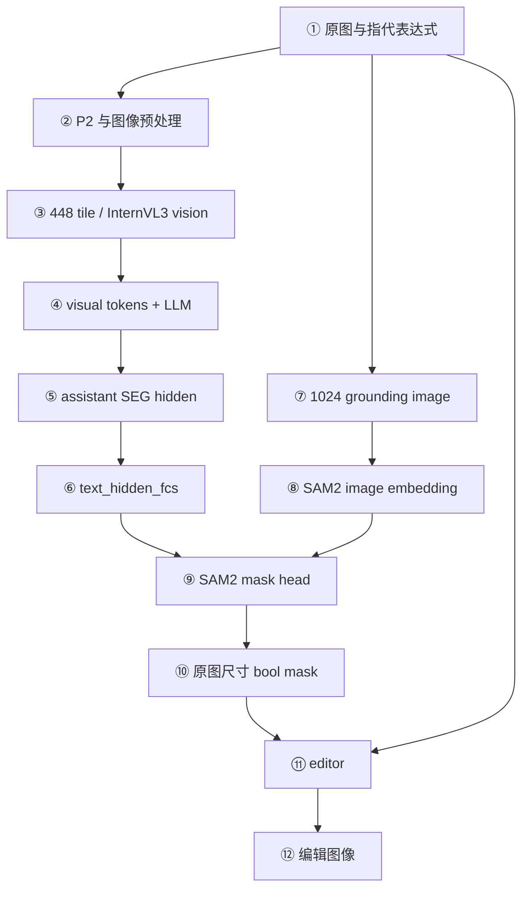
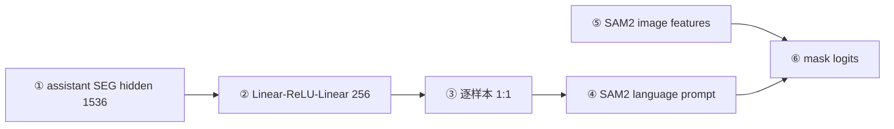
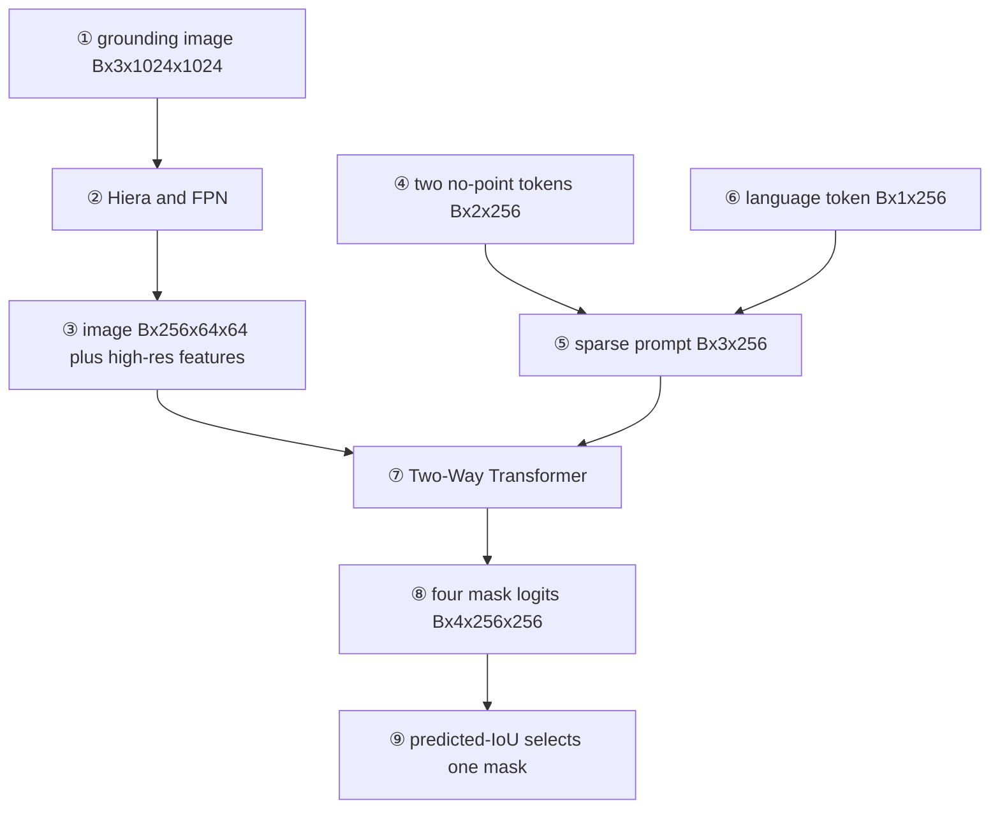
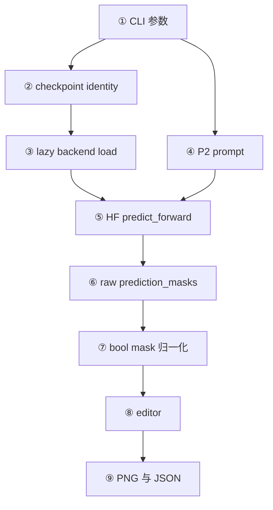
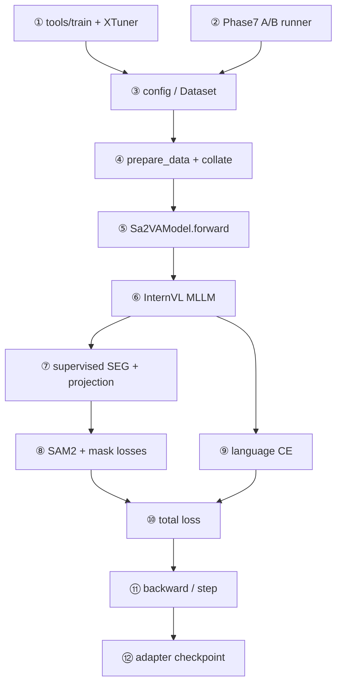
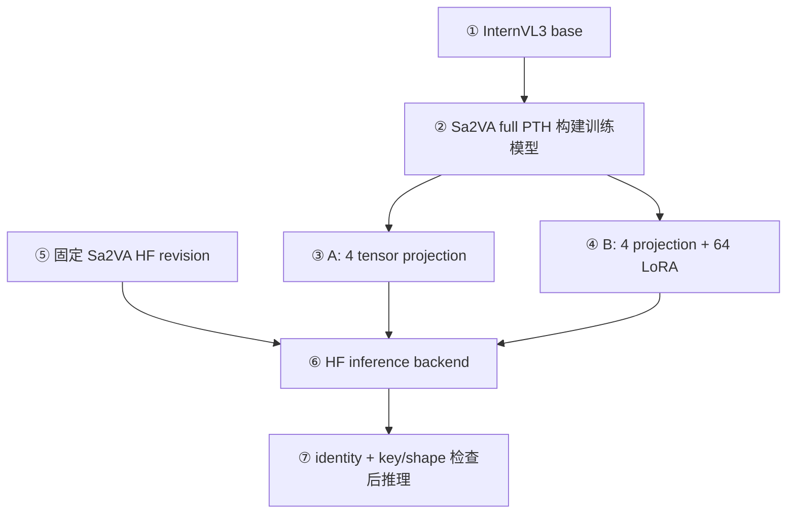

# ChartGround-Edit 项目代码学习手册：从数据到 MLLM、SAM2 与图表编辑

> 基于 `dace042` 审读源码。本手册是代码学习路线，不是运行报告。下文的模型形状若来自 Phase 4B 历史诊断会明确标出；仅靠静态源码无法确定的运行时值，不写成固定常数。所有路径相对于本仓库，链接从本文件所在的 `docs/` 目录解析。

## 0. 如何使用这份手册

不必从头读到尾。只想运行无 GT 编辑：先看 §1、§2、§10、§11、§14。想理解推理数据流：读 §2、§6–§10、§15–§16。想理解训练、LoRA 与 SAM2：读 §4–§9、§12–§14，再用 §17 的断点核对。

这里有四种代码边界，不可混为一谈：

| 边界 | 示例 | 本手册如何称呼 |
|---|---|---|
| 自研项目 | [`training/sa2va_adapter.py`](../chartground_edit/training/sa2va_adapter.py)、[`inference/sa2va_backend.py`](../chartground_edit/inference/sa2va_backend.py) | ChartGround-Edit |
| 仓库内 Sa2VA 训练源码 | [`Sa2VAModel`](../../sa2va/models/sa2va.py)、[`SAM2TrainRunner`](../../sa2va/models/sam2_train.py) | 上游训练路径；其中对齐 hook 是本 fork 的小修改 |
| HF checkpoint remote code | [`modeling_sa2va_chat.py`](../../sa2va/hf/models/modeling_sa2va_chat.py)、[`sam2.py`](../../sa2va/hf/models/sam2.py) | 仓库镜像供阅读；真正推理以固定 revision 的 checkpoint 内文件为准 |
| 外部第三方 | XTuner、PEFT、SAM2 基础实现 | 只写本仓库可确认的调用接口，不猜内部行为 |

第一次读代码建议按这个顺序：[`schema_v2.py`](../chartground_edit/datasets/schema_v2.py) → [`data_adapter.py`](../chartground_edit/training/data_adapter.py) → [`sa2va_adapter.py`](../chartground_edit/training/sa2va_adapter.py) → [`base.py`](../../sa2va/datasets/base.py) → [`data_utils.py`](../../sa2va/datasets/data_utils.py) → [`sa2va.py`](../../sa2va/models/sa2va.py) → [`internvl.py`](../../sa2va/models/mllm/internvl.py) → [`sam2_train.py`](../../sa2va/models/sam2_train.py) → [`sa2va_backend.py`](../chartground_edit/inference/sa2va_backend.py) → [`mask_processing.py`](../chartground_edit/inference/mask_processing.py) → [`editor.py`](../chartground_edit/editing/editor.py) → [`strategy_b.py`](../chartground_edit/training/strategy_b.py) → [`run_chartground_edit.py`](../scripts/run_chartground_edit.py)。

### 0.1 先只记住一条最短主线

如果你第一次看多模态分割代码，先不要同时理解 InternVL、LLM、SAM2、LoRA 和训练框架。先把一次单样本前向压缩成下面八句话：

1. Dataset 读取一张图、一个“要找谁”的短句，以及训练时才有的 GT mask。
2. 同一张图复制成两路：一路做成 InternVL 的 448 tile；一路缩放成 SAM2 的 1024×1024 输入。
3. InternVL 把 tile 变成视觉 token，并用这些向量替换文本序列中的 `<IMG_CONTEXT>` 占位 token。
4. LLM 接收已经混合图像和文本的 `inputs_embeds[B,L,1536]`，输出每个序列位置的最后层 hidden state `[B,L,1536]`。
5. 训练只选 assistant 回答中的 `[SEG]` 位置；单目标时得到每个样本一个 1536 维向量。
6. `text_hidden_fcs` 把 1536 维向量变成 SAM2 能接收的 256 维 language prompt。
7. SAM2 一边保存图像的空间特征，一边让 language prompt 与这些空间特征通过 Two-Way Transformer 交互，最后输出 256×256 mask logits。
8. 训练用 logits 与 GT 算 mask loss；推理把 logits 恢复到原图尺寸并阈值化，再由 editor 修改像素。


| 节点 | 第一次阅读对应源码 | 此时只需回答的问题 |
|---|---|---|
| ① | [`Phase7V2SplitDataset._load_sample()`](../chartground_edit/training/data_adapter.py#L219) | 图、表达式、mask 从哪里来？ |
| ② | [`Sa2VADatasetMixin._process_single_image()`](../../sa2va/datasets/base.py#L121) | 为什么一张图要预处理两次？ |
| ③ | [`InternVLMLLM._embed_visual_features()`](../../sa2va/models/mllm/internvl.py#L269) | visual token 替换了哪些文本占位？ |
| ④–⑤ | [`Sa2VAModel.forward()`](../../sa2va/models/sa2va.py#L341) | 为什么只取 assistant `[SEG]`？ |
| ⑥ | [`Sa2VAModel.text_hidden_fcs`](../../sa2va/models/sa2va.py#L84) | 1536 为什么要变成 256？ |
| ⑦ | [`SAM2Base._forward_sam_heads()`](../../sa2va/models/extension/sam2_base.py#L112) | 语言 token 在哪里与图像 feature 相遇？ |
| ⑧ | [`Sa2VAModel.forward()`](../../sa2va/models/sa2va.py#L406)、[`edit()`](../chartground_edit/editing/editor.py#L39) | 当前是在训练还是推理？ |

后文所有章节都只是在展开这八步。读到不懂的地方，先判断它属于哪一步，不要立刻钻进第三方模型的每一层。

### 0.2 张量形状怎么读

本手册大量使用 `[B,L,D]`、`[B,C,H,W]`。方括号不是某个具体 tensor 的变量名，而是在写各维含义：

| 符号 | 含义 | 本项目例子 |
|---|---|---|
| `B` | batch size，一次并行处理几个样本 | 正式训练是 1，但代码必须支持 batch 维 |
| `L` | 语言序列长度 | Prompt、图像占位、assistant target 和 padding 合计；随样本变化 |
| `D` | token 向量维度 | InternVL3 LLM hidden size 为 1536 |
| `T` | 一个 batch 合计的动态 tile 数 | Phase 4B smoke 历史观测为 7，不是固定值 |
| `C` | 图像 feature channel 数 | SAM2 主 feature 是 256 通道 |
| `H,W` | 当前坐标空间的高和宽 | 原图、1024 画布、64 feature map、256 logits 各不相同 |
| `N` | 某类 token、对象或点的数量 | 单目标 supervised SEG 数量为 1 |
| `M` | SAM2 候选 mask 数 | 当前首次无点击路径会产生 3 个候选再选一个 |

例如 `input_ids[B,L]` 中每个元素只是词表里的整数编号；它没有 1536 维语义。查 embedding table 后才得到 `inputs_embeds[B,L,1536]`。LLM 输出 `hidden_states[B,L,1536]`；再经过 `text_hidden_fcs` 才得到 `[B,L,256]`。因此不要说“MLLM 直接得到 `[B,L,256]`”：**1536 是 LLM 空间，256 是 SAM2 prompt 空间**。

还有两个常见阅读误区：

- `PIL.Image.size` 的顺序是 `(W,H)`；PyTorch 图像 tensor 通常是 `[C,H,W]`。
- reshape 只改变观察方式，不学习参数；`Linear`、卷积、attention 会用参数改变特征。

### 0.3 同一张图涉及四套坐标，不要混用

| 坐标/特征空间 | 典型形状 | 用途 | 能否直接和原图像素一一对应 |
|---|---|---|---|
| 原图 | RGB `[H,W,3]`，GT `[1,H,W]` | 保存、编辑、最终评测 | 可以 |
| InternVL tile | `[N_tiles,3,448,448]` | 让 MLLM 看图并理解指代 | 不可以；有动态切片和缩放 |
| SAM2 输入画布 | `[B,3,1024,1024]` | 提取 grounding 空间 feature | 是原图的统一缩放版，但仍不是最终输出尺寸 |
| SAM2 feature/logit | feature `[B,256,64,64]`，logit `[B,1,256,256]` | mask decoder 内部计算 | 需要插值回原图 |

这解释了为什么系统不是“InternVL 直接输出 mask”：InternVL 的 visual token 更适合语义，SAM2 的 feature map 保留了专门用于分割的空间结构。它们通过 256 维 language prompt 汇合，而不是共享同一张 feature map。

### 0.4 三个名字里都有“映射”，但不是一回事

初学时最容易把下面三类层混为一谈：

| 名称 | 输入 → 输出 | 所属模块 | 是否由最终 Strategy B 训练 |
|---|---|---|---|
| InternVL `mlp1` | pixel-shuffle 后视觉通道 4096 → LLM hidden 1536 | MLLM 图像进入语言的桥 | 否，冻结 |
| `text_hidden_fcs` | LLM `[SEG]` hidden 1536 → SAM2 prompt 256 | Sa2VA 语言进入分割的桥 | 是，四个 tensor |
| LoRA `A/B` | 给 LLM 最后 8 层 attention 权重增加低秩增量 | LLM 内部 q/k/v/o | Strategy B 训练 |

用户问“projection 在哪里”时，本项目默认指第二行的 `text_hidden_fcs`，不是 InternVL `mlp1`，也不是 LoRA。

### 0.5 哪些是官方结构，哪些是本项目工作

ChartGround-Edit 没有另造一个新的 mask decoder。InternVL → `[SEG]` → `text_hidden_fcs` → SAM2 是 Sa2VA 的基本结构。本项目在主线中做的是：

- 构造并审计图表领域 synthetic_v1/v2 数据；
- 固定 P2，把模型输入限定为 referring expression；
- 修正本项目 Prompt 出现双 `[SEG]` 后的训练 token-mask 对齐；
- 用 projection-only 和最后 8 层 attention LoRA 做受控适配；
- 实现严格 adapter identity、离线评测和 predicted-mask 编辑闭环。

它**没有**加入显式“图例 glyph → 曲线”匹配模块，也没有替换专门面向细线/散点的 SAM2 decoder。冻结结果中 `line/trend` 仍弱，256/320 个 v2 test 样本 IoU<0.5。因此手册后面解释的是“当前代码如何工作”，不是声称架构已经从根本上解决所有科学图表难点。

## 1. 项目解决什么问题

设图里有多条曲线。用户说“将图例中虚线对应的曲线高亮”。系统需要先把“图例中虚线”与整张图上的一条曲线关联起来，再给出该曲线每个像素的二值 mask，最后仅依据预测 mask 做高亮。输出不是一个类别、边界框或问答字符串，而是 `mask[H,W]` 和一张编辑后的图。主链是**指代理解 → 目标定位 → 像素分割 → 可控编辑**。

训练数据的完整编辑句子留在 JSONL 供评测/编辑使用；送入模型的 P2 只放 `referring_expression`。这使模型负责“找谁”，编辑器负责“怎样改”。若 mask 选错序列，编辑器会忠实地改错序列；编辑成功不等于分割正确。入口分别是 [`Phase7V2SplitDataset._load_sample()`](../chartground_edit/training/data_adapter.py)、[`Sa2VAInternVL3Backend.predict_prompt()`](../chartground_edit/inference/sa2va_backend.py) 和 [`edit()`](../chartground_edit/editing/editor.py)。

## 2. 顶层架构与两条视觉数据流



| 节点 | 源码入口与可确认的职责 |
|---|---|
| ① | [`Phase7V2SplitDataset.__getitem__()`](../chartground_edit/training/data_adapter.py) 或无 GT [`run()`](../scripts/run_chartground_edit.py)：读原图及指代 |
| ② | [`build_prompt_variant()`](../chartground_edit/inference/prompt_variants.py)、[`Sa2VADatasetMixin._process_single_image()`](../../sa2va/datasets/base.py) |
| ③ | [`dynamic_preprocess()`](../../sa2va/datasets/data_utils.py)、[`Sa2VAChatModel.extract_feature()`](../../sa2va/hf/models/modeling_sa2va_chat.py) |
| ④ | [`InternVLMLLM._llm_forward()`](../../sa2va/models/mllm/internvl.py)：训练路径将视觉 embedding 填入文本序列 |
| ⑤ | 训练 [`Sa2VAModel.select_seg_token_mask()`](../../sa2va/models/sa2va.py)；推理 [`get_seg_hidden_states()`](../../sa2va/hf/models/modeling_sa2va_chat.py) |
| ⑥ | [`Sa2VAModel.text_hidden_fcs`](../../sa2va/models/sa2va.py)；HF 镜像中 [`Sa2VAChatModel.text_hidden_fcs`](../../sa2va/hf/models/modeling_sa2va_chat.py) |
| ⑦ | [`DirectResize.apply_image()`](../../sa2va/models/preprocess/image_resize.py)；与 tile 路径分开 |
| ⑧ | 训练 [`SAM2TrainRunner.get_sam2_embeddings()`](../../sa2va/models/sam2_train.py)；HF [`SAM2.get_sam2_embeddings()`](../../sa2va/hf/models/sam2.py) |
| ⑨ | 训练 [`SAM2TrainRunner.inject_language_embd()`](../../sa2va/models/sam2_train.py)；HF [`SAM2.language_embd_inference()`](../../sa2va/hf/models/sam2.py) |
| ⑩ | HF [`Sa2VAChatModel.predict_forward()`](../../sa2va/hf/models/modeling_sa2va_chat.py) 阈值化；项目 [`process_prediction_masks()`](../chartground_edit/inference/mask_processing.py) 检查 |
| ⑪–⑫ | [`edit()`](../chartground_edit/editing/editor.py) 与 [`run()`](../scripts/run_chartground_edit.py) 保存结果 |

同一张图必须走两路。**MLLM 路**：`dynamic_preprocess` 依据宽高比切成运行时数量的 448×448 tile，InternVL3 vision model 提取 patch feature，经 pixel shuffle/downsample 与 `mlp1` 形成 visual tokens，替换文本里的 `<IMG_CONTEXT>` 占位后进 LLM。它擅长图例、颜色、趋势等语义关联。**Grounding 路**：原图由 `DirectResize(1024)` 变成 SAM2 输入，单独提取空间 feature；由投影后的 `[SEG]` 向量给 mask head 提示，负责像素定位。tile 几何与 SAM2 的 1024 方图并不互相替代，也不能拿 tile mask 直接当原图 mask。

## 3. 仓库结构地图

只列主链文件；“高”表示第一次应读。表内每项都是可点击的当前源码。

| 类别 | 文件 / symbol | 来源 | 优先级与位置 |
|---|---|---|---|
| schema | [`schema_v2.py::validate_annotation_v2`](../chartground_edit/datasets/schema_v2.py) | 项目 | 高；JSONL 与 mask 契约 |
| 生成 | [`synthetic_v2.py::generate_synthetic_v2`](../chartground_edit/datasets/synthetic_v2.py)、[`render_v2.py::render_scene_v2`](../chartground_edit/datasets/render_v2.py) | 项目 | 中；几何与指令从哪里来 |
| 数据读取 | [`data_adapter.py::Phase7V2SplitDataset`](../chartground_edit/training/data_adapter.py) | 项目 | 高；split、P2、mask |
| 训练桥接 | [`sa2va_adapter.py::ChartGroundPhase4Dataset`](../chartground_edit/training/sa2va_adapter.py) | 项目 | 高；tokenizer/两路图像 |
| 官方 collate | [`data_utils.py::sa2va_collect_fn`](../../sa2va/datasets/data_utils.py) | 上游 | 高；batch 字段 |
| Prompt | [`prompt_variants.py::build_prompt_variant`](../chartground_edit/inference/prompt_variants.py) | 项目 | 高；P2 文本 |
| 对齐 | [`alignment.py::validate_strict_one_to_one`](../chartground_edit/training/alignment.py)、[`Sa2VAModel.select_seg_token_mask`](../../sa2va/models/sa2va.py) | 项目 + fork hook | 高；双 SEG 防护 |
| 训练模型 | [`sa2va.py::Sa2VAModel.forward`](../../sa2va/models/sa2va.py)、[`internvl.py::InternVLMLLM._llm_forward`](../../sa2va/models/mllm/internvl.py) | 上游 | 高；语言/分割 loss |
| SAM2 训练桥 | [`sam2_train.py::SAM2TrainRunner`](../../sa2va/models/sam2_train.py) | 上游 | 高；图像 embedding 与 mask head |
| 推理后端 | [`sa2va_backend.py::Sa2VAInternVL3Backend`](../chartground_edit/inference/sa2va_backend.py) | 项目 | 高；懒加载和 mask 合约 |
| HF 推理 | [`modeling_sa2va_chat.py::Sa2VAChatModel.predict_forward`](../../sa2va/hf/models/modeling_sa2va_chat.py)、[`sam2.py::SAM2.language_embd_inference`](../../sa2va/hf/models/sam2.py) | HF 镜像 | 中；实际以 checkpoint remote code 为准 |
| Mask 后处理 | [`mask_processing.py::process_prediction_masks`](../chartground_edit/inference/mask_processing.py) | 项目 | 高；原图尺寸 bool |
| 编辑 | [`editor.py::edit`](../chartground_edit/editing/editor.py) | 项目 | 高；四动作 |
| LoRA/checkpoint | [`strategy_b.py::ChartGroundStrategyBModel`](../chartground_edit/training/strategy_b.py)、[`projection_checkpoint.py::load_projection_checkpoint_into_model`](../chartground_edit/inference/projection_checkpoint.py) | 项目 | 中；冻结/加载 |
| 评测 | [`metrics.py::intersection_over_union`](../chartground_edit/inference/metrics.py)、[`run_phase7c_v2_frozen_test.py::summarize`](../scripts/run_phase7c_v2_frozen_test.py) | 项目 | 中；单样本到组指标 |
| CLI/config | [`run_chartground_edit.py::run`](../scripts/run_chartground_edit.py)、[`phase7b_v2_lora.py`](../configs/phase7b_v2_lora.py) | 项目 | 高/中；用户和训练配置 |
| Tests | [`tests/test_phase4b_alignment.py`](../tests/test_phase4b_alignment.py)、[`tests/test_inference.py`](../tests/test_inference.py)、[`tests/test_editing.py`](../tests/test_editing.py) | 项目 | 随章节定位契约 |

## 4. synthetic_v2 样本：随机参数怎样成为图和 mask

[`build_generation_plan_v2()`](../chartground_edit/datasets/synthetic_v2.py) 固定 4 图型×4 指代×每组 100 条，组内 train/val/test=60/20/20；同一组四动作分别 15/5/5。它预先分配 seed、画布、legend、theme、交叉等参数。[`render_scene_v2()`](../chartground_edit/datasets/render_v2.py) 画几何、原图和目标 mask。生成器再调用 [`_referring_expression()`](../chartground_edit/datasets/synthetic_v2.py)、[`_edit_parameters()`](../chartground_edit/datasets/synthetic_v2.py)、[`_full_instruction()`](../chartground_edit/datasets/synthetic_v2.py)，写 JSONL；[`validate_jsonl_v2()`](../chartground_edit/datasets/schema_v2.py) 对 1600 条与文件做校验。审计入口是 [`audit_synthetic_v2.py::main()`](../scripts/audit_synthetic_v2.py)，画廊入口是 [`generate_synthetic_v2.py::main()`](../scripts/generate_synthetic_v2.py)。**本手册不重新生成数据。**

```text
固定 seed / style plan → 几何与实体 → 原图 → target index
→ 二值 mask → referring expression → action/parameters → JSONL
```

真实 train 记录 `cgev2_line_category_1609c9161fd4` 的可读子集如下（省去冗长的 `generation_metadata`）：

```json
{
  "sample_id": "cgev2_line_category_1609c9161fd4",
  "split": "train", "chart_type": "line", "referring_type": "category",
  "image_path": "images/cgev2_line_category_1609c9161fd4.png",
  "mask_path": "masks/cgev2_line_category_1609c9161fd4.png",
  "referring_expression": "类别 Group B 对应的曲线",
  "full_instruction": "在图中识别类别 Group B 对应的曲线，然后高亮该元素（强度 0.65）。",
  "edit_action": "highlight", "edit_parameters": {"strength": 0.65},
  "difficulty": "easy", "distractor_count": 1,
  "image_width": 720, "image_height": 360
}
```

完整记录还有 `schema_version`、`target_type`、`target_attributes`、`scene_id`、`content_id`、`style_family`、`instruction_template_family`、`generation_metadata`、`diversity_metadata`。后者记录 `degradation`、颜色距离、线宽、marker、遮挡、系列数等；不要把 `difficulty` 等同于 `distractor_count`。`scene_id/content_id/style/template` 为审计 split/近重复服务。生成器写这些字段，schema 检查枚举、安全相对路径、图像尺寸、PNG mask 的 `{0,255}` 非空性与 `referring_expression` 属于 `full_instruction`。图像几何退化必须同步用于 mask；参见 [`render_scene_v2()`](../chartground_edit/datasets/render_v2.py) 和 [`validate_annotation_v2()`](../chartground_edit/datasets/schema_v2.py)。

| 字段组 | 谁消费它；是否进入训练模型 |
|---|---|
| `sample_id/split/image_path/mask_path/size` | [`Phase7V2SplitDataset`](../chartground_edit/training/data_adapter.py) 过滤并读取；图、mask 和 ID 进入训练桥；评测也读 |
| `referring_expression` | [`_load_sample()`](../chartground_edit/training/data_adapter.py) 用它生成 P2；**进入模型** |
| `full_instruction` | 生成与 schema 审计、可读展示；P2 不用它的动作词；**不进入训练模型** |
| `edit_action/edit_parameters` | 冻结评测调用编辑器；**不进入训练模型** |
| `chart_type/referring_type/difficulty/distractor_count` | 平衡、审计和分组指标；不进入训练模型 |
| `target_attributes/scene/content/style/template/generation/diversity` | 生成、校验、数据分析；不进入训练模型 |

第一处断点：[`Phase7V2SplitDataset.__init__()`](../chartground_edit/training/data_adapter.py)，观察 `split`、`allow_test`、manifest SHA 与 `records`。默认拒绝 test；只有冻结 test runner 显式 `allow_test=True`。常见错误：直接把 JSONL 的 `full_instruction` 喂给 P2，会让编辑动作污染“找谁”；看 [`test_phase7a_v2_projection.py`](../tests/test_phase7a_v2_projection.py)、[`test_synthetic_v2.py`](../tests/test_synthetic_v2.py)。

## 5. Dataset Reader 到训练 batch

调用顺序是 [`Phase7V2SplitDataset.__getitem__()`](../chartground_edit/training/data_adapter.py) → [`_load_sample()`](../chartground_edit/training/data_adapter.py) → [`ChartGroundPhase4Dataset.prepare_data()`](../chartground_edit/training/sa2va_adapter.py) → [`Sa2VADatasetMixin._process_single_image()`](../../sa2va/datasets/base.py) → [`get_inputid_labels()`](../../sa2va/datasets/base.py) → [`chartground_sa2va_collect_fn()`](../chartground_edit/training/sa2va_adapter.py) → [`sa2va_collect_fn()`](../../sa2va/datasets/data_utils.py)。类名沿用 Phase 4，但 `dataset_protocol="synthetic_v2"` 时真实来源是 v2。

Reader 在 `_load_sample()` 中打开 RGB 图与 `L` mask，把 `{0,255}` 转为 `uint8 [1,H,W]` 的 0/1，构造 P2 与 `Sure, [SEG].`。`prepare_data()` 再核查尺寸、二值和非空；MLLM 路产生动态 tile `pixel_values[N_tiles,3,448,448]`，SAM2 路经 `DirectResize.apply_image()` 产生 `g_pixel_values[3,1024,1024]`，但 GT 仍保留原图 `H×W`。`_process_conversations_for_encoding()` 将 `<image>` 扩展成 `<IMG_CONTEXT>…</img>`；`get_inputid_labels()` 经过 XTuner conversation template 与 [`tokenize_conversation()`](../../sa2va/datasets/data_utils.py)。

把这段调用拆开看，一条记录先后经历以下状态：

1. `Phase7V2SplitDataset._load_sample(index)` 读 JSON dict。它只把 `referring_expression` 放进 P2；`full_instruction`、action 和审计元数据不进入模型。
2. `Image.open(...).convert("RGB")` 得到原图；mask 以灰度 `L` 打开，转 NumPy 后检查值域，再变为 `[1,H,W]` 的 tensor。开头的 `1` 表示“一张目标 mask”，不是 RGB channel。
3. `_load_sample()` 返回的 conversation 逻辑上是 human=P2、assistant=`Sure, [SEG].`。此时还是字符串，尚无 token ID。
4. `ChartGroundPhase4Dataset.prepare_data(index)` 把样本交给 `Sa2VADatasetMixin`。这里对同一张原图分别构造 `pixel_values` 和 `g_pixel_values`。
5. `_process_single_image()` 用动态切片 transform 生成若干 tile。一个 tile 不是一个 token；固定配置下一个 tile 稍后会成为 256 个 visual tokens。
6. 同一方法用 `grounding_image_processor` 生成 SAM2 的 1024 方图。GT 不跟着强制变成 1024；它保留原图分辨率，直到算 loss 时才对齐到 logits。
7. `_process_conversations_for_encoding()` 根据 tile 数，把原始 `<image>` 占位展开为足够数量的 `<IMG_CONTEXT>`。若有 7 个 tile，就是 7×256=1792 个图像上下文 token。
8. `get_inputid_labels()` 把 conversation template、system/human/assistant 分隔符一起 tokenize，得到一维 `input_ids[L]` 与 `labels[L]`。
9. `chartground_sa2va_collect_fn()` 先做 strict 1:1 检查，再调用官方 `sa2va_collect_fn()` padding；batch size 1 后文本字段多一维成为 `[1,L]`，图像和 mask 仍按 list 保留。

为什么图像字段保留 list，而文本可以直接 stack？因为不同宽高比产生不同 `N_tiles`，`pixel_values` 的第一维不一定相等；原图尺寸也不同，所以 GT `[1,H,W]` 不能在 collate 时直接堆成一个规则 tensor。模型前向会在合适的位置拼 tile，而不会把不同尺寸的 GT 强行 padding 成同一尺寸。

| batch `data` 字段 | 源码契约 / 典型形状 | dtype | 消费者 |
|---|---|---|---|
| `input_ids` | `[B,L]`，L 随文字和 tile 数变 | `long` | MLLM、SEG 选择 |
| `labels` | `[B,L]`，human/padding 为 -100 | `long` | language CE、SEG 选择 |
| `attention_mask` | `[B,L]`，从原长度构造 | `bool` | LLM |
| `position_ids` | `[B,L]` | `long` | LLM |
| `pixel_values` | **list**，每元素 `[N_tiles,3,448,448]`；不是统一 `[B,...]` | transform 产出 float | InternVL vision |
| `g_pixel_values` | list，每帧 `[3,1024,1024]`；forward 再 stack | 原始像素 tensor，进入模型后转 BF16 | SAM2 |
| `masks` | list，每样本 `[1,H,W]`，原图尺寸 | `uint8` | 分割 loss |
| `frames_per_batch` | 长度 B，此单图场景各为 1 | Python int | Sa2VAModel |
| `sample_ids/alignment_records` | 长度 B | 字符串 / dict | 严格对齐与日志 |

上述是代码契约。历史 Phase 4B smoke1 **v1** 实测为 `L=1844`、tile `7×3×448×448`、SAM 图 `3×1024×1024`、GT `[1,320,480] uint8`；不是 v2 每张图固定形状。v2 上方真实样本的原图是 720×360，若不运行 tokenizer，不能声称它的 L 或 tile 数。`ChartGroundPhase4Dataset` 的 PyTorch `__getitem__` 继承 [`Sa2VABaseDataset.__getitem__()`](../../sa2va/datasets/base.py)；项目训练脚本为确定顺序直接调用 `prepare_data(index)`。检查 [`test_phase4a_training_data.py`](../tests/test_phase4a_training_data.py)、[`test_phase4b_alignment.py`](../tests/test_phase4b_alignment.py)。断点观察 `num_image_tokens`、`pixel_values.shape`、`labels[input_ids==seg_id]` 与 `alignment_records`。

## 6. Prompt、Conversation 与双 `[SEG]`

P2 `target_only_zh` 固定在 [`PROMPT_TEMPLATES`](../chartground_edit/inference/prompt_variants.py)：`<image>请分割图中由以下指代表达式指定的图表元素：{referring_expression}\n请使用 [SEG] 标记返回分割掩码。`。训练助手目标固定为 [`ASSISTANT_TARGET`](../chartground_edit/training/data_adapter.py) 的 `Sure, [SEG].`。两边均有一个 `[SEG]`，但仅助手目标需要监督。[`tokenize_conversation()`](../../sa2va/datasets/data_utils.py) 对 human span 写 `labels=-100`，对 assistant span 写 token ID；[`InternVLMLLM._compute_loss()`](../../sa2va/models/mllm/internvl.py) shift logits/labels 算 causal CE。

先区分 `input_ids` 与 `labels`。二者形状相同，但职责不同：

| 序列区域 | `input_ids` 里是什么 | `labels` 里是什么 | 语言 CE 是否监督 |
|---|---|---|---|
| system / human Prompt | 实际 token ID | `-100` | 否 |
| `<IMG_CONTEXT>` | 图像占位 token ID | `-100` | 否 |
| assistant target | `Sure, [SEG].` 的实际 token ID | 同一目标 token ID | 是 |
| batch padding | pad token ID | `-100` | 否 |

`labels=-100` 不是把 token 从输入删掉。user Prompt 仍然被 LLM 看到，只是 `CrossEntropyLoss` 不要求模型在这些位置预测下一个 token。换句话说：`input_ids` 决定“模型看什么”，`labels` 决定“哪些位置计算语言监督”。本项目又复用这条监督边界，决定哪个 `[SEG]` 代表 GT mask。

可以把双 `[SEG]` 的一小段抽象为：

```text
位置       ... user_SEG ... assistant_SEG ...
input_ids  ... 151674   ... 151674        ...
labels     ... -100     ... 151674        ...
原选择     ... true     ... true          ...
新选择     ... false    ... true          ...
```

P2 中 user `[SEG]` 只是自然语言格式要求的一部分；Sa2VA 真正用于 mask 的语义锚点应是 assistant 输出位置。就模型结构而言，user Prompt 并非必须包含 `[SEG]`，官方问题模板通常也不把它写进问题。本项目没有在冻结实验中删掉它，因为 P2 identity 已预注册；工程上改用 labels-aware 选择，使 Prompt 文案是否出现同名 token 不再破坏监督边界。

Phase 4B 历史真实 tokenizer 诊断（**v1 smoke1，不是 v2 观测**）见 [`phase4b_alignment_protocol.md`](phase4b_alignment_protocol.md)：`cgev1_bar_category_6d51bac154` 的 `seg_token_idx=151674`，`L=1844`；user `[SEG]` 在位置 1823、label -100，assistant 在位置 1840、label 151674。原条件 `input_ids == seg_token_idx` 选两处。旧 [`check_obj_number(...,fix_number=5)`](../../sa2va/models/sa2va.py) 先把 2 token/1 mask 静默截成 1/1，再重复到 5/5；甚至可能留下错误的 user token。不能选“最后一个”或“第二个”——Prompt 或 target 的 token 个数/顺序会变化。

```python
# 示意；正式实现见 select_seg_token_mask 与 alignment.py
supervised_seg_mask = (input_ids == seg_token_idx) & (labels != -100)
assert per_sample_seg_count == per_sample_gt_count == 1
```

项目 collator 的 [`select_supervised_seg_tokens()`](../chartground_edit/training/alignment.py) 和模型 [`Sa2VAModel.select_seg_token_mask()`](../../sa2va/models/sa2va.py) 均检查 labels shape/device/dtype。前者 [`validate_strict_one_to_one()`](../chartground_edit/training/alignment.py)，后者 [`validate_strict_alignment()`](../../sa2va/models/sa2va.py) 在 MLLM forward **之前**记录 sample ID、token positions、两侧数量并 fail-fast。`object_count_policy="strict_one_to_one"` 绕开旧 `check_obj_number`；默认上游仍是 `all + legacy_fix_number`，兼容旧配置。这里的 `[SEG]` 是语言模型输出的特殊 token，其最后层 hidden state 同时作为分割 prompt，不是“输出了四个字符就有 mask”。

推荐断点：`chartground_sa2va_collect_fn` 返回前、`Sa2VAModel.forward` 的 `select_seg_token_mask` 后，检查两个 `[SEG]` 的 labels 和逐样本 count。测试：[`test_phase4b_alignment.py`](../tests/test_phase4b_alignment.py)。错误征兆：`[SEG]` 生成率高但 mask 错、user token 误入监督、sample ID 与 mask 个数错配。

## 7. InternVL3 MLLM 在这里做什么

### 7.1 先区分 ID、embedding、hidden state 和 logit

一条文本在模型中会出现四种容易混淆的表示：

| 名称 | 例子 shape | 它是什么 | 它不是什么 |
|---|---|---|---|
| `input_ids` | `[B,L]` | tokenizer 查词表得到的整数编号 | 不是语义向量 |
| `inputs_embeds` | `[B,L,1536]` | embedding table 查出的连续向量，部分位置会被视觉向量覆盖 | 还没经过 28 层 LLM |
| `hidden_states[-1]` | `[B,L,1536]` | 最后一层对每个位置的上下文表示，已经融合前文和图像 | 不是词表概率，也不是 mask |
| language logits | `[B,L,V]` | 每个位置预测词表 `V` 中下一个 token 的未归一化分数 | 不送入 SAM2 |

所以 `[SEG] hidden` 不是 token ID 151674，也不是字符串 `"[SEG]"`。它是最后层 hidden tensor 中 `[SEG]` 位置那一行 1536 维浮点数。相同 token ID 在不同图像、不同句子中会得到不同 hidden，因为上下文注意力已经改变了它。

### 7.2 文本骨架先占位，再把视觉向量填进去

模型不会把 `[T,3,448,448]` 图像 tensor 直接和 `[B,L]` token ID 拼接。实际过程是：

1. tokenizer 先把 conversation 变成 `input_ids[B,L]`。
2. 文本 embedding table 把每个 ID 查成 1536 维，得到 `input_embeds[B,L,1536]`。
3. 图像位置目前只是重复的 `<IMG_CONTEXT>` ID；它们查到的普通 token embedding 只是临时占位。
4. vision encoder 独立把每个 tile 变成 256 个 1536 维 visual embeddings。
5. `_embed_visual_features()` 找出全部 `<IMG_CONTEXT>` 位置，原地把临时 token embedding 替换成 visual embeddings。
6. 替换后的序列仍是 `[B,L,1536]`，因此普通 decoder-only LLM 可以直接接收 `inputs_embeds`。

一个极小的概念示例：

```text
token 位置:   [BOS] [IMG_1] [IMG_2] ... [文本“曲线”] ... [SEG]
替换前:       文本向量  占位向量 占位向量      文本向量          文本向量
替换后:       文本向量  视觉向量1 视觉向量2     文本向量          文本向量
进入 LLM:                 统一形状 [B,L,1536]
```

这里的 `[IMG_1]` 只是帮助理解；源码实际重复同一个 `<IMG_CONTEXT>` token ID，并靠位置不同承载不同 visual embeddings。

### 7.3 一个 448 tile 为什么变成 256 个 visual tokens

训练 [`InternVLMLLM.forward()`](../../sa2va/models/mllm/internvl.py#L252) 把 batch 内 list tile 拼成 `[T,3,448,448]`，其中 `T=ΣN_tiles`。固定 checkpoint 的 vision patch size=14，所以一个 tile 先形成 `32×32=1024` 个 patch，另有一个 CLS token：

```text
448 / 14 = 32
32 × 32 = 1024 patch tokens
vision encoder 输出包含 CLS，所以 token 数 = 1025
```

[`extract_feature()`](../../sa2va/hf/models/modeling_sa2va_chat.py#L222) 删掉 CLS，把 1024 个位置还原成 `32×32` 网格。`pixel_shuffle(scale=0.5)` 并不是丢掉四分之三信息，而是把相邻 `2×2` 的四个位置收进 channel：空间从 `32×32` 变成 `16×16`，通道从 1024 变成 4096。随后 `mlp1` 把 4096 映射到 LLM hidden 1536。最终一个 tile 得到 `16×16=256` 个 visual tokens。


| 节点 | 源码 | 本配置中的形状变化 |
|---|---|---|
| ① | [`dynamic_preprocess()`](../../sa2va/datasets/data_utils.py) | 每个 tile `[3,448,448]`；tile 数运行时可变 |
| ②–⑤ | [`Sa2VAChatModel.extract_feature()`](../../sa2va/hf/models/modeling_sa2va_chat.py#L222) | `[T,1025,1024] → [T,256,1536]` |
| ④ | [`Sa2VAChatModel.pixel_shuffle()`](../../sa2va/hf/models/modeling_sa2va_chat.py#L206) | `[T,32,32,1024] → [T,16,16,4096]` |
| ⑥ | [`InternVLMLLM._embed_visual_features()`](../../sa2va/models/mllm/internvl.py#L269) | 必须正好替换 `T×256` 个位置 |
| ⑦ | [`InternVLMLLM._llm_forward()`](../../sa2va/models/mllm/internvl.py#L135) | 统一 `inputs_embeds[B,L,1536]` |
| ⑧ | [`Sa2VAModel.forward()`](../../sa2va/models/sa2va.py#L341) | 最后层 `[B,L,1536]` 中选择目标位置 |

完整张量变化表如下。`32×32` 和 `16×16` 是固定配置推导值，不表示仓库保存了两个额外文件。

| 变化节点 | shape（本固定配置） | 固定性与依据 |
|---|---|---|
| dynamic tile 输入 | `[T,3,448,448]` | `T` 运行时可变；448 配置固定 |
| vision encoder 输出，含 CLS | `[T,1025,1024]` | 1025=`(448/14)²+1`；vision hidden 1024 配置固定 |
| 去 CLS | `[T,1024,1024]` | 源码固定的 `[:,1:,:]` |
| spatial reshape | `[T,32,32,1024]` | 由 1024 patch 数的平方根得到 |
| `pixel_shuffle(0.5)` | `[T,16,16,4096]` | downsample ratio 配置固定 |
| flatten + `mlp1` | `[T,256,1536]` | 256 与 LLM hidden 1536 配置固定 |
| visual token 展平 | `[T×256,1536]` | `T` 运行时可变 |
| `<IMG_CONTEXT>` 位置 | `[T×256]` 个 true | 与 visual token 数必须相等 |
| LLM `inputs_embeds` | `[B,L,1536]` | `B/L` 运行时可变 |
| final hidden state | `[B,L,1536]` | 1536 配置固定 |
| projection 后全序列 | `[B,L,256]` | 当前训练源码先投影全序列 |
| 选择后的 assistant `[SEG]` | 总体 `[B,256]`；逐样本 `[1,256]` | strict 单目标时每样本恰好一个 |

Phase 4B 的 **v1 smoke1 历史观测**是 `B=1`、`T=7`、`L=1844`。因此它有 1792 个 visual token，并可写成：

```text
tile tensor                  [7,3,448,448]
每 tile 的 visual embedding  [7,256,1536]
展平 visual embedding        [1792,1536]
整个 LLM 输入                [1,1844,1536]
整个 LLM 最后层输出          [1,1844,1536]
整个 projection 输出         [1,1844,256]
选中 assistant SEG           [1,256]
SAM2 接口再补 token 维       [1,1,256]
```

只有前面的 token/tile 位置由历史诊断真实记录；中间 hidden 数值未保存。不要把 `T=7`、`L=1844` 套到所有 v2 图片。

### 7.4 LLM 到底怎样让 `[SEG]` 表示“目标曲线”

LLM 的 self-attention 允许 `[SEG]` 位置读取它之前的 Prompt token 和 visual token。训练时 target 已包含 `[SEG]`，这叫 teacher forcing：模型不用先采样出它，整个 target 序列作为输入右移参与 next-token 训练。最后一层 `[SEG]` hidden 因此包含：

- 当前指代表达式的文本条件；
- visual token 中的图表内容；
- LLM 通过训练形成的“这个位置要承载分割目标”语义。

但它仍是一个**全局语义提示向量**，不是 256×256 空间 mask。空间细节保存在另一条 SAM2 image feature 路。后面 mask decoder 要用 cross-attention 让这个提示去查询图像位置。

“回答里出现 `[SEG]`”只证明语言模型输出了约定 token。它不证明 hidden 正确编码了目标：向量可能表示错系列，SAM2 也可能只恢复一部分线段。因此正式评测把 `segmentation_token_present` 与 IoU/Dice 分开。

### 7.5 当前训练源码为何先投影全序列再选择

[`Sa2VAModel.forward()`](../../sa2va/models/sa2va.py#L368) 的真实顺序是：

```python
hidden_states = output.hidden_states
hidden_states = self.text_hidden_fcs(hidden_states[-1])  # [B,L,1536] -> [B,L,256]
pred_embeddings = hidden_states[seg_token_mask]          # [N_supervised,256]
```

因此不是先得到 `[B,1536]` 再调用 projection；代码对每个 token 独立应用同一个 MLP，然后用 bool mask 取行。由于 `text_hidden_fcs` 不在 token 维混合信息，只对单行最后一维做映射，所以在数学上与“先选行、再投影”得到相同目标行。写调试脚本时仍应遵从真实顺序，以免误读断点形状。

strict 单目标、batch size 为 `B` 时，布尔索引将各样本目标暂时摊平成 `[B,256]`。`seg_token_counts` 记录每个样本数量，`torch.split` 再恢复成长度 B 的 list，每项 `[1,256]`；`generate_video_pred_embeddings()` 按 frame/object 组织后，`torch.cat(... )[:,None]` 得到送入 SAM2 的 `[B,1,256]`。

### 7.6 训练与推理的 `[SEG]` 来源不同

训练时完整 conversation 已知，`labels` 能区分 user 与 assistant，因此使用：

```text
(input_ids == seg_token_idx) AND (labels != -100)
```

推理时没有 GT assistant target，也没有用于选择的训练 labels。HF [`predict_forward()`](../../sa2va/hf/models/modeling_sa2va_chat.py) 调用 `generate(...,output_hidden_states=True)`，模型自回归生成回答；[`get_seg_hidden_states()`](../../sa2va/hf/models/modeling_sa2va_chat.py) 再按生成 `output_ids==seg_id` 取对应生成 hidden。训练的 labels-aware 逻辑不能原样套到推理，也没有改动既有 `predict_forward`。

### 7.7 两套实现路径，不能互换源码假设

训练是 MMEngine/XTuner 配置 → [`ChartGroundStrategyBModel`](../chartground_edit/training/strategy_b.py) → [`Sa2VAModel.forward()`](../../sa2va/models/sa2va.py) → [`InternVLMLLM._llm_forward()`](../../sa2va/models/mllm/internvl.py)。项目 Phase 7A/B 正式训练由 [`run_phase4c_train.py::run()`](../scripts/run_phase4c_train.py) 与 [`run_phase7b_v2_lora.py::run_train()`](../scripts/run_phase7b_v2_lora.py) 自行执行优化循环；[`tools/train.py`](../../../tools/train.py) 仅把 CLI 委托给 XTuner `train.main()`，**不是 Phase 7A/B 的直接运行入口**。

推理则是 [`Sa2VAInternVL3Backend._perform_load()`](../chartground_edit/inference/sa2va_backend.py) 的 `AutoModelForCausalLM.from_pretrained(...,trust_remote_code=True,local_files_only=True)` → 固定 HF checkpoint 内 `modeling_sa2va_chat.py::Sa2VAChatModel.predict_forward()`。仓库 [`projects/sa2va/hf/models/modeling_sa2va_chat.py`](../../sa2va/hf/models/modeling_sa2va_chat.py) 是阅读镜像；审计发现它与本地固定 checkpoint 文件的 SHA 不同，差异在 Qwen3 构造及 `processor` 参数，而本项目使用 InternVL 分支。推理时必须同时固定权重 revision 和 remote code revision，不能仅凭仓库镜像假设 checkpoint 行为。推荐在两条路径各打一个断点，观察 `input_embeds.shape` 与 SEG hidden shape，而不是把训练 logits 当作生成 logits。测试：[`test_inference.py`](../tests/test_inference.py)、[`test_phase4b_alignment.py`](../tests/test_phase4b_alignment.py)。

## 8. `[SEG]` 到 SAM2 的桥：`text_hidden_fcs`

[`Sa2VAModel.__init__()`](../../sa2va/models/sa2va.py) 定义 `Linear(1536,1536) → ReLU → Linear(1536,256) → Dropout(0.0)`；输出 256 对齐 [`SAM2TrainRunner.hidden_dim`](../../sa2va/models/sam2_train.py)。四个 trainable tensor 形状与参数数：

对一条 `[SEG]` 向量 `h∈R^1536`，它实际计算：

```text
z1 = h · W1^T + b1       # 1536 -> 1536
z2 = ReLU(z1)            # 负数截为 0，shape 不变
p  = z2 · W2^T + b2      # 1536 -> 256
```

`p` 就是后文的 `language_embd`。这一步不会产生空间维度，也不会知道哪个 256×256 像素应为前景；它只把 LLM 的坐标系翻译到 SAM2 prompt 的坐标系。空间位置必须由 `p` 与 SAM2 image feature 的注意力交互决定。

| key | shape | elements |
|---|---:|---:|
| `text_hidden_fcs.0.weight` | `[1536,1536]` | 2,359,296 |
| `text_hidden_fcs.0.bias` | `[1536]` | 1,536 |
| `text_hidden_fcs.2.weight` | `[256,1536]` | 393,216 |
| `text_hidden_fcs.2.bias` | `[256]` | 256 |

合计 `1536²+1536+1536×256+256=2,754,304`。参数 key 契约见 [`PROJECTION_KEYS`](../chartground_edit/training/strategy_b.py)。训练 [`Sa2VAModel.forward()`](../../sa2va/models/sa2va.py) 将该向量组装为 `language_embeddings`，传给 [`SAM2TrainRunner.inject_language_embd()`](../../sa2va/models/sam2_train.py)；推理 [`Sa2VAChatModel.predict_forward()`](../../sa2va/hf/models/modeling_sa2va_chat.py) 将其传给 [`SAM2.language_embd_inference()`](../../sa2va/hf/models/sam2.py)。



| 节点 | 源码与检查点 |
|---|---|
| ① | [`Sa2VAModel.forward()`](../../sa2va/models/sa2va.py) 取 `output.hidden_states[-1]`；检查 `[B,L,1536]` |
| ② | [`Sa2VAModel.__init__()`](../../sa2va/models/sa2va.py)；检查四个权重及 `[N,256]` |
| ③ | [`validate_strict_one_to_one()`](../chartground_edit/training/alignment.py) 与 [`validate_strict_alignment()`](../../sa2va/models/sa2va.py) |
| ④ | [`SAM2TrainRunner.inject_language_embd()`](../../sa2va/models/sam2_train.py) |
| ⑤–⑥ | [`SAM2TrainRunner.get_sam2_embeddings()`](../../sa2va/models/sam2_train.py) 和 `inject_language_embd()` |

Strategy A 只改这 2.75M 参数就能重映射 LLM 语义向量到 SAM2 的提示空间；但若 LLM 最后层尚未分清相似系列，单靠 256 维输出桥可能不足。保存见 [`save_projection_checkpoint()`](../chartground_edit/training/runtime.py)，推理加载/切换见 [`load_projection_checkpoint_into_model()`](../chartground_edit/inference/projection_checkpoint.py)、[`Sa2VAInternVL3Backend.set_projection_checkpoint()`](../chartground_edit/inference/sa2va_backend.py)。测试见 [`test_phase4c_overfit.py`](../tests/test_phase4c_overfit.py) 和 [`test_phase7a_v2_projection.py`](../tests/test_phase7a_v2_projection.py)。

## 9. SAM2：组件、单图路径与梯度

### 9.1 有哪些组件，不代表本任务全用到

HF 镜像 [`sam2.py::SAM2`](../../sa2va/hf/models/sam2.py) 可构造 image encoder、prompt encoder、mask decoder、memory attention/encoder 与 video predictor。训练 [`SAM2TrainRunner.__init__()`](../../sa2va/models/sam2_train.py) 通过 Hydra 构建扩展 [`SAM2Base`](../../sa2va/models/extension/sam2_base.py)。本项目训练为单张静态图：`get_sam2_embeddings()` 调用 `forward_image()` 和 `_prepare_backbone_features()`；`inject_language_embd()` 在 `directly_add_no_mem_embed` 分支把 no-memory embedding 加到当前特征，再调用 `_forward_sam_heads(language_embd=...)`。**不能说所有 video memory 都参加了训练单图 forward。**

HF 推理实现不同：[`SAM2.get_sam2_embeddings()`](../../sa2va/hf/models/sam2.py) 调用 `init_state(images)`；[`language_embd_inference()`](../../sa2va/hf/models/sam2.py) 调用 `add_language_embd(...,inference=True)`，随后 `propagate_in_video()`。即使当前只有一帧，也走 video predictor 的这一入口；不能笼统说“推理完全没用 memory/video 代码”。训练与推理都是 SAM2 家族，但不是同一 Python 类的 forward。

### 9.2 分辨率与输出

先给结论：当前训练配置中，SAM2 接收 `g_pixel_values[B,3,1024,1024]`，最终供 loss 使用的是 `pred_masks[B,1,256,256]`。中间主图像 feature 为 `[B,256,64,64]`，语言 prompt 为 `[B,1,256]`。语言向量不会直接相加到所有图像像素，而会追加为 sparse prompt token，通过 mask decoder 的双向注意力和图像 token 交互。

下面从 1024 图像开始，不省略中间来源。

#### 9.2.1 1024 图像如何变成三层 SAM2 feature

[`DirectResize.apply_image()`](../../sa2va/models/preprocess/image_resize.py) 先把原图直接缩成 1024×1024。训练 [`preprocess_image()`](../../sa2va/models/sam2_train.py#L66) 做：

```text
uint8/float 像素 [B,3,1024,1024]
→ 除以 255
→ 按 ImageNet mean/std 逐通道标准化
→ 标准化图像 [B,3,1024,1024]
```

[`get_sam2_embeddings()`](../../sa2va/models/sam2_train.py#L108) 调用 SAM2 `forward_image()`。固定 [`sam2_hiera_l.yaml`](../../../third_parts/sam2/sam2_configs/sam2_hiera_l.yaml) 使用 Hiera-L：初始 [`PatchEmbed`](../../../third_parts/sam2/modeling/backbones/utils.py#L65) 是 kernel 7、stride 4、padding 3、输出 144 通道，因此：

```text
[B,3,1024,1024]
→ Conv2d stride 4
→ [B,144,256,256]
→ permute
→ [B,256,256,144]
```

你之前看到的 `[B,256,256,144]` 到这里还只是 Hiera 的第一层 patch 网格：第二、三维是 256×256 空间，最后的 144 是 channel。Hiera 后续 stage 逐渐降低空间分辨率、增加 channel；FPN neck 再把通道统一到 256。`scalp=1` 丢掉最低分辨率那层，保留三层空间 feature。由于当前启用 `use_high_res_features_in_sam=true`，`forward_image()` 又提前用 mask decoder 的 `conv_s0/conv_s1` 将两层高分辨率 feature 降通道，得到：

| 名称 | `forward_image()` 后 shape | 为什么保留 |
|---|---:|---|
| `feat_s0` | `[B,32,256,256]` | 最细空间网格，供 decoder 第二次上采样相加 |
| `feat_s1` | `[B,64,128,128]` | 中间网格，供 decoder 第一次上采样相加 |
| main feature | `[B,256,64,64]` | 进入 prompt/mask decoder 的主 image embedding |

[`_prepare_backbone_features()`](../../../third_parts/sam2/modeling/sam2_base.py#L478) 为视频/帧接口把 BCHW 展平成 `HW×B×C`：

```text
[B,32,256,256]  → [65536,B,32]
[B,64,128,128]  → [16384,B,64]
[B,256,64,64]   → [4096,B,256]
```

`SAM2TrainRunner.inject_language_embd()` 随后把前两层 reshape 回 BCHW，构成 `high_res_features`；最后一层加 `no_mem_embed[1,1,256]` 后也 reshape 回 `[B,256,64,64]`。这里的 `no_mem_embed` 表示“当前静态图没有上一帧 memory”，不是语言融合，也不是把预测 mask 记入 memory。

#### 9.2.2 sparse prompt `[B,2,256]` 到底从哪里来

当前项目没有真实鼠标点击、box prompt 或上一张 mask。扩展 [`_forward_sam_heads()`](../../sa2va/models/extension/sam2_base.py#L112) 仍需调用 SAM2 原生 PromptEncoder，所以它在 `point_inputs is None` 时先创建：

```text
sam_point_coords = zeros[B,1,2]       # 一个占位坐标
sam_point_labels = -ones[B,1]         # -1 表示“不是一个有效点”
```

然后调用 [`PromptEncoder.forward()`](../../../third_parts/sam2/modeling/sam/prompt_encoder.py#L140)：

```python
points=(sam_point_coords, sam_point_labels)
boxes=None
masks=None
```

因为 `boxes is None`，[`_embed_points(..., pad=True)`](../../../third_parts/sam2/modeling/sam/prompt_encoder.py#L79) 会**再追加一个** label=-1 的 padding point。于是 point 数从 1 变为 2。对 label=-1 的点，源码先把位置编码清零，再加同一个可学习 `not_a_point_embed.weight[1,256]`。所以结果是：

```text
初始 coords/labels       [B,1,2] / [B,1]
PromptEncoder 再 pad     [B,2,2] / [B,2]
位置编码 + not_a_point  [B,2,256]
```

这就是初始 `sparse_embeddings[B,2,256]` 的来源。“sparse”只表示它是少量 token，不铺满 64×64 空间。两个 token 也不是点击在左上角 `(0,0)`：label=-1 使坐标位置编码被清零，它们只表达“这里没有有效人工点”。

为什么不直接从空的 `[B,0,256]` 开始？这是当前 SAM2 PromptEncoder 的接口行为：传入 point tuple 且没有 box 时会 padding。Sa2VA 扩展复用该接口，没有删除这些占位 token。

#### 9.2.3 dense prompt `[B,256,64,64]` 从哪里来

同一次 `PromptEncoder.forward()` 收到 `masks=None`。因此它不会编码 GT，也不会编码预测 mask，而是取一个可学习参数：

```text
no_mask_embed.weight       [1,256]
reshape                    [1,256,1,1]
expand                     [B,256,64,64]
```

这就是 `dense_embeddings[B,256,64,64]`。它在每个空间位置重复同一个 256 维“没有输入 mask”向量。名字里的 dense 是因为它和主图像 feature 一样覆盖 64×64 网格；它并不包含目标形状。

到这里必须区分三样东西：

| tensor | shape | 内容来源 | 是否携带目标语义 |
|---|---:|---|---|
| `backbone_features` | `[B,256,64,64]` | 当前图像 | 携带图像空间内容，但不知道用户要哪个对象 |
| `dense_embeddings` | `[B,256,64,64]` | learned `no_mask_embed` 的广播 | 只表示没有 mask prompt |
| `sparse_embeddings` | `[B,2,256]` | 两个 `not_a_point` token | 只表示没有有效点击 |

此时还没有把 referring expression 告诉 SAM2。

#### 9.2.4 语言 prompt `[B,1,256]` 在哪里加入

MLLM 的 assistant `[SEG]` hidden 经 `text_hidden_fcs` 后为每个目标得到 256 维向量。`Sa2VAModel.forward()` 将单目标 batch 组织为：

```text
language_embeddings [B,1,256]
```

扩展 `_forward_sam_heads()` 做的是：

```python
sparse_embeddings = torch.cat(
    [sparse_embeddings, language_embd], dim=1
)
```

所以：

```text
两个 not-a-point token  [B,2,256]
一个 language token     [B,1,256]
拼接后的 sparse prompt  [B,3,256]
```

`dim=1` 是 token 数这一维，channel 仍为 256。它不是：

- 把 `[B,1,256]` 广播后逐像素加到 `[B,256,64,64]`；
- 把语言向量 reshape 成 16×16 图片；
- 把 user 点击位置替换成图例位置；
- 把 GT mask 送进 decoder。

语言与图像真正发生信息交换，要等到下面的 mask decoder attention。

#### 9.2.5 mask decoder 先组成 9 个 query tokens

当前配置 `pred_obj_scores=true`、`num_multimask_outputs=3`。[`MaskDecoder.predict_masks()`](../../../third_parts/sam2/modeling/sam/mask_decoder.py#L168) 自带：

```text
1 个 object-score token
1 个 IoU token
4 个 mask tokens       # 1 个 single-mask + 3 个 multimask
```

合计 6 个 learned output tokens。再拼接上面 3 个 sparse prompt tokens，得到：

```text
tokens = [object, iou, mask0, mask1, mask2, mask3,
          no-point0, no-point1, language]
shape  = [B,9,256]
```

这 9 个 token 是 query。主图像特征先加 dense no-mask prompt：

```text
src = image_embeddings + dense_prompt_embeddings
    = [B,256,64,64]
```

另有位置编码 `image_pe[1,256,64,64]`。进入 [`TwoWayTransformer.forward()`](../../../third_parts/sam2/modeling/sam/transformer.py#L72) 后，`src` 展平为 4096 个图像 token：

```text
query tokens  [B,9,256]
image tokens  [B,4096,256]   # 4096 = 64×64
image PE      [B,4096,256]
```

#### 9.2.6 “融合”具体发生在双向注意力里

Two-Way Transformer 固定 depth=2。每个 [`TwoWayAttentionBlock`](../../../third_parts/sam2/modeling/sam/transformer.py#L119) 依次做：

1. query self-attention：9 个 query 彼此交换信息；language token 能影响 mask/IoU token。
2. token→image cross-attention：query 去读取 4096 个图像位置；referring expression 编码的条件开始查询哪些空间区域相关。
3. query MLP：继续变换每个 query 表示。
4. image→token cross-attention：4096 个图像 token 反过来读取 query；图像 feature 也被目标条件调制。
5. 两个 block 结束后，再做一次 token→image final attention。

因此“融合”不是一次 `cat` 就结束。`cat` 只是把 language token 放入 query 集合；真正把“要找哪条曲线”与“图上每个位置长什么样”结合起来的是多轮 cross-attention。输出为：

```text
hs   [B,9,256]       # 更新后的 query tokens
src  [B,4096,256]    # 更新后的 image tokens
```

随后 decoder 取出 1 个 IoU token 和 4 个 mask tokens。两个 no-point 与 language token 不直接拿去点乘成 mask，但它们已经通过 attention 改变了 mask tokens 和 image tokens。

#### 9.2.7 四个 mask token 怎样变成四张 256×256 logits

更新后的 `src[B,4096,256]` 先恢复为 `[B,256,64,64]`。由于启用高分辨率 feature，decoder 分两次转置卷积上采样，并加入前面缓存的 FPN feature：

```text
[B,256,64,64]
→ ConvTranspose 256→64, spatial 64→128
+ feat_s1 [B,64,128,128]
→ [B,64,128,128]
→ ConvTranspose 64→32, spatial 128→256
+ feat_s0 [B,32,256,256]
→ upscaled_embedding [B,32,256,256]
```

四个 mask token `[B,4,256]` 分别通过自己的 3 层小 MLP，压到 32 维：

```text
hyper_in [B,4,32]
```

最后把每个 32 维向量与每个空间位置的 32 维 feature 做点积：

```text
[B,4,32] @ [B,32,256×256]
→ mask logits [B,4,256,256]
```

这里输出的是 logits，可正可负，还没有 sigmoid。直观上，每个 mask token 生成一组 32 维“动态分类权重”，在 256×256 feature map 上逐位置判断前景。

#### 9.2.8 为什么四张最后只留一张

当前无点击初始帧满足 [`_use_multimask()`](../../../third_parts/sam2/modeling/sam2_base.py#L802) 的条件：配置允许 multimask，且有效点数按 0 计算。因此 `MaskDecoder.forward()` 舍弃 single-mask 的 `mask0`，保留 `mask1..3` 三个歧义候选和三个预测 IoU：

```text
候选 logits [B,3,256,256]
候选质量     [B,3]
```

扩展 `_forward_sam_heads()` 使用 `argmax(ious)` 选出**模型自己估计质量最高**的一张，得到 `[B,1,256,256]`。它没有查看 GT 决定候选；若 IoU head 判断错，选中的 mask 也会错。方法同时把候选插值到 1024 用于 SAM2 的 high-res/video 接口，但 [`SAM2TrainRunner.inject_language_embd()`](../../sa2va/models/sam2_train.py#L74) 返回并供训练 loss 使用的是选中的 low-res 256×256 logits。



| 节点 | 图中节点对应源码 |
|---|---|
| ① | [`DirectResize.apply_image()`](../../sa2va/models/preprocess/image_resize.py)、[`preprocess_image()`](../../sa2va/models/sam2_train.py#L66) |
| ②–③ | [`get_sam2_embeddings()`](../../sa2va/models/sam2_train.py#L108)、[`ImageEncoder.forward()`](../../../third_parts/sam2/modeling/backbones/image_encoder.py#L29) |
| ④ | [`SAM2Base._forward_sam_heads()`](../../sa2va/models/extension/sam2_base.py#L167)、[`PromptEncoder._embed_points()`](../../../third_parts/sam2/modeling/sam/prompt_encoder.py#L79) |
| ⑤–⑥ | [`PromptEncoder.forward()`](../../../third_parts/sam2/modeling/sam/prompt_encoder.py#L140)、扩展的 `torch.cat(...,dim=1)` |
| ⑦ | [`MaskDecoder.predict_masks()`](../../../third_parts/sam2/modeling/sam/mask_decoder.py#L168) → [`TwoWayTransformer.forward()`](../../../third_parts/sam2/modeling/sam/transformer.py#L72) |
| ⑧ | [`MaskDecoder.predict_masks()`](../../../third_parts/sam2/modeling/sam/mask_decoder.py#L221) 的 upscaling、hypernetwork 和矩阵乘法 |
| ⑨ | [`MaskDecoder.forward()`](../../../third_parts/sam2/modeling/sam/mask_decoder.py#L110) 与扩展 [`_forward_sam_heads()`](../../sa2va/models/extension/sam2_base.py#L247) |

#### 9.2.9 一张表串起 SAM2 的全部主要 shape

以下 shape 是当前 `sam2_hiera_l.yaml`、1024 输入、strict 单目标路径的静态推导；`B` 随 batch 变化。它们不是 Phase 7C 保存的运行时中间 tensor 值。

| 顺序 | tensor | shape | 从哪里得到 | 下一步去哪里 |
|---:|---|---:|---|---|
| 1 | normalized image | `[B,3,1024,1024]` | resize + mean/std | Hiera PatchEmbed |
| 2 | first patch grid | `[B,256,256,144]` | stride-4 Conv + BHWC | Hiera stages |
| 3 | high-res `feat_s0` | `[B,32,256,256]` | FPN + decoder `conv_s0` | 第二次 upscaling 相加 |
| 4 | high-res `feat_s1` | `[B,64,128,128]` | FPN + decoder `conv_s1` | 第一次 upscaling 相加 |
| 5 | main image embedding | `[B,256,64,64]` | FPN main level + no-memory embedding | mask decoder `image_embeddings` |
| 6 | empty point coords/labels | `[B,1,2]` / `[B,1]` | 扩展创建，label=-1 | PromptEncoder |
| 7 | initial sparse prompt | `[B,2,256]` | point encoder 又 pad 一个无效点 | 与 language 拼接 |
| 8 | dense no-mask prompt | `[B,256,64,64]` | `no_mask_embed` 广播 | 加到 image embedding |
| 9 | projected language | `[B,1,256]` | assistant SEG + `text_hidden_fcs` | sparse prompt |
| 10 | final sparse prompt | `[B,3,256]` | 2 no-point + 1 language | 与 learned output tokens 拼接 |
| 11 | all decoder queries | `[B,9,256]` | 6 output + 3 sparse | Two-Way Transformer |
| 12 | flattened image tokens | `[B,4096,256]` | 64×64 image+dense prompt | Two-Way Transformer |
| 13 | mask-token features | `[B,4,256]` | transformer 输出 `hs` | 4 个 hypernetwork MLP |
| 14 | upscaled image feature | `[B,32,256,256]` | 两次反卷积 + high-res features | 与 hyper weights 点积 |
| 15 | all raw logits | `[B,4,256,256]` | `[B,4,32] @ [B,32,65536]` | single/multimask 选择 |
| 16 | multimask candidates | `[B,3,256,256]` | 当前 initial/no-point 路径保留 1..3 | predicted IoU argmax |
| 17 | selected logits | `[B,1,256,256]` | 每样本选一个候选 | train loss / inference resize |

#### 9.2.10 训练与 HF 推理在 SAM2 部分的差异

训练类是仓库的 `SAM2TrainRunner + extension.SAM2Base`：它对单图直接取 image features，显式加 `no_mem_embed`，直接调用 mask head，返回 low-res logits 算 loss。GT 从来不作为 prompt 传入。

HF 推理入口不同。仓库镜像中的 [`SAM2.get_sam2_embeddings()`](../../sa2va/hf/models/sam2.py#L360) 调 `init_state(images)`；[`language_embd_inference()`](../../sa2va/hf/models/sam2.py#L332) 调 `add_language_embd(...,inference=True)` 再 `propagate_in_video()`。即使只有一张图，也复用了 video predictor 的 state 接口。相应 [`_forward_sam_heads()`](../../sa2va/hf/models/sam2.py#L3190) 仍把 256 维 language token 拼到 sparse prompt，所以核心语言—图像融合方式一致；状态管理和输出传播路径不同。

最后 HF [`predict_forward()`](../../sa2va/hf/models/modeling_sa2va_chat.py) 将 mask logits bilinear resize 回原图 `(H,W)`，做 `sigmoid()>0.5`，返回 NumPy bool mask。项目 [`process_prediction_masks()`](../chartground_edit/inference/mask_processing.py) 只验证/规范化输出，不用 GT 修正。

训练方向相反：[`Sa2VAModel.forward()`](../../sa2va/models/sa2va.py#L406) 用 nearest 把原图 GT `[1,H,W]` resize 到预测 logits 的 256×256，再算 loss。使用 nearest 是为了保持二值类别，不用 bilinear 制造 0 到 1 的软边界。

### 9.3 Loss 与冻结梯度

配置 [`phase4b_smoke1.py`](../configs/phase4b_smoke1.py) 继承到 A/B：sigmoid mask CE `loss_weight=2.0`，Dice `loss_weight=0.5`，`loss_sample_points=True`。[`Sa2VAModel.sample_points()`](../../sa2va/models/sa2va.py) 用 `num_points=12544`、`oversample_ratio=3.0`、`importance_sample_ratio=0.75` 取得 uncertain points；它们是模型构造默认值，不是图像所有像素数。语言 CE 在 [`InternVLMLLM._compute_loss()`](../../sa2va/models/mllm/internvl.py)，分割 CE/Dice 在 [`Sa2VAModel.forward()`](../../sa2va/models/sa2va.py) 组装成 `llm_loss/loss_mask/loss_dice`，MMEngine `parse_losses()` 汇总。单图 strict 路不允许 `check_obj_number(fix_number=5)`。

以单目标 batch size 1 为例，decoder 返回的 logits 是 `[1,1,256,256]`，而 GT 还是原图 `[1,H,W]`。代码的对齐顺序是：

```text
GT [1,H,W]
→ unsqueeze 成 [1,1,H,W]
→ nearest resize 到 [1,1,256,256]
→ squeeze/cat 后与 pred_masks 对齐
```

`nearest` 只复制 0/1 类别，不会在边界制造 0.37 这类插值值。注意这里改变的是用于 loss 的 GT 副本，原始 mask 文件没有被改写。

开启 point sampling 后，不在全部 65,536 个像素上算 mask loss，而是从 logits 中采 12,544 个点。`get_uncertain_point_coords_with_randomness` 先过采样候选，再优先选择模型接近决策边界、较不确定的位置，并混入随机点；随后同一组坐标分别采 prediction 和 GT。坐标选择包在 `torch.no_grad()` 中，但 `mask_point_preds` 的采样在外部执行，所以 loss 对 logits 仍可求梯度。

三项 loss 的职责不同：

| loss | 输入 | 主要约束 | 当前权重 |
|---|---|---|---:|
| `llm_loss` | 语言 logits 与 shift 后 assistant labels | 生成 `Sure, [SEG].` 等目标 token | MLLM 原始 CE，外层汇总 |
| `loss_mask` | 采样的 mask logits 与 0/1 GT | 每个采样点的前景/背景分类 | 2.0 |
| `loss_dice` | 同一组预测与 GT | 整体前景重叠，缓解前背景不平衡 | 0.5 |

配置中的 sigmoid CE 会在 loss 内处理 logits；不要在训练前先手工阈值化。阈值 `sigmoid()>0.5` 只属于推理生成 bool mask。若先阈值化，离散比较几乎处处不可导，projection 得不到有用梯度。

```text
total loss → mask logits → SAM2 mask-head 运算 → projected SEG
           → text_hidden_fcs →（B 策略还到）LLM LoRA
```

`grounding_encoder.requires_grad_(False)` 只禁止存储其参数梯度；前向运算仍在计算图里，Jacobian 可把 loss 对其输入语言向量的导数传回 projection。不要在 SAM2 整段外包 `torch.no_grad()`，那会切断梯度。断点看 `language_embeddings.shape`、`pred_masks.shape`、`gt_masks.shape` 与 projection grad；测试见 [`test_phase4b_alignment.py`](../tests/test_phase4b_alignment.py)、[`test_phase7b_v2_lora.py`](../tests/test_phase7b_v2_lora.py)。

可以把“冻结但可回传”理解成一条固定函数：

```text
projection 参数 θ
→ language prompt p(θ)
→ 冻结的 SAM2 函数 f(p, image)
→ mask logits
→ loss
```

SAM2 参数不更新，但函数 `f` 对输入 `p` 的导数仍存在，因此链式法则能计算 `∂loss/∂θ`。只有把 SAM2 包进 `torch.no_grad()` 或对 language prompt 调 `detach()`，这条路才会断。Strategy B 还允许梯度继续穿过 `text_hidden_fcs` 回到 LLM LoRA；冻结的 LLM 主权重仍不会进入 optimizer。

## 10. 完整无 GT 推理数据流



| 节点 | 实际调用 |
|---|---|
| ①–② | [`run_chartground_edit.py::parse_args()`](../scripts/run_chartground_edit.py)、`validate_selected_adapter()` / `validate_sa2va_revision()` |
| ③ | [`Sa2VAInternVL3Backend.load()`](../chartground_edit/inference/sa2va_backend.py)、`_perform_load()` |
| ④ | [`build_prompt_variant()`](../chartground_edit/inference/prompt_variants.py) |
| ⑤ | [`Sa2VAChatModel.predict_forward()`](../../sa2va/hf/models/modeling_sa2va_chat.py)（HF checkpoint 内 remote code） |
| ⑥–⑦ | [`Sa2VAInternVL3Backend.predict_prompt()`](../chartground_edit/inference/sa2va_backend.py) → [`process_prediction_masks()`](../chartground_edit/inference/mask_processing.py) |
| ⑧–⑨ | [`edit()`](../chartground_edit/editing/editor.py) → [`run()`](../scripts/run_chartground_edit.py) 保存 PNG/JSON |

`Sa2VAInternVL3Backend.__init__()` 只检查参数和路径，不加载模型；首次 `predict_prompt()` 才 `load()`，同一实例只加载一次。`_perform_load()` 使用 `local_files_only=True`、`trust_remote_code=True`、BF16、单个 CUDA 设备，先 `eval()` 再装 4-tensor projection 或 68-tensor adapter。`trust_remote_code=True` 意味 checkpoint 的 Python 代码会执行，因此 revision/来源检查是安全和可复现边界。HF 的 `predict_forward` 对图像同时走动态 tile 和 1024 grounding 两路，返回 `prediction` 文本与 `prediction_masks` 列表。

[`process_prediction_masks()`](../chartground_edit/inference/mask_processing.py) 只接受 list/tuple，选首个 mask；仅移除**前导且长度为 1**的维度，最后必须 `[H,W]`。[`normalize_binary_values()`](../chartground_edit/inference/mask_processing.py) 接受 bool、0/1 或 0/255（有限浮点也限这几种值），拒绝 NaN、无穷、其它值及额外维；若尺寸不同，用 nearest 回原图。空列表、空 mask、缺失 mask 分别保留 failure reason；[`PredictionResult`](../chartground_edit/inference/types.py) 记录原始形状、个数、时延、原因和 metadata。把一张空 mask 伪装为 GT 或“成功分割”都会破坏契约。

无 GT 命令模板（这里只展示用法，不在本轮执行）：

```bash
projects/sa2va/.venv/bin/python projects/chartground_edit/scripts/run_chartground_edit.py \
  --checkpoint <SA2VA_CHECKPOINT> --adapter-checkpoint <CHARTGROUND_ADAPTER> \
  --image <INPUT_IMAGE> --referring-expression '图例中虚线对应的曲线' \
  --action highlight --strength 0.65 --output-dir <OUTPUT_DIR> \
  --device cuda:<DEVICE> --dtype bfloat16
```

[`run()`](../scripts/run_chartground_edit.py) 只在预测非空时调用 editor，总会输出 `predicted_mask.png`、`overlay.png`、`result.json`；编辑成功时另有 `edited.png`。建议断点看 `prediction.raw_mask_shapes`、`prediction.mask.dtype/shape`、`edit_skipped_empty`；测试见 [`test_inference.py`](../tests/test_inference.py)、[`test_phase5b_finetuned_test.py`](../tests/test_phase5b_finetuned_test.py)。

## 11. 图表编辑后端：mask 错会怎样传到图片

统一接口是 [`edit(image, mask, action, parameters)`](../chartground_edit/editing/editor.py)。它只接受 RGB Pillow 原图、二维同尺寸的二值 mask，先调用 [`_normalize_mask()`](../chartground_edit/editing/editor.py)，空 mask 抛 `EmptyMaskError`；无 GT Demo [`run()`](../scripts/run_chartground_edit.py) 在调用前就跳过空预测。`bool`、`0/1`、`0/255` 均可；其它值、NaN、尺寸不符立即失败。它是纯像素操作，没有模型或生成式修复。

| action / 入口 | mask 内外怎样变 | 参数、输出、边界 |
|---|---|---|
| [`_highlight()`](../chartground_edit/editing/editor.py) | **保留 mask 内原色**，mask 外按 `strength` 混入 0.55 倍亮度的灰色，目标因背景退让而突出 | `strength∈[0,1]`，默认 0.65；RGB；全前景时几乎不变 |
| [`_recolor()`](../chartground_edit/editing/editor.py) | mask 外逐像素不动；mask 内采用指定颜色的 hue/saturation，保留原像素的 HLS lightness | `color=#RGB/#RRGGBB/RGB tuple`；RGB；原亮度很低时新色仍可能很暗 |
| [`_extract()`](../chartground_edit/editing/editor.py) | RGB 三通道保持原图；mask 内 alpha=255，外 alpha=0 | 无参数；RGBA；透明区展示应加棋盘格，而不是当成白色图 |
| [`_remove()`](../chartground_edit/editing/editor.py) | mask 外不变；mask 内填固定颜色，或在膨胀边缘环取 RGB 中位数作统一填色 | `fill_mode=color/neighbor`、`color`、`neighbor_radius∈[1,50]`；RGB；不是内容感知 inpainting |

`recolor` 的 lightness 取 `(max(R,G,B)+min(R,G,B))/2`，重建指定 hue/saturation 的 chroma，所以尽量保留柱子或线条上的亮暗变化。`highlight` 会修改 mask **外**的像素，这是设计语义，不是溢出 bug。`remove` 的 `neighbor` 模式只估计一个环上中位色，不会重建网格线、文字或数据背景。编辑精度上限由预测 mask 决定：假阳性使错误图元被改，假阴性留下原图残片；不能以“输出文件成功”替代 IoU。

数据 schema 的 `extract` 参数为 `{"background":"transparent"}`、`remove` 为 `{"fill_mode":"background_color",...}`，但底层 editor 接受 `extract` 无参数及 `remove` 的 `fill_mode="color"`。中间由 [`normalize_v1_edit_parameters()`](../chartground_edit/inference/frozen_test_v1.py) / [`apply_predicted_mask_edit()`](../chartground_edit/inference/frozen_test_v1.py) 做评测侧参数规范化；无 GT CLI 的 [`edit_parameters()`](../scripts/run_chartground_edit.py) 直接使用 editor API。这是两个**接口层**，不要直接把 JSONL 的原始参数无差别塞给 `edit()`。推荐断点：`_normalize_mask` 后观察前景像素数，`_highlight` 观察 mask 外是否变灰，`_extract` 观察 alpha，`_remove` 观察环像素。测试：[`test_editing.py`](../tests/test_editing.py)、[`test_phase5b_finetuned_test.py`](../tests/test_phase5b_finetuned_test.py)。

## 12. 完整训练数据流：配置不是优化循环本身

项目同时有通用 MMEngine/XTuner 入口和 Phase 7 专用脚本。下图把两条入口在 batch/model 处汇合，避免把历史训练错误归给没有运行的入口。



| 节点 | 源码、实际调用关系与输出 |
|---|---|
| ① | [`tools/train.py`](../../../tools/train.py) 修改 CLI parser 后委托 `xtuner.tools.train.main()`；这是可用的通用入口，不是 Phase 7A/B 实验的直接入口 |
| ② | A [`run_phase7a_v2_projection.py::run_train()`](../scripts/run_phase7a_v2_projection.py) 转给 [`run_phase4c_train.py::run()`](../scripts/run_phase4c_train.py)；B [`run_phase7b_v2_lora.py::run_train()`](../scripts/run_phase7b_v2_lora.py) |
| ③ | [`phase7a_v2_projection.py`](../configs/phase7a_v2_projection.py) / [`phase7b_v2_lora.py`](../configs/phase7b_v2_lora.py) 继承 [`phase4b_smoke1.py`](../configs/phase4b_smoke1.py) 里的模型与 dataset 配置 |
| ④ | [`ChartGroundPhase4Dataset.prepare_data()`](../chartground_edit/training/sa2va_adapter.py) → [`chartground_sa2va_collect_fn()`](../chartground_edit/training/sa2va_adapter.py)；输出 batch `data` |
| ⑤–⑥ | [`Sa2VAModel.forward()`](../../sa2va/models/sa2va.py) → [`InternVLMLLM.forward()`](../../sa2va/models/mllm/internvl.py)；得到 hidden states 与 language loss |
| ⑦–⑧ | `select_seg_token_mask()` → `text_hidden_fcs` → [`SAM2TrainRunner.inject_language_embd()`](../../sa2va/models/sam2_train.py)；得到 mask logits/CE/Dice |
| ⑨–⑩ | [`InternVLMLLM._compute_loss()`](../../sa2va/models/mllm/internvl.py) 与 [`Sa2VAModel.forward()`](../../sa2va/models/sa2va.py) 的 loss dict；`parse_losses()` 汇总 |
| ⑪ | A [`run_phase4c_train.py::run()`](../scripts/run_phase4c_train.py)；B [`run_phase7b_v2_lora.py::_one_step()`](../scripts/run_phase7b_v2_lora.py)；BF16 autocast、有限性检查、grad clipping、AdamW、scheduler |
| ⑫ | A [`save_projection_checkpoint()`](../chartground_edit/training/runtime.py)；B [`save_strategy_b_checkpoint()`](../chartground_edit/training/strategy_b.py) |

实际 Phase 7A 配置：960 train、5 epoch、4800 step、batch=1、累积=1、BF16、seed=20260916、warmup=240 后 cosine、`AdamW(lr=4e-5,weight_decay=0.05)`、clip max norm=1；每 epoch 存 projection。B 保持相同样本顺序与 loss，额外 LoRA 参数组 `lr=1e-4,weight_decay=0.01`，同一个 warmup/cosine。`build_epoch_schedule()` 在 [`overfit32.py`](../chartground_edit/training/overfit32.py) 固定每 epoch shuffle；A/B runner 比较每条样本出现次数。它们 `model.cuda().train()` 后冻结非目标参数；`.train()` 是模块运行模式，不等于解冻权重，含 dropout 的 LoRA 仍有训练态行为。

`Sa2VAModel.forward()` 会从 `data` 中 `pop` 掉 `g_pixel_values/masks/frames_per_batch/sample_ids`，再把剩余语言字段给 MLLM。若调试时在 MLLM 内找不到 `masks`，这是预期。strict 对齐在 MLLM 之前 fail-fast。训练脚本随后用 `model.data_preprocessor(batch,True)`、`_run_forward(...,mode="loss")`，检查每个 loss 有限、训练张量 gradient 非零且有限、冻结参数无 grad，`clip_grad_norm_(error_if_nonfinite=True)` 后 `optimizer.step()`；既不靠 val 反传，也不默默重试。建议断点在 `select_seg_token_mask`、loss dict 返回处、`_one_step` 的 backward 前后、step 前后。测试见 [`test_phase7a_v2_projection.py`](../tests/test_phase7a_v2_projection.py)、[`test_phase7b_v2_lora.py`](../tests/test_phase7b_v2_lora.py)。

## 13. Zero-shot、Strategy A、Strategy B：改变了哪里

Zero-shot 是固定 Sa2VA，没有 ChartGround 专用参数更新。A 从原始 Sa2VA full PTH 初始化，只开 4 个 `text_hidden_fcs` tensor（2,754,304 参数）；它重学语义→SAM2 prompt 的坐标变换，训练后空预测可明显减少，但不能让已混淆的 LLM 隐状态凭空拥有全部图表语义。B **同样从原始 full PTH 初始化**，并非接续 A：再给最后 8 个 decoder layer（20–27）的 attention `q_proj/k_proj/v_proj/o_proj` 加 rank-16 LoRA。冻结 embeddings、`lm_head`、LLM MLP、前 20 层、vision、InternVL `mlp1` 与整个 SAM2；没有 modules_to_save，也没有官方 rank-128 大 LoRA。配置见 [`phase7b_v2_lora.py`](../configs/phase7b_v2_lora.py)，确切模块名由 [`exact_lora_targets()`](../chartground_edit/training/strategy_b.py) 给出，模型构建后再次读真实 decoder 层数并验证。

LoRA 的计算是 `W' = W + (alpha/r)·B·A`；`A∈R^{r×d_in}`、`B∈R^{d_out×r}`，一个线性层新增 `r(d_in+d_out)` 参数。这里 hidden size 1536、12 attention heads、2 KV heads，故 q/o 输出 1536，k/v 输出 `2×128=256`。一层 q/o 各 `16(1536+1536)=49,152`，k/v 各 `16(1536+256)=28,672`；四模块合计 155,648，乘 8 层为 **1,245,184**。64 个 LoRA tensor 是 `8 layers × 4 modules × 2(A/B)`，加 projection 2,754,304，总 **3,999,488**，约占完整模型 0.1726%。这里的输出维从固定 base/checkpoint config 的 GQA 结构推导；运行时仍由 [`assert_strategy_b_trainables()`](../chartground_edit/training/strategy_b.py) 实数核验。

为何只放后 8 层 q/k/v/o？这是预注册的小型受控消融：尽量只改变较靠近输出的语言关系建模，避开视觉塔和整层 MLP 的大范围更新，并把参数量固定为可审核值。代码/实验并未证明这组 LoRA 是全局最优，也没有据 test 改 rank。为何不训练 SAM2 或 Strategy C？本轮策略比较只检验语义侧增量，SAM2 解冻会同时改变空间解码，无法隔离 B−A 贡献。

冻结 synthetic_v2 test 数值来自 [`phase7c_v2_frozen_test_summary.json`](../results/phase7c_v2_frozen_test_summary.json)，不是本手册重跑：zero-shot Macro IoU `0.081553`，A `0.231966`，B `0.294018`；B−A `+0.062052`，paired 16-group bootstrap 95% CI `[0.038416,0.088712]`。这是合成图效果，不是实际论文图表的生产精度。`line/trend` 仍弱、256/320 样本 IoU<0.5；看 [`phase7c_v2_frozen_test_results.md`](phase7c_v2_frozen_test_results.md)。

## 14. 三类 checkpoint：为什么 adapter 不能单独推理



| 节点 | 源码与作用 |
|---|---|
| ①–② | [`phase4b_smoke1.py`](../configs/phase4b_smoke1.py) 的 base 路径/full PTH；[`Sa2VAModel.__init__()`](../../sa2va/models/sa2va.py) 先构建后 `load_state_dict` |
| ③ | [`save_projection_checkpoint()`](../chartground_edit/training/runtime.py) 与 [`load_projection_checkpoint_into_model()`](../chartground_edit/inference/projection_checkpoint.py) |
| ④ | [`strategy_b_state()`](../chartground_edit/training/strategy_b.py)、[`save_strategy_b_checkpoint()`](../chartground_edit/training/strategy_b.py) |
| ⑤–⑥ | [`Sa2VAInternVL3Backend._perform_load()`](../chartground_edit/inference/sa2va_backend.py) 固定 HF checkpoint remote code/权重 |
| ⑦ | [`validate_selected_adapter()`](../scripts/run_chartground_edit.py)、[`load_strategy_b_checkpoint_into_hf_model()`](../chartground_edit/training/strategy_b.py) |

| 格式 | 用途 / 是否独立推理 | 关键键与大小（冻结历史记录） |
|---|---|---|
| full Sa2VA PTH | 训练初始化，仍需匹配 InternVL3 base 配置；不作为用户 Demo adapter | 1,589 BF16 tensors，约 4.63 GB；SHA 见 [`phase4b_alignment_protocol.md`](phase4b_alignment_protocol.md) |
| projection-only | 在固定 HF Sa2VA 上覆盖 4 个 `text_hidden_fcs.*`；**不能独立推理** | 4 tensors，约 11 MB；[`runtime.py`](../chartground_edit/training/runtime.py) 保存 `meta.chartground_phase4b` |
| 最终 B adapter | 在固定 HF Sa2VA 上覆盖 projection 并注入 LoRA；**不能独立推理** | 4+64=68 tensors，约 15.3 MiB；SHA `c47ce4e38a9b1679c766d6360d66b6a3b69286d36b9d7cde50c70991ae475b97` |

4 个 projection 元素 + 1,245,184 LoRA 元素 = 3,999,488；若作为 FP32 tensor，纯数据约 `3,999,488×4≈15.26 MiB`，再有少量容器 metadata。这解释为什么不是完整 2B 模型。`--projection-checkpoint` 只能装旧 4 tensor，`--adapter-checkpoint` 只能装 B 的 68 tensor；Demo [`run()`](../scripts/run_chartground_edit.py) 要求**恰选一个**。两条 loader 都检查精确 key 集、shape、base/full-PTH identity，并把 tensor 转到模型实际 dtype/device。最终 Demo 还核验固定 adapter SHA、step4800、manifest/P2、LoRA 配置及 HF revision；错配拒绝，不能“尽量加载”。

```python
# loader 合约示意；不是对模型的运行调用
if set(saved_state) != set(expected_keys):
    raise ValueError("key mismatch")
for key in expected_keys:
    if saved_state[key].shape != model_parameter[key].shape:
        raise ValueError("shape mismatch")
    model_parameter[key].copy_(saved_state[key].to(model_parameter[key]))
```

[`Sa2VAInternVL3Backend.set_projection_checkpoint()`](../chartground_edit/inference/sa2va_backend.py) 保存原始 HF projection 快照，可恢复/覆盖全部四个 key。Phase 7C 的 [`_activate_state()`](../scripts/run_phase7c_v2_frozen_test.py) 切换 zero-shot/v1/A/B 时同时处理 LoRA enable 状态，并用 sentinel mask hash 验证最终恢复；这比只覆盖部分 key 更能防残留。测试：[`test_phase7b_v2_lora.py`](../tests/test_phase7b_v2_lora.py)、[`test_phase7c_v2_frozen_test.py`](../tests/test_phase7c_v2_frozen_test.py)、[`test_phase5b_finetuned_test.py`](../tests/test_phase5b_finetuned_test.py)。

## 15. 评测数据流：为什么 Macro 不等于 Micro

[`PredictionResult`](../chartground_edit/inference/types.py) 是无 GT 的后端输出；评测才加入 GT，调用 [`intersection_over_union()`](../chartground_edit/inference/metrics.py)、[`dice_score()`](../chartground_edit/inference/metrics.py) 与 [`binary_pixel_counts()`](../chartground_edit/inference/split_evaluation.py)。Phase 7C 的 [`_prediction_row()`](../scripts/run_phase7c_v2_frozen_test.py) 记录每条的 execution、mask contract、`[SEG]`、前景像素、交/并、IoU/Dice 与 edit 状态；[`summarize()`](../scripts/run_phase7c_v2_frozen_test.py) 先调用 [`summarize_checkpoint_rows()`](../chartground_edit/training/overfit32.py)，再分 chart/referring、action、difficulty、theme/degradation 聚合；[`paired_group_bootstrap()`](../scripts/run_phase7c_v2_frozen_test.py) 对相同 320 ID 做配对 16-group 重采样。图由 [`render_ablation()`](../scripts/run_phase7c_v2_frozen_test.py) 等或 Phase 8B 离线 [`render_phase8b_saved_visualizations.py`](../scripts/render_phase8b_saved_visualizations.py) 读取**已保存**的 mask/指标绘制。

```text
IoU = |P∩G| / |P∪G|       Dice = 2|P∩G| / (|P|+|G|)
Sample Macro = mean(320 个样本分数)
16-group Macro = mean(每个 chart×referring 组的均值)
Micro IoU = Σ交集像素 / Σ并集像素
```

v2 test 每组恰好 20 条，因此其 Sample Macro 和 16-group Macro 数值相同；换成不平衡数据就不一定。Micro 按像素量加权，大目标/大图可能影响更大，所以 B 的 Macro IoU 0.294018、Micro IoU 0.398550 可以同时成立。空预测是 `|P|=0`；若 GT 非空，它的 IoU/Dice 为 0 并留在分母。`nonempty_disjoint` 表示预测非空但无交集；`overlap` 表示交集像素>0。`execution_success` 只说模型调用未异常，`mask_contract_valid` 说输出类型/几何合法，`[SEG] rate` 说文本有 token，三者均不保证分割正确。旧 [`inference_success()`](../chartground_edit/inference/metrics.py) 把空预测视为失败，语义过宽，正式结果改用上述独立字段；参见 [`result_metric_semantics()`](../chartground_edit/inference/prompt_benchmark_v1.py)。

Paired group bootstrap 先按 sample ID 配对 B/A，逐组取平均差，再以固定 seed 对 16 组有放回抽样 10,000 次，取 2.5/97.5 分位；它衡量冻结 test 上组间差值的不确定性，不是重新选择模型的依据。错误类型由 [`_failure_analysis()`](../scripts/run_phase7c_v2_frozen_test.py) 依冻结规则给出；可视化不是指标计算入口。常见错误：把空 mask 排除、把编辑成功当 IoU、对 B 与 A 用不同样本或让 test 参与 checkpoint 选择。对应测试：[`test_phase7c_v2_frozen_test.py`](../tests/test_phase7c_v2_frozen_test.py)、[`test_split_baseline.py`](../tests/test_split_baseline.py)、[`test_phase8b_saved_visualizations.py`](../tests/test_phase8b_saved_visualizations.py)。

## 16. 两条真实样本追踪：训练诊断与冻结推理结果

### 16.1 训练样本：v1 smoke1 的监督边界

使用已有 [`phase4b_alignment_protocol.md`](phase4b_alignment_protocol.md) 的 v1 train 样本 `cgev1_bar_category_6d51bac154`。这是**训练 tokenizer/collator 诊断**，不是一次新的训练，也不能把它的 tile/token 位置当成 v2 常数。同一适配链可用于 v2 [`Phase7V2SplitDataset`](../chartground_edit/training/data_adapter.py)，但 v2 逐层张量并未因此自动记录。

| 数据流 | 已记录观测或源码契约 | 实际代码位置 |
|---|---|---|
| JSONL → Reader | train，原图 `480×320` | [`Phase4TrainDataset.__getitem__()`](../chartground_edit/training/data_adapter.py)、[`_load_sample()`](../chartground_edit/training/data_adapter.py#L219) |
| 图像与 GT | RGB `480×320`；GT `uint8[1,320,480]`、前景 8127 像素 | [`ChartGroundPhase4Dataset.prepare_data()`](../chartground_edit/training/sa2va_adapter.py#L75) |
| P2/assistant | user P2 含 `[SEG]`；assistant target 为 `Sure, [SEG].` | [`build_prompt_variant()`](../chartground_edit/inference/prompt_variants.py#L27)、[`ASSISTANT_TARGET`](../chartground_edit/training/data_adapter.py) |
| Tokenizer → batch | `input_ids/labels=[1,1844] long`，SEG token ID 151674 | [`tokenize_conversation()`](../../sa2va/datasets/data_utils.py#L74)、[`chartground_sa2va_collect_fn()`](../chartground_edit/training/sa2va_adapter.py#L106) |
| 双 `[SEG]` → 监督选择 | user 位置 1823 的 label=-100；assistant 位置 1840 的 label=151674；原条件选两处，labels-aware 只选 1840；GT count=1 | [`select_seg_token_mask()`](../../sa2va/models/sa2va.py#L186)、[`validate_strict_alignment()`](../../sa2va/models/sa2va.py) |
| MLLM 双路图像 | tile `[7,3,448,448]`；SAM2 输入 `[3,1024,1024]` | [`_process_single_image()`](../../sa2va/datasets/base.py)、[`DirectResize.apply_image()`](../../sa2va/models/preprocess/image_resize.py) |
| MLLM → projection | 依据配置，最后层每 token 1536 维、projected SEG 256 维；**此样本实际 hidden 数值/完整 shape 未记录** | [`InternVLMLLM._llm_forward()`](../../sa2va/models/mllm/internvl.py#L135)、[`Sa2VAModel.forward()`](../../sa2va/models/sa2va.py#L341) |
| SAM2 → loss | 图像 feature、sparse language prompt、mask logits → GT nearest 对齐后 mask CE/Dice，加上 language CE；**此样本 logits shape、三项 loss 数值未记录** | [`inject_language_embd()`](../../sa2va/models/sam2_train.py#L74)、[`Sa2VAModel.forward()`](../../sa2va/models/sa2va.py#L341) |

### 16.2 推理样本：已保存的 Phase 7C Strategy B 结果

本节只读取 [`Phase 7C metrics JSONL`](../results/phase7c_v2_frozen_test_metrics.jsonl) 的第 961 条（`state=v2_strategy_b`）与原始 v2 record，离线核对既有 mask/编辑图。样本 `cgev2_line_category_c150037d8a1e` 是 test 中一张 560×420 深色 line 图；选择它是为了演示一条**已有完整产物**的链路，不用于重新选择模型或展示最佳效果。图像、GT 位于 v2 manifest 的相对 `images/`、`masks/` 路径；运行产物目录约定下，保存的文件分别是 `masks/v2_strategy_b/<sample_id>.png` 和 `edited/v2_strategy_b/<sample_id>.png`，不把本机输出根目录写进文档。

| 数据流 | 冻结记录与离线文件核对 | 实际代码位置 |
|---|---|---|
| image / expression → P2 | 原图 RGB `560×420`；表达式“类别 Group A 对应的曲线”；P2 仅插入该表达式，不带 highlight 参数 | [`build_prompt_variant()`](../chartground_edit/inference/prompt_variants.py#L27)、模块级 [`_load_sample()`](../chartground_edit/training/data_adapter.py#L219) |
| P2 → backend | Strategy B adapter 严格加载后，backend 将 P2 交给固定 HF remote-code `predict_forward()`；**此样本 tile 数、LLM hidden shape、SAM2 内部 logits shape 未记录** | [`Sa2VAInternVL3Backend.predict_prompt()`](../chartground_edit/inference/sa2va_backend.py#L176)、HF [`predict_forward()`](../../sa2va/hf/models/modeling_sa2va_chat.py) |
| saved predicted mask | 已保存 `L` PNG `560×420`；记录的 raw mask 为 bool `[1,420,560]`、`num_masks=1`、`mask_contract_valid=true`、`segmentation_token_present=true`；二值数组 SHA-256=`6d50c99519d0cf655c325362ef96b226b1d508c8f5e498ceac12123603571a80`（不是 PNG 文件 hash） | [`process_prediction_masks()`](../chartground_edit/inference/mask_processing.py#L40)、[`_prediction_row()`](../scripts/run_phase7c_v2_frozen_test.py) |
| mask → IoU/Dice | GT 前景 1467、预测前景 815、交集 472、并集 1810；`IoU=472/1810=0.2607734807`，`Dice=944/(1467+815)=0.4136722174`；非空且 overlap，错误分类 `partial target` | [`intersection_over_union()`](../chartground_edit/inference/metrics.py#L12)、[`dice_score()`](../chartground_edit/inference/metrics.py#L20)、[`_prediction_row()`](../scripts/run_phase7c_v2_frozen_test.py) |
| action → saved edit | 原 record 的 `edit_action=highlight`、`strength=0.65`；冻结记录 `edit_attempted=true`、`edit_execution_success=true`、`edit_skipped_empty=false`；保存的编辑结果是 RGB `560×420`。编辑器只用预测 mask，不用 GT | [`_prediction_row()`](../scripts/run_phase7c_v2_frozen_test.py#L329) → [`apply_predicted_mask_edit()`](../chartground_edit/inference/frozen_test_v1.py#L354) → [`edit()`](../chartground_edit/editing/editor.py#L39) |

这条链的“已保存”只涵盖预测 mask、mask metadata、像素统计与编辑图；没有逐层 hidden、attention、prompt embedding 或中间 logits 的快照，因此这些 shape/数值都应标为**未记录**，不能从最终 IoU 倒推。另一个 v2 train 记录 `cgev2_line_category_1609c9161fd4` 在 §4 仅示范 schema，也没有 tokenizer 逐层诊断。

## 17. 推荐断点与 VS Code 调试路线

本节是**将来获得运行授权后的调试指南**；本手册编写过程没有加载模型或访问 GPU。三条路线按数据 → 推理 → 训练逐渐深入。

| 数据断点 | 看什么 | 预期 / 排错 |
|---|---|---|
| [`validate_annotation_v2()`](../chartground_edit/datasets/schema_v2.py) 的 `check_files` 前后 | `image_width/height`、mask unique、`diversity_metadata` | PNG mask `{0,255}` 且非空；先查 schema 再查模型 |
| [`Phase7V2SplitDataset.__init__()`](../chartground_edit/training/data_adapter.py) | split、manifest SHA、`len(records)` | train=960/val=320；默认不能读 test |
| [`ChartGroundPhase4Dataset.prepare_data()`](../chartground_edit/training/sa2va_adapter.py) | `sample.prompt`、`num_image_tokens`、两路 image shape、GT | P2 只用 referring expression；mask `[1,H,W]` |
| [`chartground_sa2va_collect_fn()`](../chartground_edit/training/sa2va_adapter.py) | `input_ids/labels/attention_mask`、SEG positions、`alignment_records` | 每样本恰好 1 supervised SEG/1 mask |

| 推理断点 | 看什么 | 预期 / 排错 |
|---|---|---|
| [`run()`](../scripts/run_chartground_edit.py) adapter 校验前 | 互斥 checkpoint、P2 文本、action 参数 | 先拒错配，后读图、建 backend |
| [`Sa2VAInternVL3Backend._perform_load()`](../chartground_edit/inference/sa2va_backend.py) | revision、`active_adapter_checkpoint`、`is_loaded` | 首次加载；后续同实例复用 |
| HF [`Sa2VAChatModel.predict_forward()`](../../sa2va/hf/models/modeling_sa2va_chat.py) | tile 数、`g_pixel_values`、`prediction_masks` | 两路视觉输入不同；实际执行 checkpoint remote code |
| HF [`get_seg_hidden_states()`](../../sa2va/hf/models/modeling_sa2va_chat.py) → `text_hidden_fcs` | SEG 数、hidden `[N,1536]`、projection `[N,256]` | 文本有 SEG 不代表 mask 一定非空/正确 |
| HF [`SAM2.language_embd_inference()`](../../sa2va/hf/models/sam2.py) | `sam_states`、out logits shape | 单图也会进 predictor 的传播入口 |
| [`process_prediction_masks()`](../chartground_edit/inference/mask_processing.py) | raw dtype/shape、`resized`、failure reason | 输出 bool `[H,W]`，不是 logits |
| [`edit()`](../chartground_edit/editing/editor.py) | mask foreground、action、输出 mode | 空 mask 跳过；extract 为 RGBA |

| 训练断点 | 看什么 | 预期 / 排错 |
|---|---|---|
| [`select_seg_token_mask()`](../../sa2va/models/sa2va.py) | `labels[input_ids==seg_id]`、布尔 mask | 只取监督 assistant SEG |
| [`validate_strict_alignment()`](../../sa2va/models/sa2va.py) | sample ID、positions、GT count | forward 前 fail-fast，不进 fix_number=5 |
| [`InternVLMLLM._llm_forward()`](../../sa2va/models/mllm/internvl.py) | `vit_embeds/input_embeds/labels` | visual token 数须匹配占位数 |
| [`Sa2VAModel.forward()`](../../sa2va/models/sa2va.py) 的 projection 后 | `hidden_states[-1]`、`pred_embeddings` | `[B,L,1536]` → 单目标 `[1,256]` |
| [`SAM2TrainRunner.inject_language_embd()`](../../sa2va/models/sam2_train.py) | image feat、language prompt、低分辨率 logits | 冻结 SAM2 仍参与可微运算 |
| [`Sa2VAModel.sample_points()`](../../sa2va/models/sa2va.py) 和 loss dict 返回 | point count、GT nearest、三项 loss | 每项 finite；别混淆语言 CE/分割 loss |
| [`run_phase7b_v2_lora.py::_one_step()`](../scripts/run_phase7b_v2_lora.py) backward/step 前后 | projection/LoRA grad、冻结 grad、参数差 | 4+64 tensor 仅目标可训练；step 后改变 |
| [`save_strategy_b_checkpoint()`](../chartground_edit/training/strategy_b.py) 与 loader | 68 key、identity、dtype/shape | 缺键或错 base 必须拒绝 |

## 18. 测试如何保护数据流

以下函数名已逐个对照当前测试定义；无模型/GPU 的单测重在契约，而非证明 IoU。

| 测试文件 / 代表函数 | 守护的契约 | 若失败先怀疑什么 |
|---|---|---|
| [`test_synthetic_v2.py::test_v2_render_is_deterministic_and_masks_have_chart_semantics`](../tests/test_synthetic_v2.py) | 生成确定性、split 和 mask | seed/style/几何变换漂移 |
| [`test_phase4a_training_data.py::test_adapter_contract_masks_prompts_and_seg_count`](../tests/test_phase4a_training_data.py#L113) | 仅允许目标字段越过训练边界 | full instruction/action 泄漏 |
| [`test_phase4b_alignment.py::test_real_smoke_collator_is_strict_one_to_one`](../tests/test_phase4b_alignment.py) | labels-aware SEG 与 mask 1:1 | tokenizer/label 边界或 collate 错 |
| [`test_phase7a_v2_projection.py::test_phase7a_fixed_schedule_visits_each_train_sample_five_times`](../tests/test_phase7a_v2_projection.py#L77) | 960 train、4800 step 的访问顺序；同文件配置测试保护 projection-only | split/冻结/采样合同变化 |
| [`test_phase7b_v2_lora.py::test_exact_last_eight_attention_targets`](../tests/test_phase7b_v2_lora.py#L65)、[`test_strategy_b_hf_loader_is_strict_and_casts_dtype`](../tests/test_phase7b_v2_lora.py#L173) | LoRA exact targets、68 tensor loader | 错层、错参数组或 adapter key |
| [`test_inference.py::test_backend_lazy_loads_once_and_records_upstream_contract`](../tests/test_inference.py#L210)、[`test_resize_uses_nearest_and_preserves_binary_values`](../tests/test_inference.py#L123) | lazy backend、mask 类型与尺寸 | remote output 协议/后处理变化 |
| [`test_editing.py::test_all_actions_handle_all_chart_types`](../tests/test_editing.py#L92)、[`test_recolor_keeps_every_outside_pixel_unchanged`](../tests/test_editing.py#L49) | 四动作、mask 内外像素语义 | editor 回归、透明度错误 |
| [`test_phase7c_v2_frozen_test.py::test_phase7c_aggregation_is_test_only_and_uses_all_four_states`](../tests/test_phase7c_v2_frozen_test.py#L91) | 固定四状态/指标；同文件 runner 测试保护无训练入口 | frozen identity、聚合或状态残留 |
| [`test_phase8b_saved_visualizations.py::test_tp_fp_fn_colors_are_exact`](../tests/test_phase8b_saved_visualizations.py) | 离线 error map 与样本选择 | 图示不忠于保存 mask |
| [`test_release_docs.py::test_release_markdown_relative_links_exist`](../tests/test_release_docs.py) | 公开文档相对链接 | 文件移动后未修链接 |

全量测试只应限定在 `projects/chartground_edit/tests`，仓库根 pytest 会收集无关脚本。建议先跑契约最小集再跑全量，不必为读文档加载模型。

## 19. 四天学习路线与无大模型练习

| 天 | 必读 | 断点 / 必须回答的问题 | 不运行大模型的小练习 |
|---|---|---|---|
| Day 1 数据与编辑 | [`schema_v2.py`](../chartground_edit/datasets/schema_v2.py)、[`synthetic_v2.py`](../chartground_edit/datasets/synthetic_v2.py)、[`data_adapter.py`](../chartground_edit/training/data_adapter.py)、[`editor.py`](../chartground_edit/editing/editor.py) | 在 `_load_sample` 看 P2/GT；为何 action 不进入模型？ | 用 6×6 RGB 图和手工二值 mask 调 `edit()` 四动作，比较 mask 内外像素与 RGBA alpha |
| Day 2 推理 | [`sa2va_backend.py`](../chartground_edit/inference/sa2va_backend.py)、[`mask_processing.py`](../chartground_edit/inference/mask_processing.py)、[`prompt_variants.py`](../chartground_edit/inference/prompt_variants.py)、HF [`modeling_sa2va_chat.py`](../../sa2va/hf/models/modeling_sa2va_chat.py) | 在 `predict_prompt` 看 raw shapes；为什么同一图要两路视觉？ | 用 NumPy 构造 bool/0-255/NaN/多余维 mask，单测 `process_prediction_masks()`，不要调用 backend.load |
| Day 3 训练/SAM2 | [`sa2va_adapter.py`](../chartground_edit/training/sa2va_adapter.py)、[`data_utils.py`](../../sa2va/datasets/data_utils.py)、[`sa2va.py`](../../sa2va/models/sa2va.py)、[`sam2_train.py`](../../sa2va/models/sam2_train.py) | 在 strict alignment 看双 SEG；冻结参数为什么仍传梯度？ | 只用 CPU 小 tensor 调 `select_supervised_seg_tokens()` 和 `validate_strict_one_to_one()`，覆盖 user SEG 在前/后 |
| Day 4 LoRA/checkpoint/评测 | [`strategy_b.py`](../chartground_edit/training/strategy_b.py)、[`projection_checkpoint.py`](../chartground_edit/inference/projection_checkpoint.py)、[`metrics.py`](../chartground_edit/inference/metrics.py)、[`run_phase7c_v2_frozen_test.py`](../scripts/run_phase7c_v2_frozen_test.py) | 看 exact key 与 group bootstrap；Macro/Micro 为什么不同？ | 计算 `16×[1536+1536]` 与 `16×[1536+256]` 的 LoRA 参数，再用两张小 mask 手算 IoU/Dice |

“建议断点”是后续获准运行时的位置，不要求当天构建 2B 模型。当天至少写下一个输入输出 shape、一个 fail-fast 条件、一个对应测试；这样读代码不会退化成记模块名。

## 20. 常见面试问题：可由代码验证的回答框架

**为什么不用目标检测？** 本任务要像素级曲线/散点系列/置信带；框会包含大量相邻图元。检测可做候选，但不能代替 mask。[`edit()`](../chartground_edit/editing/editor.py) 的像素运算明确依赖同尺寸二值 mask。

**MLLM 与 SAM2 如何对齐？** 原图两路预处理；LLM 最后层的 supervised assistant `[SEG]` hidden 经 `Linear-ReLU-Linear` 映射到 SAM2 hidden_dim=256，strict 1:1 绑定唯一 GT mask。训练 [`Sa2VAModel.forward()`](../../sa2va/models/sa2va.py) 与推理 HF [`predict_forward()`](../../sa2va/hf/models/modeling_sa2va_chat.py) 分属两套入口。

**为什么 `[SEG]` 不等于分割成功？** token 只是选择 hidden state 的锚点。语言生成可正确输出标记，但向量可能指错系列，SAM2 也可能给空或部分 mask；正式指标把 `[SEG]`、mask contract、IoU 分开记录。

**projection-only 为什么能训练？** loss 对 SAM2 输入的导数经过冻结但可微的 decoder 回到 projection；只冻结参数不截断计算图。语义向量映射的方向/尺度变了，mask 可改善；但 LLM 本身的混淆未被修正。

**为何 LoRA 仅最后八层 q/k/v/o？** 这是固定的受控消融，不是搜索得到的最优配置；严格 target 名防止误选视觉塔。B 总可训练 3,999,488，且与 A 都从相同 full PTH 起步，才能解释 B−A。

**Macro 与 Micro 的差异？** 前者平均 16 组均值，后者把全体交并像素相加再求比；目标面积差异会使 Micro 偏向大目标。本 test 16 组等量，所以 Sample Macro=Group Macro，但不保证一般数据如此。

**synthetic-to-real gap 怎么看？** 合成图扩展了布局、主题、遮挡与退化，但没有真实论文图表 OOD 的定量验证；最终 B Macro IoU 仅 0.294018，256/320 仍低于 0.5，主要 under-segmentation。不能宣称生产级。

**为什么不直接解冻 SAM2？** 会改变实验变量和训练成本，且当前 B−A 先隔离语言侧增益。冻结 test 后不能依据结果自动开展 Strategy C；须另注册训练/评测协议。

**怎样防 test leakage？** [`Phase7V2SplitDataset`](../chartground_edit/training/data_adapter.py) 默认拒绝 test；A/B 仅用 val 选择，Phase 7C protocol 先冻结四状态、checkpoint hash 与一次性调用数，再执行 test。指标从保存预测计算，失败/空 mask 不从分母删除。

**remove 是 inpainting 吗？** 不是。[`_remove()`](../chartground_edit/editing/editor.py) 只用固定色或邻域环中位色填充，图表线、网格、文字不会被生成式重建。

## 21. 源码导航索引

| 想理解的问题 | 首先阅读 | 然后阅读 | 对应测试 |
|---|---|---|---|
| 数据字段/隔离 | [`schema_v2.py`](../chartground_edit/datasets/schema_v2.py) | [`data_adapter.py`](../chartground_edit/training/data_adapter.py) | [`test_synthetic_v2.py`](../tests/test_synthetic_v2.py) |
| Prompt | [`prompt_variants.py`](../chartground_edit/inference/prompt_variants.py) | [`sa2va_adapter.py`](../chartground_edit/training/sa2va_adapter.py) | [`test_phase4a_training_data.py`](../tests/test_phase4a_training_data.py) |
| MLLM tile | [`base.py`](../../sa2va/datasets/base.py) | [`internvl.py`](../../sa2va/models/mllm/internvl.py) | [`test_phase4b_alignment.py`](../tests/test_phase4b_alignment.py) |
| `[SEG]` | [`alignment.py`](../chartground_edit/training/alignment.py) | [`sa2va.py`](../../sa2va/models/sa2va.py) | [`test_phase4b_alignment.py`](../tests/test_phase4b_alignment.py) |
| projection | [`sa2va.py`](../../sa2va/models/sa2va.py) | [`runtime.py`](../chartground_edit/training/runtime.py) | [`test_phase4c_overfit.py`](../tests/test_phase4c_overfit.py) |
| SAM2 | [`sam2_train.py`](../../sa2va/models/sam2_train.py) | [`sam2.py`](../../sa2va/hf/models/sam2.py) | [`test_phase4b_alignment.py`](../tests/test_phase4b_alignment.py) |
| loss | [`Sa2VAModel.forward`](../../sa2va/models/sa2va.py) | [`InternVLMLLM._compute_loss`](../../sa2va/models/mllm/internvl.py) | [`test_phase7a_v2_projection.py`](../tests/test_phase7a_v2_projection.py) |
| LoRA | [`strategy_b.py`](../chartground_edit/training/strategy_b.py) | [`phase7b_v2_lora.py`](../configs/phase7b_v2_lora.py) | [`test_phase7b_v2_lora.py`](../tests/test_phase7b_v2_lora.py) |
| checkpoint | [`projection_checkpoint.py`](../chartground_edit/inference/projection_checkpoint.py) | [`strategy_b.py`](../chartground_edit/training/strategy_b.py) | [`test_phase7b_v2_lora.py`](../tests/test_phase7b_v2_lora.py) |
| inference | [`sa2va_backend.py`](../chartground_edit/inference/sa2va_backend.py) | [`run_chartground_edit.py`](../scripts/run_chartground_edit.py) | [`test_inference.py`](../tests/test_inference.py) |
| editing | [`editor.py`](../chartground_edit/editing/editor.py) | [`run_chartground_edit.py`](../scripts/run_chartground_edit.py) | [`test_editing.py`](../tests/test_editing.py) |
| metrics | [`metrics.py`](../chartground_edit/inference/metrics.py) | [`run_phase7c_v2_frozen_test.py`](../scripts/run_phase7c_v2_frozen_test.py) | [`test_phase7c_v2_frozen_test.py`](../tests/test_phase7c_v2_frozen_test.py) |
| gallery | [`render_phase8b_saved_visualizations.py`](../scripts/render_phase8b_saved_visualizations.py) | [`README.md`](../README.md) | [`test_phase8b_saved_visualizations.py`](../tests/test_phase8b_saved_visualizations.py) |

下面 30 个高频入口的行号已用 `rg` 对照本次修订前的源码 commit `dace042`；跳转时**同时认文件与 symbol**，后续源码改动可能使行号偏移。HF 项是仓库镜像定位；真实推理仍执行固定 checkpoint 的 remote code。

| 环节 | 当前源码定位（symbol + 行号） | 环节 | 当前源码定位（symbol + 行号） |
|---|---|---|---|
| v2 Reader | [`Phase7V2SplitDataset`, L160](../chartground_edit/training/data_adapter.py#L160) | record 装载 | [`_load_sample()`, L219](../chartground_edit/training/data_adapter.py#L219) |
| 训练适配 | [`ChartGroundPhase4Dataset`, L24](../chartground_edit/training/sa2va_adapter.py#L24) | `prepare_data()` | [`ChartGroundPhase4Dataset.prepare_data()`, L75](../chartground_edit/training/sa2va_adapter.py#L75) |
| 双路图像 | [`Sa2VADatasetMixin._process_single_image()`, L121](../../sa2va/datasets/base.py#L121) | 项目 collate | [`chartground_sa2va_collect_fn()`, L106](../chartground_edit/training/sa2va_adapter.py#L106) |
| 官方 collate | [`sa2va_collect_fn()`, L184](../../sa2va/datasets/data_utils.py#L184) | tokenizer | [`tokenize_conversation()`, L74](../../sa2va/datasets/data_utils.py#L74) |
| MLLM | [`InternVLMLLM._llm_forward()`, L135](../../sa2va/models/mllm/internvl.py#L135) | visual 替换 | [`InternVLMLLM._embed_visual_features()`, L269](../../sa2va/models/mllm/internvl.py#L269) |
| vision 特征 | [`Sa2VAChatModel.extract_feature()`, L222](../../sa2va/hf/models/modeling_sa2va_chat.py#L222) | 语言 CE | [`InternVLMLLM._compute_loss()`, L303](../../sa2va/models/mllm/internvl.py#L303) |
| SEG 选择 | [`Sa2VAModel.select_seg_token_mask()`, L186](../../sa2va/models/sa2va.py#L186) | 严格对齐 | [`Sa2VAModel.validate_strict_alignment()`, L216](../../sa2va/models/sa2va.py#L216) |
| projection 定义 | [`Sa2VAModel.__init__().text_hidden_fcs`, L84](../../sa2va/models/sa2va.py#L84) | 训练模型/loss | [`Sa2VAModel.forward()`, L341；mask loss L423–445](../../sa2va/models/sa2va.py#L341) |
| SAM2 image embedding | [`SAM2TrainRunner.get_sam2_embeddings()`, L108](../../sa2va/models/sam2_train.py#L108) | language 注入 | [`SAM2TrainRunner.inject_language_embd()`, L74](../../sa2va/models/sam2_train.py#L74) |
| prompt/mask head | [`SAM2Base._forward_sam_heads()`, L112](../../sa2va/models/extension/sam2_base.py#L112) | 推理 HF 入口 | [`Sa2VAChatModel.predict_forward()`, L589](../../sa2va/hf/models/modeling_sa2va_chat.py#L589) |
| 推理 backend | [`Sa2VAInternVL3Backend.predict_prompt()`, L176](../chartground_edit/inference/sa2va_backend.py#L176) | lazy load | [`Sa2VAInternVL3Backend._perform_load()`, L332](../chartground_edit/inference/sa2va_backend.py#L332) |
| mask 后处理 | [`process_prediction_masks()`, L40](../chartground_edit/inference/mask_processing.py#L40) | adapter 严格加载 | [`load_strategy_b_checkpoint_into_hf_model()`, L305](../chartground_edit/training/strategy_b.py#L305) |
| projection 加载 | [`load_projection_checkpoint_into_model()`, L32](../chartground_edit/inference/projection_checkpoint.py#L32) | 四动作派发 | [`edit()`, L39](../chartground_edit/editing/editor.py#L39) |
| 单样本指标 | [`intersection_over_union()`, L12；`dice_score()`, L20](../chartground_edit/inference/metrics.py#L12) | 聚合 | [`summarize()`, L425](../scripts/run_phase7c_v2_frozen_test.py#L425) |
| 冻结单样本记录 | [`_prediction_row()`, L329](../scripts/run_phase7c_v2_frozen_test.py#L329) | 配对 bootstrap | [`paired_group_bootstrap()`, L483](../scripts/run_phase7c_v2_frozen_test.py#L483) |

最后再次强调边界：阅读本手册不需要模型。确切的运行时 tile 数、hidden/logit tensor 的实际值、显存或新图表上的 IoU，只能由对应授权实验/断点给出；旧实验数值只能作为冻结历史记录使用，不能推断新的性能。

## 附录 A：逐站排错速查表

本附录只保留诊断入口；设计缘由与调用链见 §4–§17。形状中的 B/T/L/H/W 分别是 batch、tile 总数、文本长、原图高宽，均可能随输入变化。

### A.1 生成与 schema

- 输入：固定 seed、style plan、chart/referring/action 配额。
- 输出：RGB PNG、非空二值 mask、JSONL record。
- 首个断点：[`render_scene_v2()`](../chartground_edit/datasets/render_v2.py) 返回处，看图/mask 尺寸与 target index。
- 常见错误：几何变换不同步、legend glyph 混入 mask、表达式不唯一。
- 对应测试：[`test_v2_render_is_deterministic_and_masks_have_chart_semantics()`](../tests/test_synthetic_v2.py#L60)。

### A.2 Reader 与 split

- 输入：v2 manifest、指定 split。
- 输出：单条样本的 RGB 图、`uint8[1,H,W]` GT、P2、assistant target。
- 首个断点：[`Phase7V2SplitDataset.__init__()`](../chartground_edit/training/data_adapter.py#L160)，看 `records`、manifest hash、`allow_test`。
- 常见错误：v1/v2 manifest 混用、误读 test、将 full instruction 输入模型。
- 对应测试：[`test_phase7a_manifest_and_split_contract()`](../tests/test_phase7a_v2_projection.py#L67)。

### A.3 双路图像

- 输入：RGB `(W,H)`。
- 输出：MLLM `[N_tiles,3,448,448]` 与 SAM2 `[3,1024,1024]`。
- 首个断点：[`_process_single_image()`](../../sa2va/datasets/base.py#L121)，看 tile 数与 grounding image。
- 常见错误：把 tile 数固定为 7；把 SAM2 画布当作原图坐标。
- 对应测试：[`test_real_smoke_collator_is_strict_one_to_one()`](../tests/test_phase4b_alignment.py#L284)。

### A.4 Tokenizer 与 batch

- 输入：P2/target conversation、tile 对应的 image token 数。
- 输出：`input_ids/labels/attention_mask [B,L]` 与图像、GT list。
- 首个断点：[`chartground_sa2va_collect_fn()`](../chartground_edit/training/sa2va_adapter.py#L106) 返回前。
- 常见错误：忽略 padding label=-100，或误把一个 tile 当一个 image token。
- 对应测试：[`test_real_adapter_model_boundary_excludes_audit_fields()`](../tests/test_phase4b_alignment.py#L310)。

### A.5 supervised `[SEG]` 对齐

- 输入：`input_ids/labels [B,L]`、GT mask list。
- 输出：每样本一个 assistant SEG 位置、一个 GT；否则立即报错。
- 首个断点：[`select_seg_token_mask()`](../../sa2va/models/sa2va.py#L186) 后，检查两个 SEG 的 label。
- 常见错误：误选 user SEG、跨样本配对、`fix_number=5` 掩盖错配。
- 对应测试：[`test_two_seg_tokens_select_only_supervised_assistant()`](../tests/test_phase4b_alignment.py#L67)。

### A.6 InternVL 语义前向

- 输入：`input_ids[B,L]`、`[T,3,448,448]` tile。
- 输出：最后层 hidden `[B,L,1536]` 与语言 CE。
- 首个断点：[`_embed_visual_features()`](../../sa2va/models/mllm/internvl.py#L269)，看占位数与 visual token 数。
- 常见错误：tokenizer/config revision 错配，视觉 embedding 数不等于占位数。
- 对应测试：[`test_real_smoke_collator_is_strict_one_to_one()`](../tests/test_phase4b_alignment.py#L284) 保护输入契约；该测试不构建完整 MLLM。

### A.7 projection 与 SAM2

- 输入：监督 SEG hidden `[1,1536]`、grounding 图。
- 输出：`[1,256]` language prompt 与 mask logits。
- 首个断点：[`SAM2TrainRunner.inject_language_embd()`](../../sa2va/models/sam2_train.py#L74)，看 sparse prompt 拼接前后的形状。
- 常见错误：把 256 维 prompt 当空间图、将整个冻结 SAM2 放进 `no_grad()`。
- 对应测试：[`test_phase4c_config_is_fixed_320_step_train_only()`](../tests/test_phase4c_overfit.py#L143) 保护 Strategy A 配置；SAM2 中间 shape 需运行时观察。

### A.8 Loss 与梯度

- 输入：language logits/labels、mask logits、nearest 对齐的 GT。
- 输出：语言 CE、mask CE、Dice 与目标参数 grad。
- 首个断点：[`Sa2VAModel.forward()`](../../sa2va/models/sa2va.py#L341) 返回 loss dict 前。
- 常见错误：loss finite 但 grad=0、optimizer 含冻结权重、GT 与 logits 尺寸不符。
- 对应测试：[`test_phase7b_config_is_frozen_and_test_disabled()`](../tests/test_phase7b_v2_lora.py#L73) 保护配置；真实 grad 需授权的训练 smoke 观察。

### A.9 HF 推理与 mask

- 输入：原图、P2、固定 Sa2VA revision 与 adapter。
- 输出：`PredictionResult.mask bool[H,W]`、raw metadata 或 failure reason。
- 首个断点：[`Sa2VAInternVL3Backend.predict_prompt()`](../chartground_edit/inference/sa2va_backend.py#L176) 接收 raw 输出处。
- 常见错误：`[1,H,W]` 未去 singleton、把异常与合法空 mask 混淆、对 logits 直接非零化。
- 对应测试：[`test_leading_singletons_are_removed_but_ambiguous_shape_fails()`](../tests/test_inference.py#L113)。

### A.10 编辑、指标与保存

- 输入：原图与同尺寸预测 bool mask；指标分支另用 GT。
- 输出：编辑图/JSON；离线分支另有 IoU/Dice 与组指标。
- 首个断点：[`_prediction_row()`](../scripts/run_phase7c_v2_frozen_test.py#L329)，看 `prediction`、`intersection`、`edit_skipped`。
- 常见错误：空 mask 用 GT 补、编辑成功被误说成分割正确、失败样本从分母删除。
- 对应测试：[`test_only_strategy_b_runs_editor()`](../tests/test_phase7c_v2_frozen_test.py#L115)。

## 附录 B：术语表

| 术语 | 初学者应记住什么 | 本项目落点 |
|---|---|---|
| MLLM | 多模态大语言模型：在文本 token 序列里融合图像特征，产出带视觉上下文的语言 hidden state。 | InternVL3 经 `InternVLMLLM` 接入。 |
| visual token | 一个图像局部的视觉向量，不是一张 tile，也不是一个像素。 | 一个 448 tile 在固定配置下形成 256 个。 |
| tile | 动态切出的 448×448 图像块；数量依图像宽高比变化。 | MLLM 路输入，非 SAM2 的 1024 图。 |
| hidden state | 某层网络在各 token 位置的向量表示；不是可读回答文本。 | assistant SEG 最后层向量为 1536 维。 |
| logit | 归一化概率/阈值之前的实数分数。 | SAM2 mask head 的输出先是 mask logits。 |
| prompt embedding | 作为分割解码器条件的向量。 | 256 维语言向量拼进 SAM2 sparse prompt。 |
| GT mask | 数据集给出的目标真值二值图，仅用于训练 loss 或离线评测。 | 无 GT Demo 不读取它。 |
| `[SEG]` | 分割目标的特殊 token；它的 hidden state 是语言→mask 的锚点。 | 训练只选 labels 非 -100 的 assistant token。 |
| projection | 把一种特征空间映射到另一种的可学习层。 | `text_hidden_fcs`：1536→256。 |
| LoRA | 冻结原权重，仅训练低秩增量 `BA` 的参数高效微调。 | Strategy B 的最后 8 层 q/k/v/o。 |
| Macro IoU | 先逐组求 IoU 再平均，各组同权。 | 本项目主指标是 16 组 Macro。 |
| Micro IoU | 先把所有样本交集/并集像素相加，再作比值；大目标权重更高。 | 与 Macro 可显著不同。 |
| remote code | HF checkpoint 自带、由 `trust_remote_code=True` 执行的模型 Python 实现。 | 固定 Sa2VA revision；仓库 HF 镜像只供导航。 |
| adapter | 依附于 base model 的少量增量权重，不能单独推理。 | 最终 adapter 是 4 个 projection + 64 个 LoRA tensor。 |
