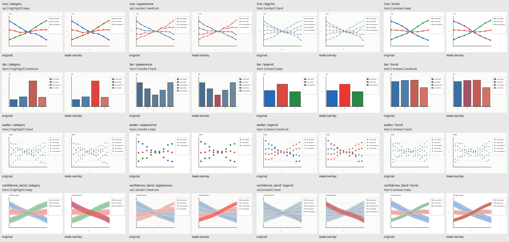

# synthetic_v1 严格审计

审计日期：2026-09-16  
生成器：`synthetic-v1.0.0`  
固定 seed：`20260916`  
结果：**通过（0 个硬约束失败）**

本审计由独立入口 `scripts/audit_synthetic_v1.py` 读取落盘 manifest 与 PNG 文件完成，不依赖生成器内部断言。没有加载模型或运行任何推理。

## 数量与交叉分布

| split | line | bar | scatter | confidence_band | total |
|---|---:|---:|---:|---:|---:|
| train | 48 | 48 | 48 | 48 | 192 |
| val | 16 | 16 | 16 | 16 | 64 |
| test | 16 | 16 | 16 | 16 | 64 |

每个 split 中，category/appearance/legend/trend 的计数与上表 chart type 对应计数相同。16 个 `chart_type × referring_type` 组合在 train/val/test 中都严格为 12/4/4。每个组合内部 action 为 train 3/3/3/3、val 1/1/1/1、test 1/1/1/1；全局每种 action 均为 80。

## 难度与干扰项

| split | easy | medium | hard |
|---|---:|---:|---:|
| train | 64 | 64 | 64 |
| val | 21 | 22 | 21 |
| test | 21 | 21 | 22 |
| total | 106 | 107 | 107 |

干扰项计数 2/3/4 分别为 106/107/107，且逐条等于实际 entity 数减一。每个 chart/referring/split 子集均覆盖 easy、medium、hard。

## Split 隔离与重复检查

- `sample_id`、image path、mask path、seed、scene ID、content ID：重复组均为 0。
- style family 跨 split 交集：空。
- instruction template family 跨 split 交集：空。
- 原图 SHA-256 精确重复：0 组。
- mask SHA-256 精确重复：0 组。
- content ID/底层数值内容跨 split 重复：0。

近重复检查把 plot area resize 为 24×16 RGB，并计算两张图的平均绝对像素差除以 255；只比较跨 split 样本，阈值固定为小于等于 `0.01`。该阈值报告 97 对人工复核候选，不作为硬失败，也不自动删除数据。候选多发生在具有共同 axes/layout、相同 chart type 和相近难度的图；其 SHA-256、seed、scene/content ID 和底层数值哈希均不同。该检测意在保守暴露候选，而不是宣称 97 对属于泄漏。完整列表保存在本地生成目录的 `audit.json`。

## Mask 像素审计

| 项目 | 结果 |
|---|---:|
| 已检查 mask | 320 |
| 空 mask | 0 |
| 全一 mask | 0 |
| 非二值 / 尺寸 / 文件格式错误 | 0 |
| legend proxy 进入 mask | 0 |
| plot region 外前景 | 0 |
| marker 语义错误 | 0 |
| confidence band 退化为细线 | 0 |
| 前景像素 min / median / mean / max | 592 / 2419 / 5667.5625 / 18744 |
| 前景比例 min / median / mean / max | 0.003854 / 0.015749 / 0.036898 / 0.122031 |

confidence band 使用面积阈值 `foreground_ratio >= 0.01` 检查区域语义；line/scatter 根据记录的实际 marker center 做像素断言；bar mask 与目标柱体 rectangle 完全一致。

## 人工 gallery 检查

已实际打开 `assets/synthetic_v1_gallery.png`。16 个 chart/referring 组合均出现，同时覆盖四种 action 与三档难度。抽查中：overlay 与目标对齐；legend glyph 未着色；line 包含 marker；scatter 覆盖目标系列的全部点；confidence band 为填充区域而非中心线；bar 只覆盖单个目标柱。图例标签、颜色、类别或趋势均能唯一指向展示目标。



## 审计命令

```bash
projects/sa2va/.venv/bin/python projects/chartground_edit/scripts/validate_synthetic_v1.py --manifest projects/chartground_edit/data/synthetic_v1/annotations.jsonl --expected-count 320

projects/sa2va/.venv/bin/python projects/chartground_edit/scripts/audit_synthetic_v1.py --manifest projects/chartground_edit/data/synthetic_v1/annotations.jsonl --expected-count 320 --near-duplicate-threshold 0.01 --output-json projects/chartground_edit/data/synthetic_v1/audit.json
```

## 结论

synthetic_v1 满足 Phase 3A 的结构、分布、mask 和 split 隔离硬约束，具备进入独立 Phase 3B balanced-val Prompt benchmark 的数据条件。该结论不等价于真实数据质量或模型性能验证；test 仍应冻结，Prompt 只能在 64 条 balanced val 上比较。
