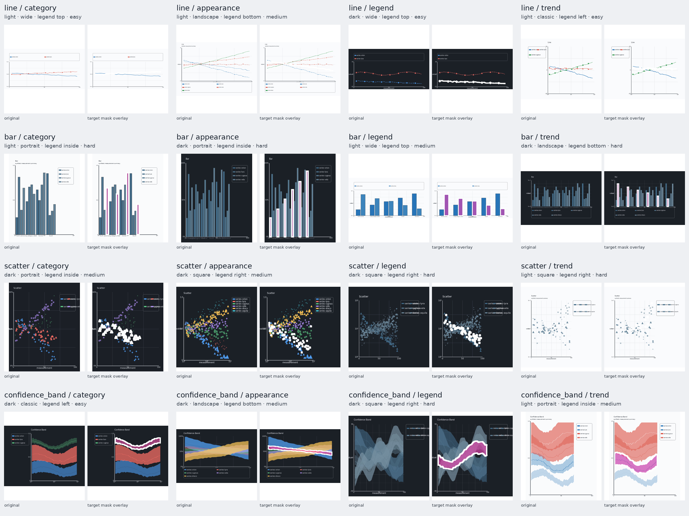

# synthetic_v2 data card

## 概览

`synthetic_v2` 是 ChartGround-Edit 的第二版 Pillow 合成数据协议，目标是扩大视觉与布局分布，供后续受控 A/B/C 参数高效训练消融使用。它不替代或修改 `synthetic_v1`，也不改变 Phase 3/4/5 的任何结果。

- Schema：`chartground-edit-v2`
- Generator：`synthetic-v2.0.0`
- Seed：`20260917`
- 总量：1,600
- Split：train/val/test = `960/320/320`
- 组合：4 chart types × 4 referring types，每组合 100 条
- 每组合 split：`60/20/20`
- 每组合每种 action：train 15，val 5，test 5
- Manifest SHA-256：`1815d127d9104db1e1d91d2dddd8080c099a4f84d922896f655910adca2154be`

数据由代码生成，不含真实论文、个人信息或人工标注内容。大批量 PNG/JSONL 受根 `.gitignore` 的 `data/` 规则保护；仓库版本化保存生成器、校验器、审计器、测试与 gallery。

## 精确分布

每个 `chart_type × referring_type` 组合均为 100 条；line、bar、scatter、confidence band 各 400 条，category、appearance、legend、trend 各 400 条，highlight、recolor、extract、remove 各 400 条。

| 维度 | 分布 |
|---|---|
| 画布 | 5 种：720×360、672×448、560×420、500×500、448×560；各 320 |
| 宽高比 | 0.8–2.0；中位数 1.333 |
| DPI | 96/120/144/180/220；各 320 |
| theme | light/dark = 800/800 |
| legend | top/bottom/left/right/inside；各 320，1–3 列 |
| grid | none/major/major+minor = 536/532/532 |
| layout | compact/standard/whitespace = 537/533/530 |
| numeric format | standard/scientific/percent/negative；各 400 |
| axis scale | linear-linear 537，log-linear 533，linear-log 530 |
| difficulty | easy/medium/hard = 544/544/512 |
| distractor count | 1/2/3/4/5；各 320 |
| JPEG quality | 100/96/90/84，近似均衡 |
| blur | 0/0.35/0.65 px = 800/400/400 |
| screenshot scale | 1.0/0.88/0.76 = 800/400/400 |
| antialias factor | 1×/2× = 803/797 |

曲线覆盖 monotonic、periodic、piecewise、plateau、noisy、exponential，并显式覆盖 0、1、多次交叉；柱图使用 4–7 类 grouped bars、变宽/变距与正负值；散点覆盖不同 marker、透明度、密度、cluster/trend/outlier 与重叠；confidence band 覆盖对称/非对称宽度、透明度、弱/强中心线以及交叉和局部遮挡。

## 难度

`difficulty` 不由 distractor 数量直接映射。生成计划在每个 chart/referring/split 内，根据下列八项预注册 proxy 排序后分为 easy/medium/hard 三层：

1. 目标与干扰颜色相似度；
2. 交叉或几何遮挡；
3. 序列数量；
4. marker 相似度；
5. legend 密度与列数；
6. 目标面积；
7. 线宽、点大小或 glyph 粗细；
8. confidence band overlap。

最终图像还记录从实际 mask/几何测得的 `difficulty_factors` 和 `difficulty_score`。计划分数的 easy/medium/hard 均值分别为 `0.351/0.487/0.614`；每个 distractor count 都同时包含三种 difficulty，因此二者不是一一对应关系。

## Mask 与指代语义

- mask 为原图尺寸、单通道、二值 PNG，非空且非全图；
- line mask 覆盖可见的完整目标线及存在的 marker；
- scatter mask 覆盖目标序列的全部点；
- bar mask 覆盖目标 grouped-bar 序列的全部柱体；
- confidence-band mask 是完整二维区域；
- legend glyph 不进入 mask；inside legend 使用保留的数据区域，避免遮住目标；
- category、颜色、legend label、trend 在同一图中均唯一指向目标；
- screenshot resize/antialias 同步作用于图像与 mask，JPEG 和 blur 只改变图像外观，不改变 mask 语义。

独立 audit 对 1,600 条样本逐条检查，结果为 semantic error `0`。前景比例范围 `0.000930–0.157976`，中位数 `0.017366`。

## Split 与重复审计

- `style_family`、`instruction_template_family` 带 split 作用域，三者无交集；
- 底层 `data_signature`、seed、scene ID、content ID 均唯一，无跨 split 复用；
- 未发现只改变 action 的跨 split 重复；
- v2 内精确 image duplicate `0`、精确 mask duplicate `0`；
- 与 synthetic_v1 精确 image duplicate `0`；
- 联合近重复检测候选 `0`。

近重复判据不是 v1 的单一低分辨率坐标轴指纹，而是同时要求 dHash Hamming、16-bin RGB histogram、edge thumbnail、target-mask thumbnail、foreground ratio 和宽高比均接近；跨 split 候选作为 hard failure。

## v1 与 v2 多样性

| 指标 | synthetic_v1 | synthetic_v2 |
|---|---:|---:|
| 样本数 | 320 | 1,600 |
| 画布尺寸数 | 1 | 5 |
| 宽高比范围 | 1.5 固定 | 0.8–2.0 |
| 前景比例中位数 | 0.015749 | 0.017366 |
| 序列数范围 | 3–5 | 2–6 |
| distractor 范围 | 2–4 | 1–5 |
| 颜色距离中位数 | 0.063919 | 0.200282 |
| line width 范围 | 2–5 px | 1–3 px |
| marker size 范围 | 3–6 px | 2–6 px |
| legend 位置 | right | top/bottom/left/right/inside |
| theme | light | light + dark |
| crossing count | v1 未记录 | 0–34 |
| occlusion ratio | v1 未记录 | 0–1，中位数 0.084646 |
| sampled within-set dHash 距离中位数 | 0.21875 | 0.484375 |

v1→v2 的 5,000 对确定性采样 dHash 距离中位数为 `0.484375`。该指纹统计描述视觉差异，不是模型性能指标。



## 复现

```bash
projects/sa2va/.venv/bin/python \
  projects/chartground_edit/scripts/generate_synthetic_v2.py \
  --output-dir projects/chartground_edit/data/synthetic_v2 \
  --seed 20260917 --clean \
  --gallery-output projects/chartground_edit/assets/synthetic_v2_gallery.png

projects/sa2va/.venv/bin/python \
  projects/chartground_edit/scripts/audit_synthetic_v2.py \
  --manifest projects/chartground_edit/data/synthetic_v2/annotations.jsonl \
  --v1-manifest projects/chartground_edit/data/synthetic_v1/annotations.jsonl \
  --output-json projects/chartground_edit/data/synthetic_v2/audit.json
```

本阶段仅生成和审计数据，没有加载模型、运行推理、训练或修改既有指标。
